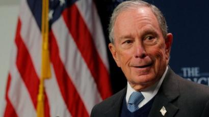

私の主張として、トランプ氏はかなり親中の大統領であり、連任して欲しいです。残念ですが、次期のアメリカの大統領はマイケル・ブルームバーグ氏になるでしょう。

<figure>

<figcaption>

マイケル・ブルームバーグ

</figcaption>

</figure>

ブルームバーグ氏は前ＮＹ市長で、経済の実績はかなり評価されているようです。11月24日に正式出馬と表明しました。大統領の選挙に出馬するような人を見ると、トランプの相手になるのがこの人だけでしょう。  
然も、トランプ氏はあくまで成功した商人しかすぎません、ブルームバーグ氏は世界中のリーダたちと直接対話しています。  
11月、北京で開催した経済フォーラムで、ＴＯＰの人達と合意し、次期の大統領になる準備は済んでいるかと思います。この参加した[リーダ陣](https://www.neweconomyforum.com/leadership/#row-hero)を見れば、実力を感じるでしょう。アメリカ、中国、香港等、背後にコントロールしている人は全て揃えて、今後、世界情勢の変化に関わり深いでしょう。

トランプ政権の米中貿易戦は、根本的な利益にお互いに触らず、米中友好が裏側の主軸だ、もし、ブルームバーグ政権でしたら、貿易戦と口にしなくても、中国には厳しい状況に直面するでしょう。

勿論、首相になるために、色々な過程があります。それについて、[@pandypandy0513](https://twitter.com/pandypandy0513)氏がまとめた内容を添付します。

https://twitter.com/pandypandy0513/status/1206452621466198017?s=20

https://twitter.com/pandypandy0513/status/1206453012731875328?s=20

https://twitter.com/pandypandy0513/status/1206453827517337600?s=20

https://twitter.com/pandypandy0513/status/1206480811102392321?s=20

https://twitter.com/pandypandy0513/status/1206670840345088001?s=20

https://twitter.com/pandypandy0513/status/1206740367581671425?s=20
