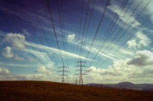

中国大停電はオーストラリアの石炭と関係ありません。計画より、電気の需要は大幅に上がったようで、2020年末、中国の南方中心、業者向けの電気利用の制限は設けました。右寄りのコンテンツ屋さんは大騒ぎをたているようで、この日本全土の最悪なCOVID19パンデミックの注目から、分散させるためのネタとして、丁度良いかもしれません。

電気使用の制限について、以下の背景と考えられます。

**生産需要の急増** まず、世界中、正常稼働の工場は、基本、中国に集中します。ベトナムも通常だけど、ボリュームが限られます。 インドも、東南アジア諸国も、コロナ禍でフル稼働できない所が多い背景はあります。いくらコロナ禍と言っても、使う需要はさほど変わらないので、注文は中国の業者に殺到するでしょう。こちらは、主な原因と思われる。

違う❓と思われる人は、三峡ダム、世界一の水力発電所を思い出してください。三峡ダムの発電機、１機の出力は70万KW、同様な発電機は合計32機あります。 あまりイメージが湧いてこないでしょうが、日本一と誇る奥只見発電所の出力は合計、56万KWです。 ようは、40の日本一の水力発電所でも、中国工場の不足とした電量の穴を埋められないことです。

**環境問題** 火力発電所は、大量な石炭を使います。石炭のような、汚染の多い燃料の使用は、計画的に減らす国策がありますので、生産需要の急増にあわせて、電力の生産は足りなくなっているようです。 こちらは、オーストラリアと関係ないわけです。本当に必要だったら、鉄鉱石と同様、値上がりしても輸入するから、通関で留める必要ありません。

**核兵器の生産？** 噂というか、推測でもあります。米軍の脅威を受け、中国軍は核兵器の保有量を増やすと発表しました。 核兵器の生産で、不可欠なウラン濃縮に、大量な遠心機が必要なわけです。 ウラン濃縮用の遠心機は、大量な電気は必要で、一つの原子爆弾の生産だけで、遠心機の必要な電力は、中等レベルの国の全国の電量ほど必要だそうです。 千発単位の核兵器を増やすようで、天文数字な電力を消耗するでしょう。例年のない使い方に、電気を回してるかと推測されています。

**まとめ** 冷静に考えてみれば、中国の電力不足は、右寄りのコンテンツ屋さんとの想定は離れていること分かるかと思います。中国崩壊希望の人は、また、引き続き、失望します。

いつもの話ですが、今の時代、仮に中国は崩壊するとしたら、日本はアジアで独り勝ち、覇権に戻ることが、まずありません。日本の経済の不況等から始まるのです。右翼の嘘を信じ込む人以外、アホがいないからです。

補足： オーストラリア産石炭の輸入は、製鋼業者は冶金に使用する高品質なもので、発電と関係ありません。
