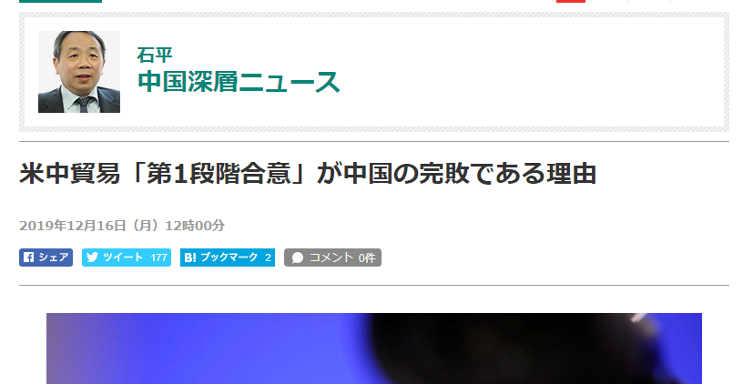
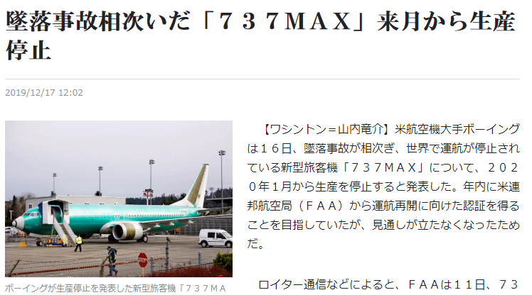

日本など民主国家では、言論の自由を唱えながら、政治的正当性もあります。例えば、フランスなど西欧では、同じアメリカの大統領でも、トランプだったら何でも否定する、オバマだったら何でも肯定するのが基調です。何故かと、別に深い理由がなく、白人と黒人の違いだけだ。日本の場合、中国なら、必ず悪のが基調も同じである。これらは、政治的正当性のことです。但し、客観的に物事を判断するには、政治的正当性が邪魔になるわけです。

日本の国粋主義、右翼は必ず中国を否定するのが、右翼の政治的正当性だ。勿論、反する理由があって、その主な理由の一つとしてはこちらだと思います。  
中国のおかげで、日本は野蛮人から行き成り文明社会へ切り替わって、近代まで、文化、政治などあらゆるところで影響されたわけです。ある意味、中国は日本の恩人でもある。近代、強くなった日本はこの中国という恩人に対して何をやったのでしょうか。  
「侵略」が政権の交代でもあり、別としても、大規模な虐殺や、占領した後、中国文化を日本文化で同化しようとしました。中国に対しての侵略は近代だけではないが、日本の恩返しが独特すぎますね。

恥ずかしくて仕方がなく、どうしようとして、じゃ、取り合えず否定すれば、心が癒されるのね。  
何でもかんでも中国が悪の基調は主流になり、日本が悪かった？いや、中国が悪の存在だとして、そのイメージを築けていけば、正当性も生まれてくるのだ。

勿論、この政治的正当性の考え方を広げるにはマスコミの発信が必要だ。この中国出身の石平が中の一人です。  
1962年生まれ、1980年代、日本へ留学した石平の大学の学費、留学の学費、生活費は、すべて国からの出費です。国の出費を使って、恩返しなどしようともなく、育てた政権を批判する事を職として飯を食っているのです。  
勿論、今はこの人の祖国は日本です。石平はこんな人で、賛否について、ご判断ください。

米中貿易戦について、日本の政治的正当性を基に判断するのならば、石平の言う通り、中国の完敗でしょう。

米中貿易、第1段合意のタイミングで、ボーイングの737ＭＡＸ生産停止も注目して欲しいです。  
安全問題も色々あったでしょうが、Ｎｏ１の購入先、中国から、何かしたらの異変があったのでは？

中国への輸出は、ボーイング等、乗客機は大きな割合を占めている。仮に、中国は乗客機の輸入量を大幅に減らす予定でしたら、アメリカ製造業への打撃が大きい訳だ。米中貿易戦の中、何方も絶対的な優位ではないから、長く続いている。米は損失を見込んでいるため、合意に急いでいるでしょう、でないと、中国の完敗まで継続すると思います。第1段合意の中、農産品の輸入額を増やすことは、収益高いハイレベルの製造業の輸出は減らすと読み替えてよいかと思います。

石平は元々エリートだから、情弱なオジサンではありません。政治的正当性があるこそ、飯を食っている評論家だから、中国完敗の結論に導くような発言をするでしょう。  
我々、真実を求める人は、政治的正当性が、客観的に物事を判断するするのを妨げるだけです。  
利益のために、何でも売る石平のような評論家を勝手に信じるより、色んな所から情報を入手して、貴方の自らの判断が賢明でしょう。
