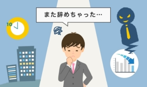

コロナ時代だけではないが、仕事の安定、給料を決める本質とは何でしょうか？  
スキルと直結しません。代替できるかどうかで、決められます。

仕事の安定性を高め、給料upにしたければ、スキルupだろうと勘違いする人は多いです。  
実は、代替し易さ⇒安定性と給料は反比例の関係であること、学校や、経営者の洗脳では、誰も気づきませんかも?  
ようは、代替しやすければ、スタッフはいくらスキルが高くても、経営者都合で、いつに首されてもおかしくない。  
逆に、代替し難いほど、スタッフはいくらダメな人でも、安定な高い「給料」を得続けることになります。

こちらは経営の本質にも関わるポイントですから、基本、経営者はスタッフに教えない、同じスタッフとしての教育担当も、同じスタッフですから、理解できないことも普通です。

一つの例で考えましょう。

あなたの茶碗に、**うんこ**を乗せたことがあるとしたら、何も考えず、その茶碗を捨てるのが普通です。  
但し、生まれてから、**うんこ**しか入らない大腸となるホルモンは食べた事はありますよね？ホルモン好きな人も多いと思います。  
では、何故、同じ**うんこ**を乗せるものなのに、茶碗なら捨てる、ホルモンなら食べるのでしょうか？

理由は簡単ですホルモンは、他の器官の代替できない味を提供できるからです。その味のものを食べたい場合、ホルモン以外、代替することが難しい。  
茶碗がうちにいくらでもあるから、別のものを簡単に変えられる、代替しやすい。

仕事も同じ原理です。  
あなたを代替できる人がなければ、いくらしょぼく、何もやらなくても、高い給料を得続けるわけです。逆に、経営状況が悪くなったら、すぐに首されるでしょう。  
ちょっと、極端な話は、天下りの官僚、政治要人の子供など、普段は何をやらなくても、そこにいるだけで、高い給料を得続ける。政府から仕事を得るには、それ以外の人は受付さえもしてくれないからです。  
逆例でいえば、工場のスタッフです。特に単純な肉体労働であるこそ、機械で代替しやすいので、いくら熟練して、努力家の人としても、時が来たら、仕事が失います。

IT業の転職に関わる人なら、こちらについてわかりやすいかもしれません。  
例えば、Android、iOS開発の需要が爆発的に増えたら、あまり技術力高くなくても、高い給料を得られる職場は沢山ある。同じ技術できる人は増えてきて、代替しやすくなるから、スキルが変わらなくても、給料が基本減っていきます。  
こちらは、IT業で長く仕事をする人は、高い学習力が必須レベルの一つである要因と言ってもよいでしょう。  

いかがでしょうか？  
仕事の安定、給料の高さは、スキルと直結しないこと、ご理解できたのでしょうか。  
勿論、よくわからなければ、スキルを高めて代替され難くすることも一つの策です。  
コロナ時代、もし、あなたも仕事のボトルネックを感じられたら、自らの仕事人生について、考え直す機会ではないかと思います。  
自らのスキルの高さに拘ることなく、如何に、自らのことが必要とする職場を見つけることが重要です。仕事の安定性、給料はスキルと直結しなく、代替の難易度により、決められるからです。
