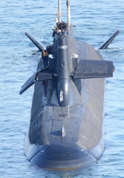
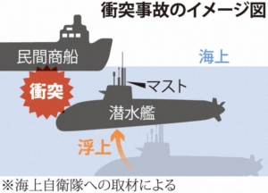

潜水艦(そうりゅう)の事故について、海中から浮上する時、[5万トンの商船](https://www.jiji.com/jc/article?k=2021021001193&g=soc)を発見できなく、衝突事故を起こしたことについて、私と同様、違和感を感じた人はいるでしょう。海上自衛から色々理由を説明したが、言及し難い真実と陰謀がある、専門家から指摘されました。

5万トンの商船が[ソナーの死角にあったと説明した](https://www.jiji.com/jc/article?k=2021020901147&g=soc)ことは、空母のような大型軍艦が、ソナーの死角に隠せば、日本の最大級ディーゼル潜水艦は見つけられない事？こちらは、自衛隊の公開された情報と矛盾が大きすぎるので、信じられなく、隠された事実が必ずあります。

軍事に詳しい専門家から、今回の事故について、以下の点を説明された 1．浮上と強調されたが、単純に浮き上がるのではなく、潜水艦(そうりゅう)は、商船の下に姿を隠す訓練中で、事故った。 2．追いかけられて、浮上するか、隠そうそするか、慌てて事故してしまった。 3．今の自衛隊は、世界大戦時代の日本軍の質と全然違って、戦力のない集団と言ってもよい。

潜水艦(そうりゅう)はディーゼル潜水艦で、弱点として、潜水と浮上、水面と近い時、ディーゼルエンジンを使います。このディーゼルエンジンを使う時間帯の騒音が大きいことだ。海中深く潜航する時、モーターを使うので、もし、潜水と浮上する時、商船の下、又は、そばに隠せば、見た目上も、エンジンの音も、人工衛星、水中にあるセンサからの検知ができなくなるでしょう。  今回、潜水艦浮上時の事故について、 民間商船に下に隠すとか、事前に周知する訳でもないし、中国の東海や、南シナ海などへ行ってきたとか、明言できないので、海自の担当者は本当の意図、勿論、何も言えなく、訳の分からない言訳にします。

民間商船の下に隠すことは、関係ない民間人を勝手に戦争に巻き込むことにもなります。この点は、戦前と戦後の今、日本当局の無責任さは、全く同じと、何故、中国は尖閣諸島問題などで、日本に向けて、こんなに強硬なのか、一斑を見えるでしょう。

因みに、今回の事故より、びっくりする事は、通信設備のバックアップがない事です。しかも、数時間を経て、[携帯電話で状況を報告](https://www.jiji.com/jc/article?k=2021020900988&g=soc)したとは、そうりゅうに乗ってた人の誰か、個人の携帯電話を持ち込んだでしょうか？ 日本の技術力に疑わないが、いくら先進な設備でも使うのが人間ですから、人間の意識が足りなければ、何を使っても意味がない。携帯電話を潜水艦へ持ち込めたことから、今の自衛隊は世界大戦時代の日本海軍の意識と全然違うと見受けます。

日本自衛隊は宣伝されたような戦力がありません。しかも、基礎の製造業は遅れつつある一方、いざとなる時、日本の想定した相手の中国解放軍と比べると、かなりレベル低い存在であることは分かるでしょう。いまだに、大日本帝国の幻想をする人は目を覚めたらどうなるでしょう？
