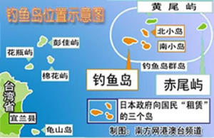

台湾や日本の中途半端の自称専門家や、ジャーナリストは、武力で台湾を統一する戦争では、東沙からだという論説が最近のネットで記事が流れて、それらは全て勘違いである事、こちらで説明します。ちなみに、東沙諸島は、本質からいうと、釣魚島(尖閣諸島)と同じである事、併せて説明したいと思います。

筆者は東沙諸島奪還の説を始めてみたのは、日本や台湾の人ではなく、中国のインフルエンサーから、半分冗談の話です。清時代の台湾統一戦争の例を挙げ、先に、金門、澎湖、東沙の回収からと、戦術上の話を展開したが、但し、あの時代は、日本も米国も、外部からの要因がない所まで語らなかったわけだ。台湾や日本の地政学分析のスキルが足りないか？分からないが、その半年後、同じ内容の説はいつものデマ醸成するパターンで、台湾スタートして日本で広がってるようだ。

**何故中国は台湾を統一しなくてはならないか**

中国共産党政権は自らの正当性を主張するために、中華民族の復興と、外国の列強から国民を守れる事をスローガンとして、満清と国民党の中華民国政権の差別化を図って、長年で正当性をアピールしている。特に直近の日本からの侵略を守ることをアピールするには、[下関条約](https://ja.wikipedia.org/wiki/%E4%B8%8B%E9%96%A2%E6%9D%A1%E7%B4%84#:~:text=%E4%B8%8B%E9%96%A2%E6%9D%A1%E7%B4%84%EF%BC%88%E3%81%97%E3%82%82%E3%81%AE%E3%81%9B%E3%81%8D,%E3%82%92%E7%B5%8C%E3%81%A6%E7%B7%A0%E7%B5%90%E3%81%95%E3%82%8C%E3%81%9F%E3%80%82)で奪われて帰還した台湾が避けられないものと、また、共産党政権の脅威であった国民党政権の撲滅も、台湾が注目されます。また、習近平政権のの[腐敗撲滅](http://www.peoplechina.com.cn/zhuanti/2014-12/22/content_661605.htm)キャンペーンでは、台湾商人経由のマネー洗浄に深く関わっており、香港と同様、制する必要がある。

極端な話では、台湾が統一できなければ、中共政権の存在さえもできなくなり、日本や、米国等の外力により、台湾が独立できたら、戦火は必ずその国に届きます。ただ、統一したら米国に都合も悪いので、台湾の独立も、全力で止めているわけです。

**直ぐに統一できなくても、独立を防ぐための駒設けた**

毛沢東、鄧小平時代は、台湾と比べて、中共の軍事力が弱くて、特に米国など、海外勢力と力を組み合わせて、独立しようとしたら、中共政権は止められない。

そこで、独立しないために、あえて、金門を残した。金門は福建省に属する地域です。地図を見てください。今の日本でよく言ってる「台湾」とは、基本、中国の台湾省のことです。勿論、今の台湾の中華民国政権も、福建省があって、実際に支配できる地域は金門です。これで、台湾が中国大陸と関係あること、いくら教科書を変えて、洗脳しても、台湾人には避けられない事実であること、伝わりやすいポイントになります。

特に毛沢東時代、海軍が弱くて、南シナ海に対して、ほぼ管理できない状態である。台湾の中華民国政権は、ベトナム、フィリピンや、米国と、南シナ海で紛争の種が必要なわけです。そこは、東沙諸島である

今でも東沙諸島も機能をしているわけで、米軍軍艦は南シナ海で通過する際に、台湾の領域にも侵害することを避けられないと、台湾当局は米国へ偏りたくても、内部から反発があり、対米等への不満を表に出さなくてはならない。

勿論、その島を占領した方がよいかもが、海面の上下、領空、電磁権は、全て今の中共に握られてるので、島を占有するより、米台の隙間の種があった方が、戦略上有利でしょう。

同じ考え方で、釣魚島(尖閣諸島)も似たような、日台の連合を防ぐ役割を果たしてます。

[釣魚島(尖閣諸島)](http://www.peoplechina.com.cn/zhuanti/node_66942.htm)は台湾省に属する地域であり、金門と同様、中華人民共和国政権も、中華民国政権も、同じです。最近、中国海警の公船は日本の漁民を釣魚島から追い出すことは、中華民国当局は外国からの侵略を守れないから、その変わりに、中共当局は行政権を実行してあげたのだ。こちらは、台湾の人は、海外で大使館の助けが必要な場合、中華人民共和国大使館へ行く事と一緒です。 だから、中国の海上警察はあくまで、中国大陸と台湾の漁業者を守って、日本漁業者を同海域から追い出す以上、何もしない。上陸して行政を行うべきなのは、中国大陸側の警察ではなく、台湾当局の警察ですから。

自衛隊、日本の右翼団体は尖閣上陸した場合、必ず、台湾の中華民国当局からの抗議があるのも、この理由です。日台関係に紛争となる点は、釣魚島(尖閣諸島)が必須であること、お分かりになったのでしょうか。だから、[自衛隊の中国海警尖閣上陸](https://www.yomiuri.co.jp/politics/20210226-OYT1T50344/)云々は、中国の尖閣周辺の活動について、何もしないと、かなり弱気な宣言であることも、本当の意味もお分かりになるのでしょうか。

勿論、釣魚島(尖閣諸島)は日中紛争のポイントとして、元々米国に設けたものでもあることと、戦争が近づいたら、遠慮していくわけですから、[日本の尖閣主権を支持したり、しなかったり、自らの発言を覆す](https://www.sankei.com/world/news/210227/wor2102270015-n1.html)。今は、逆に、中国の日米関係を離反するツールになってるようだ。

**最後**

中華人民共和国、中共当局は、台湾の中華民国政権を滅ぶまで、東沙諸島、釣魚島(尖閣諸島)の機能はするので、占有する必要ありません。台湾本島は統一された日は、東沙諸島、釣魚島(尖閣諸島)の任務が終了するので、その時から、疑問なく中国の領土になります。

日本は米国の望む通り、尖閣奪還しようと中国に仕向けたら、間違いなく、日本は戦場になるでしょう。避けた方がよいです。 もしかしたら、日本は自らの運命を決められなく、中米の合意で、各自の安全を守るために、尖閣をネタとして、日本を戦場にして、無人区を作る可能性もなくはない。 もしも、日本当局は中国の共同開発を断らなければ、今の窮地に陥ることないかもしれない。
