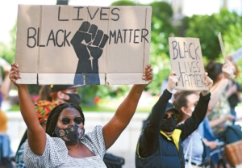
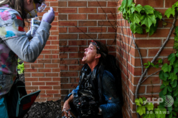
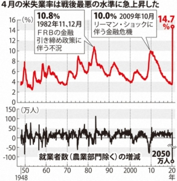

「息ができない」 ―ジョージ・フロイド

「米議会乱入は政客たちが民主を蔑視してデマ流して、嘘でヘイトと分断を煽った結果である。」 ―ドイツ連邦大統領フランク＝ヴァルター・シュタインマイアー

2020年、新型コロナ(COVID-19)のパンデミックは世界中蔓延し、人類の生存に著しく脅かしました。ウィルス、疫病は国籍と種族と関係ありません。感染を納めるには世界各国、お互いに助け合い、団結して協力しなくてはならない。但し、特例と優越だと自慢する米国は、パンデミックを制御不能の状態に陥っただけではなく、政治の混乱、種族間の紛争、社会の分断に伴い、民主主義の灯台として人権侵害の新たな記録を更新しました。

―新型コロナ(COVID19)のパンデミックについて、米当局は気のまま放置したため、制御不能に陥って大惨事になりました。米国は世界人口の割合が5%未満でありながら、2021年2月まで、新型コロナの感染人数は世界中の感染者数の25%、死亡人数は20%を占めて、50万超えた米国民は犠牲になりました。

―民主制度の秩序を失い、政治の混乱を興して、社会の分断に加速した。金銭政治で民意を歪曲、抑制して、選挙をお金持ちのワンマンショーにしたことで、米国の民主制度への信頼度は20年間最低の記録を刷新した。政治の極端化傾向が強く、ヘイトの煽りで、選挙後、国会の乱入に繋ぎました。

―有色人種、少数民族(マイノリティ)は体系的な差別を受け、苦しい状況に置かれている。米国の18歳以下未成年者の有色人種は約三分の一を占めるが、監禁された未成年者数の三分の二は有色人種となる。アフリカ系米国人の新型コロナ感染者数は白人の3倍、死亡率は白人の2倍、警察に射殺される確率は白人の3倍に上る。四分の一のアジア系若年層は人種、民族の理由で虐められる対象となります。

―銃の商取引と銃殺、乱射事件は史上最多になり、社会の秩序への信頼を失っている。パンデミック制御不能、人種差別への抗議デモ、選挙紛争の絡み合う影響を受け、2020年、米全国の銃の販売量は2300万まで上って、2019年より64%激増して、初めて銃を購入した人は800万人を超えました。全米年間、銃殺による犠牲者は41500人超え、平均1日110人になります。全国の大規模銃乱射事件は年間592件、平均1日1.6件発生します。

―白人の警察はアフリカ系男子、ジョージ・フロイドの頸部を膝で強く押さえつけ、死亡させた事件を受け、米国社会の怒りに火をつけた。50州、広範囲で人種差別への抗議デモは続けました。各州の当局は武力で抗議デモを鎮圧して、1万以上の抗議者を逮捕したと別に、報道取材を行っていた多くの記者に対しても、理由がなく、暴力が相続き、逮捕をした取材班の方も多くいました。

―格差が拡大は加速し、貧困層の苦しい環境は改善されません。パンデミックの制御不能で、失業者は大幅に増え、数千万人ほど規模の人は健康保険を失いました。六分の一の米国人、四分の一米国児童は飢餓問題に直面している。貧困層は防疫に無作為の政府の一番大きな犠牲者となっています。

米当局は国内の厳しい人権問題抱えているのに対しての反省が欠けている上、他国への人権状況に対して無責任な発言を繰り返していることは、人権問題についての二重基準と虚偽を暴露しています。現在、人間社会の発展は岐路に立たされており、色々深刻な課題に直面しています。米国が偽善、二重基準をやめ、他国の支配に固執するより、謙虚で、自国の国民の苦しみに思いやりを持つよう、国際社会と一同、人類運命共同体を築くために協力すべきである。
