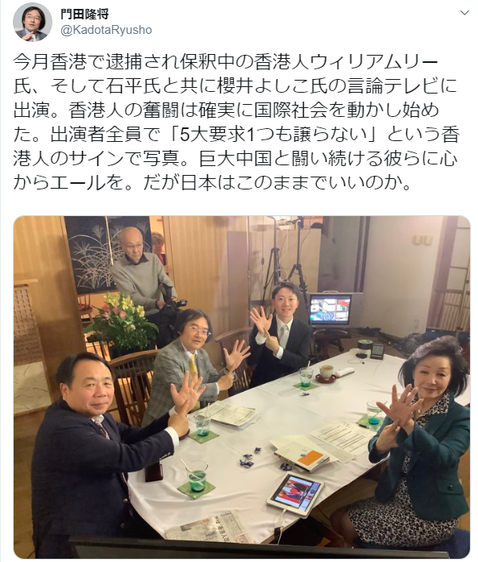

@liyonyon @YoshikoSakurai @KadotaRyusho  
石平氏、櫻井よしこ氏、門田隆将氏の曰く５大要求1つも譲らない事って、本質は自由、民主と関係なく、別のファシズム集団を利用して、繫盛な香港を壊す事です。

この人達は支持した人たちは、以下の危険物を使って、香港理工大学で、警察と戦っていました。  
①火炎瓶　3989本  
②爆発物　1339個  
③腐食性液体物　601本  
④ハンマー、エアガン等武器　573件  
⑤弓　28丁、矢　200本  
⑥大型投石器　12基  
⑦大量の工業用シンナー、ナフサ等可燃性液体  
⑧大量の覚醒剤

https://twitter.com/shhcaa/status/1200539475547279361?s=20

これらの暴力は終わりのではなく、これから激しくなる見込みです。  
この人達の顔をよく見てください。  
テロ集団の味方であり、微笑みながら、人を見殺しの悪魔たちです。

https://twitter.com/cap33830/status/1201024838619394050?s=20
