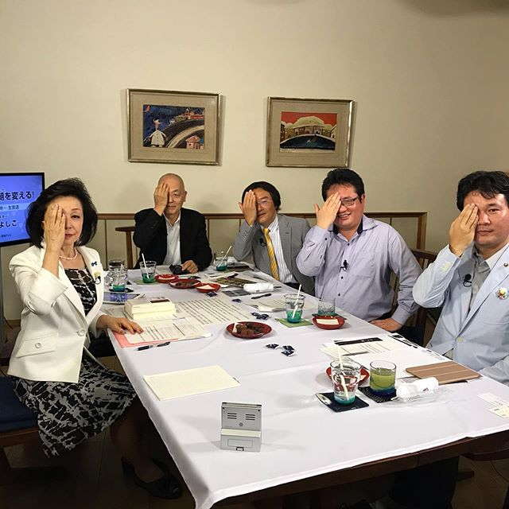
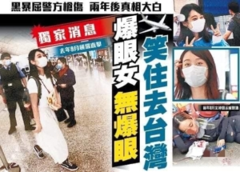

「警察が私の目を奪った」と主張した香港の女性について、twitter上、嘘であることが説明済みので、今更議論するつもりがありません。  
今回は裁判からの結果もあったので、一応追記しておきます。

ちょっと、面白く思うのが、日本の自称リベラル、おじさん、おばさんたちは、20代の若者に騙されて(?)、翻弄されることって、どう言う顔をするのか、知りたい。また、自由云々とか言えるだろうね。  
本物民主、自由だったら、嘘いらないでしょうが、元々偽物だから、あえて唱えないと、すぐばれてしまうでしょう。

補足：目が奪われたと主張した女性は、既に回復して、2020年9月、台湾へ移住したと香港現地のマスコミでは報道されました。  

