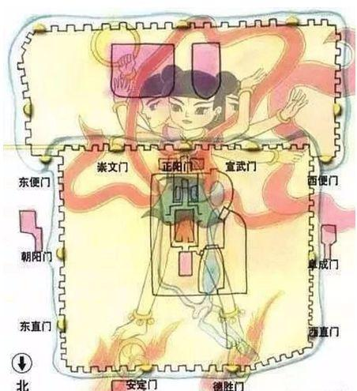
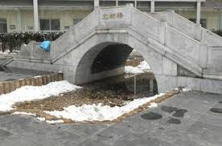
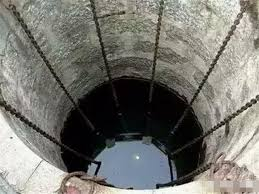

北京は歴史長い歴史を持ち、今の形になったのが明の永楽帝時代からで、三国志、張飛の出身地でも北京地方です。

<figure>

<figcaption>

八臂哪吒（はっぴなた)の城

</figcaption>

</figure>

明の軍師、[劉伯温](https://ja.wikipedia.org/wiki/%E5%8A%89%E5%9F%BA)は、五行八掛の理論を基に、北京を 八臂哪吒（はっぴなた)の城に設計した。八つの城門があり、哪吒の八臂を表す。

北京には竜公と竜母、2匹の孽竜がいて、この形にしないと、治められず、災害の多い都市になるのだ。  
劉伯温と[姚広孝](https://ja.wikipedia.org/wiki/%E5%A7%9A%E5%BA%83%E5%AD%9D)が北京を建築するために、北京へ軍を率いてきました。 竜公と竜母はその姿をみて、相手にならないと分かったから、老人の夫婦に化けて逃げようとした。

ちょうどうこの時、軍が到着し、次の計画を立てようとして、劉伯温が占うと、 竜公と竜母が逃げようとすることを分かった。竜が逃げると、水もつられて、離れてしまうので、水源を確保するために、将軍の姚広孝に追いかけ、留めるようと命じた。

竜公と竜母が北京を出ようとしたところ、姚広孝が追いつき、竜と戦って、持ち出そうとした水を卸せた事ができた。但し、竜がいないと水源が長く続かないので、 劉伯温が竜公、竜母と約束した。  
戦った所に橋があるので、井戸を掘って、負けた竜にそこにいてもらって、その橋が古くなるまで、北京の水源を守ってほしいと条件を加えた。 竜公と竜母は、橋が長くても千年ぐらいあれば、古くなるので、運命でもあるし、北京に離れることなく、 その条件で劉伯温と約束した。

<figure>

- 
    
- 
    

<figcaption>

北京の北新橋と鎖竜井

</figcaption>

</figure>

劉伯温は竜を永遠にいてもらうために、竜をチェーンでロックして、橋の名前を「北新橋」にした。これで、橋が古くならず、いつの時代でも新しい橋のままで、竜が離れません。

これ以上、北京の八臂哪吒、北新橋と鎖竜井の伝説であります。登場人物は異なる時代の人で、真実ではありませんが、「北新橋」と竜を納める「鎖竜井」は今の北京でもあります。鎖竜井は海とつながる海眼と言われて、今でも、どこまでつながっているか、謎です。  
日本占領時代でも、鎖竜井の中に何があるかを知りたく、チェーンを全て地面にあげようと現地の人に強要した。北新橋の街で、チェーンが沢山たまって、海のような臭い悪臭など沸き、キリの見えないほど怖すぎて途中であきらめた。当時、 鎖竜井のチェーンを引き上げに強要した日本軍の部隊は、間もなくの太平洋戦争で全滅されたようだ。

完
