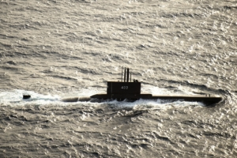
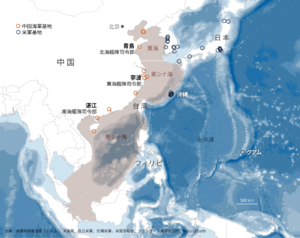
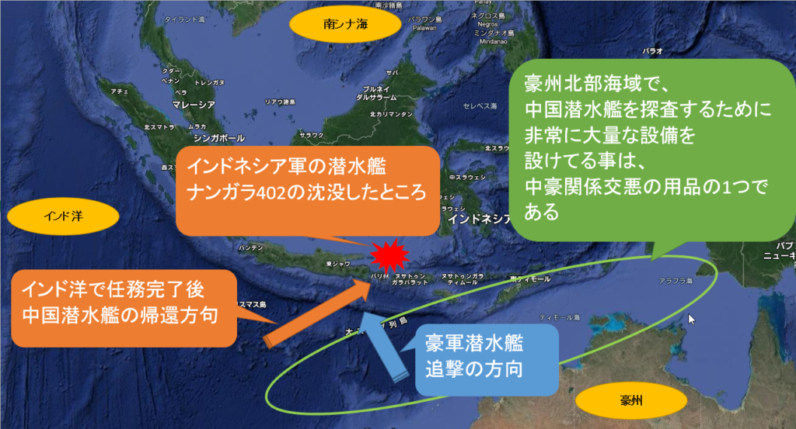

魚雷発射訓練中のインドネシア軍潜水艦、ナンガラ402は、2020年4月21日、バリ島の北約96キロメートの所で沈没して、本当の原因とは、豪海軍の潜水艦攻撃だったと、専門家([民族阵线-老兵莱昂](https://www.youtube.com/channel/UCkZ9vSvx7lg9FvZifpbH2FA))は分析した結果を共有します。

ナンガラ402の乗組員は中米紛争に巻き込まれた無辜の人達であり、悲しい限りであります。この記事で、哀悼の意を表したく、ご冥福をお祈りします。

**前提知識**

何故、南シナ海を巡って、中米は紛争をするか、一言いうと、一帯一路の海上ルートの紛争である。こちらについて、過去の記事「[一帯一路の戦略を理解するーー海上編](https://blog.loveapple.cn/?s=%E4%B8%80%E5%B8%AF%E4%B8%80%E8%B7%AF%E3%81%AE%E6%88%A6%E7%95%A5%E3%82%92%E7%90%86%E8%A7%A3%E3%81%99%E3%82%8B%E3%83%BC%E3%83%BC%E6%B5%B7%E4%B8%8A%E7%B7%A8)」をご参考して頂ければと思います。もう一つ主な理由として、セカンドストライク、核による反撃力を確保するために、核潜水艦の動く海域を確保するためのものである。核潜水艦の反撃力を確保するために、数百メートル以上の深海に潜まなければならない。  
中国内海の渤海、日本、韓国沿いの黄海、東シナ海の深度は、大体、数十メートル、数百メートルの浅い海域となります。核潜水艦の高さは30メートル程の高さもあるので、渤海で潜んでも、人工衛星等から、影を見えてしまうほどです。しかも、韓国、日本沿いは、潜水艦の探査手段、設備は非常に多く、潜水艦の姿を隠すにはかなり難しい。中国の領海は広いとはいえ、セカンドストライクのために、潜水艦を隠せる海域は南シナ海しかありません。近年、人工島の建設も、物理的に超音波を遮断する障害物になり、米国主導の反対声が多い、主な要因である。

また、南シナ海は広いとはいえ、囲まれた海域であり、大型船、潜水艦など通れるところが限られます。インド洋側、マラッカ海峡、太平洋側はバシー海峡と台湾海峡のみとなります。そして、今回、沈没が発生したインドネシア側、バリ島付近は、海底の地形が複雑であり、潜水艦は隠しやすい海域である。同海域、曽て、米ソ冷戦時代も、潜水艦の沈没事故が発生したところです。

飛行機や、軍艦は、海、空中の見えるところにあるので、動きが分かりやすいが、潜水艦は水面下に隠されて、目に見えないこそ、世界情勢を分析する時の抜けやすい所ですが、各国の外交に深く影響する要素である。米国は、中露向けの戦争を興さない主な理由として、中露の潜水艦は深海で隠して、米本土への核攻撃はできるからです。

因みに、最近、中国のロケットは海南島の発射場から打ち上げる事も、海南島周辺、南シナ海から確保したことを表します。

**沈没事件の経緯**

上記図の通り、中国潜水艦、恐らく、核ではなく、_静音性が比較的に劣る_通常動力型潜水艦は、インド洋での任務を終え、バリ島側から、南シナ海へ入ろうとして、米豪の対潜哨戒機、潜水艦に発見されて、バリ島付近まで追跡されたと推測します。  
両国の潜水艦は対立になり、豪潜水艦は中国側を攻撃しようとして、魚雷発射訓練中のナンガラ402の音を聞こえて、撃沈してしまった。  
勿論、ナンガラ402は、中豪潜水艦の存在は知らなかった。  
そして、ナンガラ402沈没の原因は、インドネシア当局ははっきりとしてる。

**公開されてないのに、何故豪に撃沈されたと分かるか？**

まず、中国とインドネシアの関係を確認しましょう。  
敵対ではないが、南シナ海で領域紛争はあり、少なくも、有効ではありません。米国の長年の工作により、中国勢力の影響に強く警戒しています。インドネシアは1990年代に、反中騒乱があったことから、国内も、中国に友好的とは言えません。

沈没事故のバリ島から、一番近いのは米軍と豪州です。事件の直後も、いち早く米豪は救助活動に携わった。そして、シンガポールも近いし、同潜水艦を大規模改修した韓国も、そして、南シナ海に積極的に携わる日本も、ヘルプを出せば、きっと、やってくるのに、何故か、[潜水艦の救助は中国海軍に頼みました](https://news.yahoo.co.jp/articles/01ddc584ffe616652cd5fbd62de243e850465630)。

今は、ナンガラ402の救助活動について、米国関係の国は全て排除してるような状態について、注目してください。通常ではないだろう。

4月下旬、豪国防総長は中国への武力攻撃と言及した。

5月6日、中国外交部は[豪州との戦略経済対話「無期限停止」](https://www.nikkei.com/article/DGXZQOGM062F60W1A500C2000000/)と発表したことは、実質的に、中豪は断交の状態です。いくら戦狼外交と言っても、断交するほどではないし、通常に考えると、中国らしいやり方ではない。

豪軍は中国の潜水艦を攻撃しようとしたことであれば、上記、おかしいところは、全て通ります。

**まとめ**

ナンガラ402の本当の沈没した原因は、永遠に公開されないかもしれない。豪海軍に撃沈されるって、多くの日本人の常識を超えた推測かもしれませんが、豪も、世界中戦争を興して、現地住民を虐殺、迫害する爪牙の一つである。

中米紛争で周辺国に巻き込まれる事は避けられないが、弱い国は一大国、覇権に寄せすぎることは賢明ではない。  
豪州はアングロサクソンの傲慢があるくせに、その傲慢と幻想に相応しい実力がありません。中豪の断行は中米の関係が友好になるまで(2030-2050年❓)、回復するのでしょうか❓分かりませんが、戦争が起こらないことだけを祈りたい。

この事件を受け、中国とインドネシアの南シナ海での紛争は、米国の望ましくない方向へ加速するでしょうか。中国と東南アジア諸国の関係は、一層深くなると望ましい。

豪州はインドネシア国内の紛争に深くかかわり、東ティモールをインドネシアから独立させた等、周辺各国を虐めたり、紛争を煽ったりするなど、未来、中国勢力の浸透で、平和の方向へ進むと見込んでもよいかと思われる。
