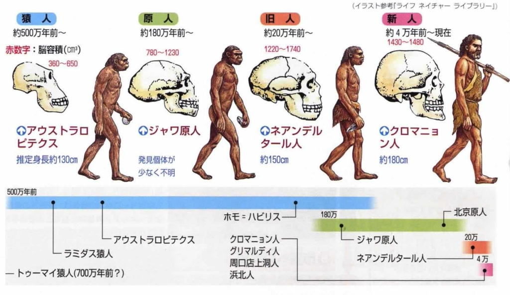

地球外生命体の証拠と言えば、人類自分自身では？  
①毛が少ない。氷河期世代から、寒い時期から生きてきたのに、肌はツルツル、毛が入らない事は、地球の環境に適した進化ではない  
②汗腺が異常に発達。全身から汗かける動物は少ない、特に人類は馬のように長く、長距離で走ることもないのに、この異常発達した汗腺、毛が少ない特徴と合わせて、非常に熱いところにいる証拠だ。  
ネコ科、イヌ科も熱帯にいる動物は多く、人類ほどの汗腺が必要ないようだ。  
③眼白。大きな眼白を進化したのが人類だけだそうだ。単にコミュニケーションのためだけらしい、眉毛もそうだが、人類は自然界に必要以上なコミュニケーション力を求める証拠だ。  
④嘘と未来の表現がある。自然界では、嘘と未来の表現は絶対必要ない。犬でも単語の意味を理解できるが、嘘と未来の事、基本理解できない。人類はこの余計な機能をどうやって進化した？

⑤人類は進化してきたものではない。  
左図で人類の進化と勘違いする人が多いでしょうが、実は違って、この図は、曽て、地球にいた人類、及び、人類と似た生物を表している。結果的に、残ったのが今の人類だけだ。  
人類は進化してきた証拠は、いまだにないのだ。  
⑥人類の脳は最強ではない。  
人類の脳は最強だから、文明を築けたと勘違いする人が多いようだが、実は違う。クジラ、イルカなど、曽て絶滅した人類らしい生物も含めて、人類より脳は強い動物は沢山いる。現代文明まで進化できたのが人類だけだ。

今まで、進化論が主流だが、近年、多くの学者は細胞から、人類自身まで、進化論を疑って研究を行っているようです。進化論は小さな問題しか説明できなくて、細胞のような複雑な構造はどうやってあったのか、人類はどうやって進化したのかなど、進化論で説明できる証拠がないようです。

抑々、人類自身は、地球外生命体として、地球にやってきたかと考える人は多いようです。  
私は神話、伝説など登場した神など、簡単に想像したものではなく、太古時代の宇宙人ではないかと思います。あの時代の人類は何故か記録できなく、神話、伝説などの形で残ったかと思います。人類自体が地球外生命体だと信じるというか、信じたいです。
