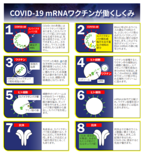
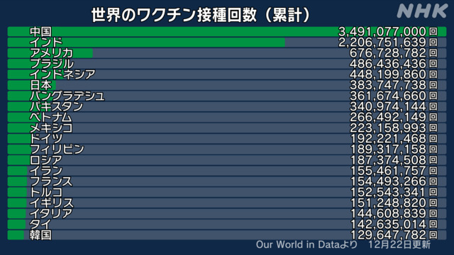
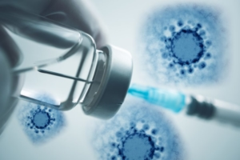
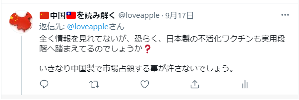

新型コロナ(COVID19)、初めて人類向けにmRNAワクチンを利用し始めたので、従来の不活化ワクチンとどう違うのか、常識レベルで説明したいと思います。 分かりやすく説明したく、浅い内容ですので、詳しい内容にいて、専門医の記事、又は、直接聞いてください。 まず、ざっくりまとめると、以下の表となります。

|  | **不活化 ワクチン** | **ｍRNA ワクチン** |
| --- | --- | --- |
| 有効性 | 低い | 高い |
| 安全性 | 高い | 不明(低い) |
| 輸送等の難易度 | 簡単、常温、低温可能 | 難しい、冷凍輸送必要 |
| 変異株の対応 | 可能 | ほぼ不可能 |

**不活化ワクチン**とは、「死んだ病原体の一部」をワクチンとして作ったものです。 日本脳炎、インフルエンザ等、昔から使われてる、成熟したワクチンの技術である。ゲノムへの操作が基本なく、免疫力を引き出す部分の病原体としたワクチンです。

特徴として、対象ウイルスに対して、有効性がmRNAワクチン程、芳しい数字がでない、インフルエンザの事例から、60%程の有効性があれば、接種者数を増やして、集団免疫の状態になるので、パンデミックを納めます。 病原体そのものを使うので、変異株に対しても、基本有効の場合が多い。 例えば、WHO承認の中国シノファーム製新型コロナワクチン、不活化ワクチンとして、有効性は米ファイザー社製のワクチン程の有効性が基本ありませんが、アラビア、スペイン、ブラジルの一部等、中国シノファーム製ワクチンを大規模接種する地域は、中国程の厳しい対策をしなくても、基本、パンデミックは納めているようです。

**mRNAワクチン**とは、[基本はゲノム操作した物を人の細胞に埋めて、直接、対象となるウイルス(RNA)に対して、抗体を発生させる仕組みです](https://www.snohd.org/ImageRepository/Document?documentId=6074)。

対象となるウイルスに直撃するので、ファイザー社製のmRNAワクチンの有効性は、90%以上の数字を報告しています。不活化ワクチンより、遥かに高いわけ。

業者の公開データによると、かなり良い結果を出してるが、安全性について、mRNAワクチンは人類史上初、しかも、検証期間が短すぎるので、不明な事は多いです。

ファイザー社製ワクチンを接種したことによって、重い副反応、死亡に至る人は多いです。日本は、現時点で少ないが、欧米各国、イスラエル、同社製ワクチンを大規模接種する国は、多くの重い副反応、死亡の事例が報告されています。勿論、現時点は特定できなく、時間が経って、副反応と認めるケースもあり得るでしょう。

**ウイルスの変異と変異株の対応**

ウイルスの変異は特別な事ではありません。ウイルスは安定した遺伝子をもつDNAではなく、RNAですから、増殖していく中、新種に変異しやすい現象があります。こちらは、カゼを引くのも同じく、RNAですから、DNA系の天然痘、結核のように、一回かかって治療したら生涯免疫できるのと異なって、また、別のRNAがやってくるので、何回も感染できます。

RNAウイルスの変異しやすい特性から、不活化ワクチンとmRNAワクチンの対応も変わります。 不活化ワクチンは病原体そのものを使うので、変異株であっても、免疫できるケースは多いです。ゲノム操作mRNAは、別のRNAが来て、マッチングできなければ、認識できないようです。 この理由で、薬剤耐性が強い南アフリカからの変異株は、ファイザー社製ワクチンの場合、ほぼ効果がないにも関わらず、中国シノファーム製ワクチンは、50%以上の有効性を示したようです。但し、インドからの変異株3千超えあるので、薬剤耐性も毒性も、今現在の知られてる全ての変異株より強い。中国の不活化ワクチンの接種者も感染した報告があります。どちらも対応できない場合があると明らかです。

**ワクチンは万能薬でなく、日々のご用心を！**

[世界のワクチン接種ランキング](https://www3.nhk.or.jp/news/special/coronavirus/vaccine/world_progress/)から、気づいてほしいことですが、ワクチンがあればコロナ退治できると限りません。

アメリカの感染数曲線から納めるように見えても、数的に少なくないと、PCR検査スポットはワクチン接種スポットに切替わったので、検査数自体は減っています。

インドについていう事なく、公表数宇より、20-30倍の感染と言われています。ワクチン接種しても、防疫しなければ、意味がなく、逆に薬剤耐性が強いウイルスが生まれる環境ができてしまうことです。

ワクチンなしでも、1年以上、健康に過ごせた人は殆どです。これから変異があっても、日々のご用心を重ねていけば、コロナ禍の困難を乗り越えるでしょう。

**どっちを接種すべき**❓

日本や、EUのお金持ちは大金をかけて、中国の不活化ワクチンを接種する報道がありますが、我々、日本で生活する庶民にはそんな沢山選択肢がなく、ファイザー社製ワクチンのみとなります。

医療従事者にいう程でもないが、特に、接客等、沢山の人と接触する機会多い人は、政府の案内に従って、なる早く、あるものを接種した方が無難でしょう。

高齢者についても、中国シノファーム製新型コロナワクチンは年齢制限があるので、中国へ行っても、ファイザー社製のワクチンになるかもしれません。

個人的に在宅ワーク中心で、この時期では、変に移動もしたくなく、成るべく、不活化ワクチンの日本上陸を待ちたい。ご参考になればと思います。

**補足：** [Japantimesの報道によると、中国からのワクチンの臨床効果は、試験データより高い有効性を示している。インドネシアでの追跡した結果では、100%の人を死亡から守って、96%の人を入院するほどの重症から救えた。](https://www.japantimes.co.jp/news/2021/05/12/asia-pacific/china-sinovac-effective/)

**再補足：**

9/17：「[「中国ワクチン」日本で臨床試験開始の報道　国内で使われる日は来るか](https://www.j-cast.com/trend/2021/09/17420372.html)」 そろそろ、日本でも中国の不活化ワクチンを接種できるようになる。このニュースを見て、恐らく、日本も国産不活化ワクチンができるかと、twitterで発信しました。 9/21：「[新型コロナ不活化ワクチン来年度実用化へ　ＫＭバイオロジクス　【熊本】](https://news.yahoo.co.jp/articles/ac370f9791dc2cd77bfc6d80832259fc320bbbb2)」 やっぱり、当たりました。来年と言っても、3ヶ月ほどですから、もうすぐです。

国産不活化ワクチンができるまで、中国ワクチンを中傷して、止める、日本政府の動きから、中国ワクチンの強さを改めて認識すべきでしょう。[中米英、イスラエル等、既に、ワクチンの成果を示してる。](https://blog.loveapple.cn/news/202109227614.html)

但し、ワクチンが救世主ではないので、あれば万全ということがありません。万全でないものの中、まず、安全な不活化ワクチンにしましょう。 このワクチンで騒ぐ一年間、色々不祥事にもうんざりです。 改めて、不活化ワクチン接種しましょうと呼びかけたいです。
