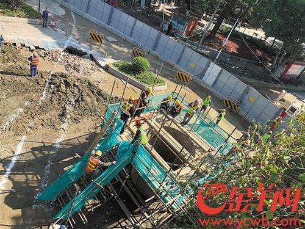

12月18日、広州地下鉄集団宣伝部門のスタッフより、救助案を基づき、地下の固定工事が終わり次第、捜査作業を再度進めたいと言われました。  
  
2019年12月1日9時28分、広州大道北与禺東西路の交差点、地下鉄11号線の作業地域で、地面の崩落が発生し、通過した清掃車1台、及び、スクーター1台は転落し、計3人の被害者が出ていました。  
  
同スタッフは、7日、 広東TVニュースチャンネルより、詳しい救助案は既に公開しており、多くの人員と設備を投入し、初期段階での転落車両の位置確認済みの状況の変わりがありません。  
  
原文： [广州地铁施工区域地陷事故发生已过17天，对3名被困人员的搜寻工作仍在继续](http://baijiahao.baidu.com/s?id=1653237431364140034&wfr=spider&for=pc)  
翻訳：[中国を読み解く](https://blog.loveapple.cn)
