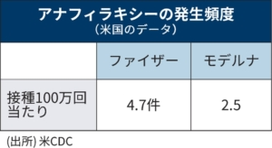
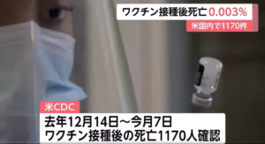
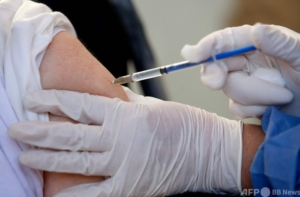
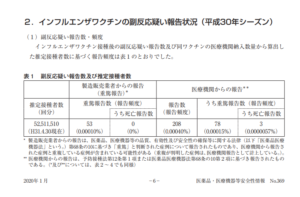

新型コロナ退治の勝負はワクチンであると言われています。ワクチンは有効だけで意味がなく、安全性も重要な評価ポイントである。英米メーカから、mRNAの最新技術で開発された新薬が有効性が高くて目立ちます。但し、命に係わる副作用を見る観点から、有効性も安全性も両立した不活化ワクチンも選択肢として、あるべきではないかと思います。

ファイザー社、モデルナ社制、mRNA新型コロナワクチンを接種して、殆どの人は副作用が出るので、当たり前ようなこととなっています。接種した人の体験でも、痛みとか疲労感など言われてます。これらの軽い副作用より、命に係わる重い副作用はどうなってるのか❓皆さんは僕と同じく気になるでしょう。日経新聞の記事、「[ワクチン副作用は？　ファイザー・モデルナ製の注意点](https://www.nikkei.com/article/DGXZQOUC218R30R20C21A5000000/)」から、100万回当たり、ファイザー：4.7件、モデルナ：2.5件と報道されてます。

こちら、「[アナフィラキシー](https://allergy72.jp/anaphylaxis/what.html#:~:text=%E3%82%A2%E3%83%8A%E3%83%95%E3%82%A3%E3%83%A9%E3%82%AD%E3%82%B7%E3%83%BC%E3%81%AF%E3%80%81%E7%99%BA%E7%97%87%E5%BE%8C%E3%80%81%E6%A5%B5%E3%82%81%E3%81%A6,%E3%81%AB%E3%81%82%E3%82%89%E3%82%8F%E3%82%8C%E3%82%8B%E3%82%A2%E3%83%AC%E3%83%AB%E3%82%AE%E3%83%BC%E7%97%87%E7%8A%B6%E3%81%A7%E3%81%99%E3%80%82)」とは、命に係わる副作用の事です。医療従事者ではなく、一般ユーザ向けの文書で、何故、こんな分かりにくい表現を使うのか、意味分からないと思う人は僕だけでしょうか❓わかりません。この記事の内容では、仮に、日本中1億人、ファイザー社制ワクチンを接種したとして、1人当たり2回の接種ですから、2億万回の比率では、5000～10000人は死ぬかもしれない。現時点、新型コロナの死者は12000人超え、数字から見ると、ほぼ変わらなさそうだ。よいか❓ 下図は2021年2、3月頃の報道です。当時、米各メーカの新型コロナワクチンによる死亡は0.003%でした。 因みに、この数字は、重い副作用による起こした障害が含まれてません。 しかも、長期的な後遺症について、全く言及しません。まだ、時期が短く、どんな後遺症があるか、誰も知らないからです。だって、通常のワクチンの研究開発期間は十年以上経つもんだから、新型コロナワクチンのリスクが通常のワクチンと桁違いの存在である。

**不活化ワクチンが欲しい！**

政治的相互信頼がない中国から生産した不活化ワクチンは日本で接種できないが、世界中で普及しています。副作用はどうなるか❓[鍾南山](https://ja.wikipedia.org/wiki/%E9%8D%BE%E5%8D%97%E5%B1%B1)氏曰く、インフルワクチンとほぼ同じである。勿論有効性も評価され、大規模接種した地域では、周りから比べると、一番、パンデミックを抑えたようだ。

中国メーカのワクチンの予防接種した体験者は、殆ど、軽い症状もなく、無感と言ってました。そして、今まで、中国国内接種数は4億超え、中国以外にも5～6億輸出して、今まで、直接による死亡者、又は、重い副作用の報道は基本、見当たりません。

仮に、インフルエンザワクチン並みの副作用と仮定して、[厚生労働省から、平成30年シーズンの統計数字による](https://www.mhlw.go.jp/content/11120000/000583992.pdf)と、5千万超えの接種のなか、死亡が3件、重症が131人だそうです。 中国シノファーム社製のワクチンの副作用はこの程度と考えてよいのでしょうか❓実績はこれより、かなり低いようです。

不活化ワクチンは成熟した古い技術で開発されたもので、米メーカのmRNA技術より安全性が高いと間違いありません。どこのメーカは別として、医学、科学的な観点から、不活化ワクチンの選択肢を増やしてほしいと思っています。

東京五輪のために、新型コロナの対策はいまいちでやってきたが、体に入れるもんですから、これからの新型コロナワクチンについて、政府側が責任を持って、科学的な対応でお願いしたいです。

補足： 2021/6/10までの報道では、現在、日本国内の接種数は2千万超えたところ、[接種後に死亡した人数が190人超え](https://news.tbs.co.jp/newseye/tbs_newseye4288754.html)ました。中国製ワクチン、国内の接種数8.25憶、国外へ輸出した分を含めて、10億を超えた実績の中、ワクチンと直結するような死亡件数は、1件も報告されてない。中国製ワクチンは世界各地で、安全性と試験より高い効果の実績を示してる。 [台湾が勿論](https://news.yahoo.co.jp/articles/72e88893feac458210dd79190c2454f4760a173e)、選択肢があれば、大金をかけても、中国製ワクチンを接種する報道は日本でもちらほら見てます。[台湾にいる邦人も、AZワクチンを見たら、中国製を打ちたい](https://news.yahoo.co.jp/articles/f3ac6b16410a39f89683fddf8dc077388bf64135)と言ってるようだ。
