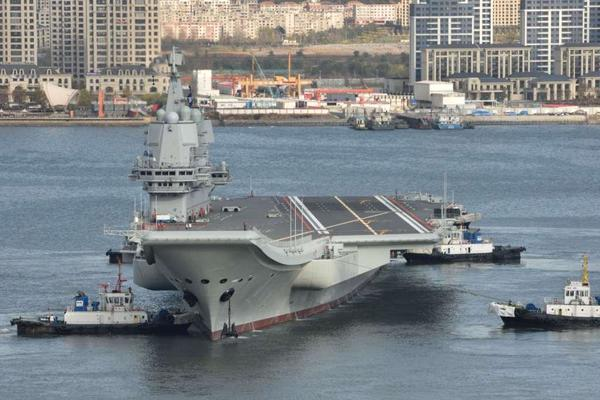

中国を読み解くさんは個人のブログで、世界中あっちこっちで情報収集する事は出来なく、マスコミ、ネットから入手した情報をまとめて、分析するのが基本的な方法です。表題の結論を得たのがこの「[中国人民解放軍が限界露呈](https://jbpress.ismedia.jp/articles/-/58607)」からです。

<figure>

<figcaption>

大連港を出港する中国初の国産空母「001A」（2019年11月14日、写真：Imaginechina/アフロ）

</figcaption>

</figure>

日本の自称リベラルと香港粥たちは、米中新冷戦を唱えています。冷戦とは、実際に大規模な戦闘行為を起こさず、双方で軍拡競争を行いながら相手に対して優位な地位に立とうとし、それにより経済的に疲弊した状態に持ち込むことで、長期的な観点から相手が自壊していくことで最終的に勝利することです。  
米ソ冷戦では、ソ連は軍拡競争で、インフラなどに投資はできず、民間の経済がダメになって、崩壊になりました。但し、軍事力は、一時的にアメリカより上回っていた。

例の記事の中に、国防予算の記述があった。「 米国の国防予算は近年、年間7000億ドルを超えている。一方、中国の国防予算は通常約2500億ドルである。」これが面白ない内容だ。

2017年度から、中国の実質ＧＤＰは、約アメリカの三分の二まで成長してきた。これからはアメリカ上にどんどん成長していくでしょう。(元情報：[世界経済のネタ帳](https://ecodb.net/))  
国防予算は大体ＧＤＰの割合からみて、合理的かどうかを判定するならば、中国は4600億ドル以上にすることはアメリカに匹敵するでしょう。中国は今の予算で、軍備を維持できるのであれば、このままでいくと、アメリカはソ連の歩む道を繰り返して、冷戦に失敗してしまうのでしょう。

2020年は、世界情勢の極変の一年で、今の所何の結論も出せませんが、中国は今の予算で、４基の空母艦隊も維持できるのであれば、新冷戦の優位に立ているかと思います。
