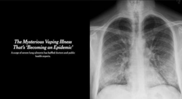
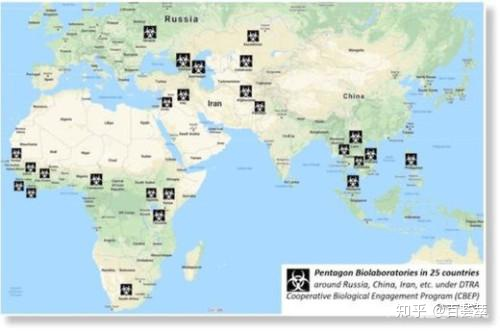
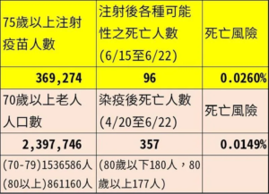
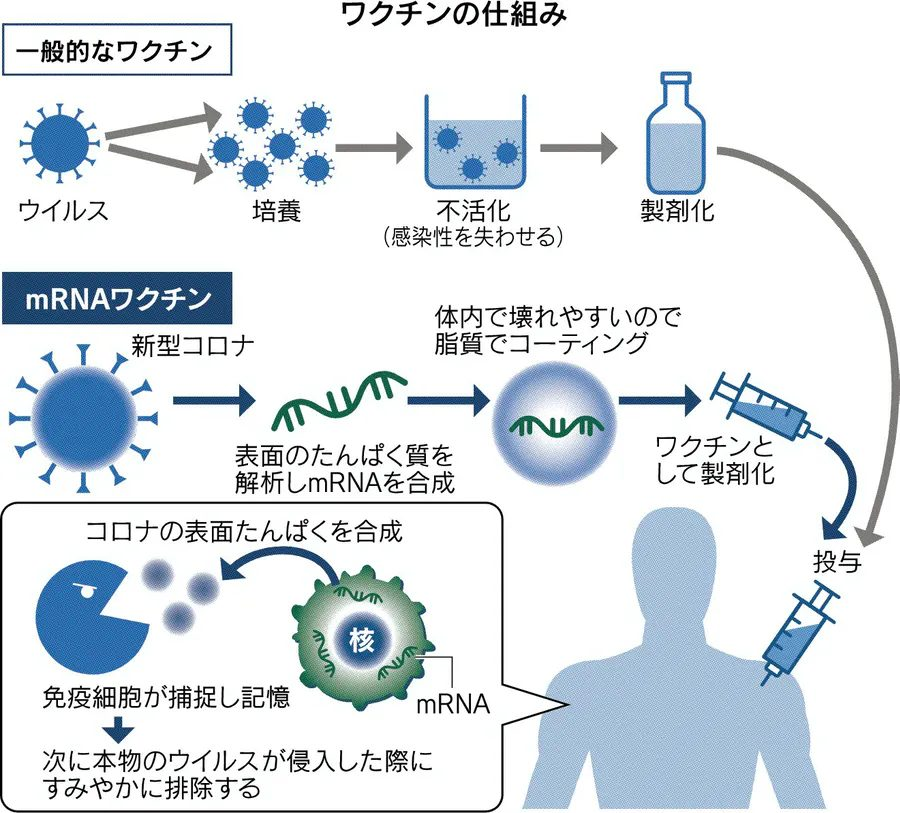

ケンブリッジ大学の研究結果からですが、新型コロナ罹患者の内、中国系(東亜人種)の死亡率は他の種族より、74.3%高いと結果があります。  
URLが長いので、元情報のリンクを以下に設定しておきました。ご確認ください。  
[情報源ページのリンク](https://www.cambridge.org/core/journals/canadian-journal-of-neurological-sciences/article/covid19-and-its-cardiac-and-neurological-complications-among-ontario-visible-minorities/428DC25E1C726D417220EE8AF14C37EC)  
[PDFファイルのDLリンク](https://www.cambridge.org/core/services/aop-cambridge-core/content/view/428DC25E1C726D417220EE8AF14C37EC/S0317167121001487a.pdf/covid-19-and-its-cardiac-and-neurological-complications-among-ontario-visible-minorities.pdf)

新型コロナは初めて命名された経緯は武漢からですが、  
実には同年、米メリーランド州で発見した「[電子タバコ肺炎](http://japanese.cri.cn/20200513/f533feae-7f58-5a0b-4ec4-edfd6a5b163d.html)」と言われたもの、後々、その肺炎は電子タバコと関係ないと正式に否定された事と、患者の症状は新型コロナと同様であるから、新型コロナはフ[ォート・デトリック試験室から開発されたものではないかと、中国当局は米国の説明を求めてる。](http://j.people.com.cn/n3/2021/0603/c94474-9857402.html)  
こちらは陰謀論ではなく、同試験室は、[旧日本軍のバイオ武器を開発していた731部隊](http://j.people.com.cn/n3/2021/0605/c94474-9857988.html)との取引の背景と、前述の電子タバコ肺炎と言われたもの、科学的な調査と情報の開示を求めていることです。

ケンブリッジ大学の研究結果からも、何故メリーランド州からかも見えてきたかと思われます。米原住民のDNAは東亜人種と近いからです。勿論、新型コロナの成果までに至るには長年の研究開発、DNAデータの収集は欠かせません。米国は中露の周辺で大量な生物武器を研究する試験室を持ってます。下図は米国のバイオ武器研究所の所在位置を示すものです。

陰謀論❓と思われがち内容で、無実だと否定することは簡単です。中国の武漢ウイルス研究所と同様、米国はフォート・デトリック試験室等、国連の専門家に調査してもらえば、疑惑が晴らします。何故、米国は自国のウイルス研究の情報を隠して、一方的に武漢ウイルス研究所の研究データを求むのか❓  
武漢にあったパンデミックの中国人の感染情報を手にしたいからです。それはどうしても無理で、最近は静かになった替りに、中国人のDNAと近い、アジアの日本や、台湾の人を使った試験は始まったでしょう。

特に台湾、中国人ですから感染を広げて、日本経由、AZワクチンというWHO未承認のワクチンで、本来はいきなり接種すべきでない、老人、妊婦、授乳中の女性から打ち始めました。ちょっと古いデータですが、[日本からのワクチンを接種した場合、コロナより高い死亡率を示した](https://t.co/9I3GJA8HyM?amp=1)。  
台湾の場合は、ブラックウォーター社の新種ワクチンの人体試験もあります。人体試験というものは、日本のAZに留まりません。[授乳期間中の女性は日本からのAZワクチンを接種して、子供に母乳を与えて、翌日、子供が亡くなった事件も想像もつかない事件がありました](https://news.ebc.net.tw/news/society/266592)。

それでは、何で日本も試験対象に❓  
まず、何で日本は米国や、インドのように大規模なPCR検査をしないか❓もう一回考えてみてください。  
日本、日本人は世の中の特別な存在、又は、特別に賢明じゃないと、認識してください。むしろ、国としては短見しがちで、過ちを犯しやすい愚かな国である事、受け止めた方がよい。  
大規模PCR検査で、医療の荒し、経済への打撃、誰も分かります。何故、お金をかけて、大規模PCR検査をやるかと、全員のワクチン接種の下準備であることです。

**ワクチンとはウイルスを殺す薬ではありません。**  
ワクチンは人の免疫機能にウイルスの特徴を覚えて貰う低い毒性を持つウイルスの一種である。  
健康な人に接種するのは当たり前ですから、接種する前に、誰が感染したか否か、明らかにしなくてはならない。こちらは通常なプロセスです。

日本のやり方は、PCR検査をせずに、感染者と健康な人、全ての人に対して、ワクチンの接種しようとしています。既に感染してる人はワクチンを打ったらどうなるか❓

特に何もない？死ぬ？分かりません。特に実績の少ないmRNAワクチンの研究開発では、大量な人体試験のデータと実績を重ねていく必要があります。まさに、日本は、人体試験の大型試験場になっています。

こちらは感染病、ワクチンについての常識の復唱というか、当たり前なことしかいってないので、日本政府のTOP、専門家たちは勿論私以上知っているわけです。  
何故皆は黙ってるか❓  
政治利権のボース、米国を怒らせると、医者はそのまま失格とやられるからです。

本当か？と思ったら、もう一回、ダイヤモンド・プリンセスの日本の対応を思い出してみてください。  
・感染者と健康者を一つの密閉空間で感染させる  
・降りた後、街でそのまま解散して、東京でウイルスを広げる  
・船の中の感染対策に指摘した感染病専門家は批判を浴び、日本語で状況を公表できなく、医師資格さえも危なかったようだ

新型コロナのパンデミックの中、何かしらの目的でデマを流してる医療従事者は多いが、事実を語る場合、「中国」などのキーワードを避けるとか、特に注意を払ってるような印象を見受けます。勿論、公的な場じゃなくて、個人的に直接対面したお医者さんは普通にしゃべります。

思い出して、振返ってみれば、突然に表れたパンデミックは、全て偶然ではないと気付くだろう。勿論、米国から見る日本は下等人種の中でも、高い方ですから、日本より下等な台湾がもっと悲惨な環境で苦しんでいるでしょう。

新型コロナのパンデミックは、中国人向けのバイオ戦争です。  
但し、中国共産党当局は全力で自国民を守って、世界唯一の安定な地域で、経済の高成長を維持してます。  
米国は中国へ直接手が届かない結果、かわりに、日本や台湾、そして東南アジアはバイオ武器のターゲットにするでしょう。

前述、ケンブリッジ大学の結果は、デルタ株が含まれないので、インドという大型培養皿から育てた変異株はどこまで威力あるか、東京五輪、東南アジアへの展開などで、これからデータの収集などの結果を待つしかない。  
新型コロナのバイオ武器説は、正式に事実が明らかになるのも時間がかかるか、永遠に不明かもしれない。今までの状況、証拠からは、米国ウイルス研究所からのものの可能性が依然として高い。
