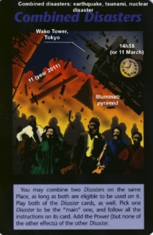
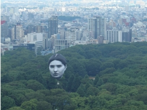

2020年3月、中国から新型コロナパンデミックの時期、「[イルミナティカードの予言が本当になったら、東京オリンピック時にどんな災難があり得るのでしょうか。](https://blog.loveapple.cn/news/202003144782.html)」で東京五輪の予言の内容をまとめてみましたので、振返ってみて、そして、近い未来を更に予言してみようと思います。 (尚、以下の内容は不快感を与える恐れがあるため、ご了承下さい。ホラー小説の気持ちでご覧になって下さい。)

まず、当時まとめた内容： 1．新型コロナの再来？ 2．戦争？ 3．地震 4．中止の可能性

1年後の今も収まらなく、7月末から、あまりPCR検査を抑えめでも、東京だけの感染者、1日5千人程上っただけでなく、ワクチンの普及したイスラエル、英米等も、新たな感染拡大になり、「1」の予想通りでしょう。 中止しなかったが、延期とは、当時あり得ない様な事ですし、いまだに即時中止の声が多い。「4」がちょっと外れだけど、良かったと言えるかな？

「2」の戦争について、五輪最中で日本周辺で起こってないが、いくつかの兆候が表してるので、緊急予告❓したいと思います。

1. 中国持ちの米国債、8月期限の割合がかなり多いようだ。
2. 2022年のスケジュールで、[石垣島にミサイル、電子戦基地の配備](https://www.yomiuri.co.jp/politics/20210802-OYT1T50230/)。 中国の台湾統一は日米の準備万端を待つことがまずないでしょう。
3. 中印国境、インドから改めて緊張感を高めてる。
4. 日英米の軍事演習訓練で、台湾がまた、興奮になってるようだ。
5. 2019年から、中国は連続してきた軍事演習等、米軍の偵察機との電子戦などで、 台湾なしでも、南シナ海制御、各海路の封鎖は確実。米軍主導の侵入、備えている。
6. [中国は南シナ海で軍事演習といって、既にバシー海峡を含めて10万平方キロメートルを封鎖中](https://news.tbs.co.jp/newseye/tbs_newseye4331143.html)。 日米の警告でもあるか、必要だと判断したら、一瞬で台湾を奪還するでしょう。
7. [インドのアビギャ・アナンド君、今年9-10月程、大事が起こると予言](https://www.54-luck.com/view/236)。 都市伝説のようなことで推測の要素として入れませんが、同氏、コロナの予言ほぼ当たったから、参考程というか、実状況も大事が起こる傾向と見受けてます。

誤解しないで欲しいところは、こちらは戦争を望むことではありません。我々の生活に関わる近い未来を予測してみたいだけです。そして、東京五輪も「死」のメッセージを多く暗示しており、潜在意識から、多くの人は命を落とすことを予言してるかと思われます。

 「3」の地震について、確かに地震が起こってない、起こらないでしょうが、東京五輪は世界を呪ってるのではないかといった視点で展開してみたい。

ホラー漫画のものをそのまま再現して、悪霊を招くのでしょうか❓

抑々、沢山の霊が東京の上空に浮かぶことを表すのでしょうか❓

芸術、アートとは人の潜在意識と繋がるものですので、これを見って、美しい、モチベーションアップ等、ポジティブな印象を受ける人が少ないかもしれません。

これは強引❓かもしれません。

霊を招くような開幕式について、批判も多く、こちらはさらに解釈しないが、選手に使わせる段ボールベッドは何でしょう❓

段ボールだからエコーでしょうか❓比較的に大きな体ではない中国選手も、約１、２週間でボロボロになる報告もありました。仕方なく、床にマットレスを引いて寝る人は多いです。

また、紙製のものは、日本や、中国等、東亜文化では、死んだ故人のために使わせる習慣はあるとご存知でしょう。元々、悪意がないかもしれないが、紙のベッドを選手に使わせる事は、呪いの暗示では❓という潜在意識が現れたのではないかと見受けてます。

五輪はポジティブなイメージを世界に伝わりたいのが一般ですが、今回の東京五輪では、中々、暗雲が多いかと見受けています。

あまり話がまとまらなくてすみませんが、東京五輪について、イルミナティカードのことを言わなくても、何かしらの災害を暗示するような、ネガティブなイメージが多いです。

開催の前から、不祥事が多く報道されて、偶然な事件とはいえ、関係者全員の潜在意識が色んな形で表に表すものだと見受けます。五輪の暗雲かもが、国運を賭ける日本の運命でもあるでしょう。

以上です。
