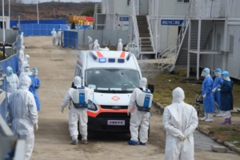

中国はどんな社会か？独裁？自由ない？監視される？ 本当は、格差あるが、比較的に社会の階層が固まらず、貧乏人も、安定な生活をおくれるところです。 新型コロナ対策を通じで、本当の中国、もしくは、中国政府当局の目指す社会を説明していきたいと思います。

新型コロナ対策は、大量な資金を含めて、政府は膨大なリソースをかけて、本気で対応しなくてはならない所から、中国の政策、どんな社会か、日欧米の資本主義の国とのような違いあるか、理解していこう。

**コロナ禍の特徴を理解しよう**

コロナって、どのような人は一番危険でしょうか？ まず、外出が危険と知りながらも、稼ぎに行かなくては生活できない、低収入の人達です。 収入低い仕事は、小売りの売り場、工場、工事現場等、人と接する機会多い職種に集中します。 例えば、「[年収が低い会社ランキング2020](https://diamond.jp/articles/-/248457?page=2)」記事から、トスネット社の仕事内容から、警備、清掃等、現場へ行かないとできない仕事が殆どです。勿論、元々、付加価値の低い仕事ですから、給料が安いって同社の業務形態に文句するつもりないが、コロナ禍の中、一番危険な人、どんな層か、大体イメージが付くでしょう。

逆に、お金持ちは、外出しなくても余裕あるから、安全に生活をおくれるでしょう。サラリーマン等、PC上の作業が中心の業者、例えば、ソフトウェア開発関係、収入が中間、又は以上の人達、仕事をするとしても、外出する機会が基本少ない。筆者本人も、2020年の4月頃から、1年半ほどの間、出勤の回数が指で数えるぐらいです。

**徹底としたコロナ対策の中国政府の狙い**

新型コロナは初めて見たウイルスであり、中国当局の地方首長も、一般の人も、何も知らないかった状態です。新種ウイルスの危険性を知り始めた時から、迅速に対応し続けたわけです。中国国内では湖北、武漢政府は批判を浴びたとしても、あくまで中国基準ですから、日欧米各国の対応と比べて、かなり責任感強い対応だったかを思います。 日本では、後講釈の言い方が多く、馬鹿馬鹿しい評論が殆どです。要は、ほぼ防疫しない、隠蔽体制の日本の立場から中国を批判する資格がない。

武漢から、全国の多くの都市はロックダウンになり、2ヶ月程、中国全体の経済が停滞してい状態でした。

独裁だ、自由ない等、海外から、色々批判があったが、結局、中国政府は誰を守ったか？気づくのでしょうか。 そうです。貧困層や、低収入層の健康を中心に守ってきたわけです。 サービス業を始め、全ての業者に影響を及ぼしたわけ。その後の中小零細企業に向けて、減税等の策を打ったが、最初の無償の支援などを含めて、一番損したのは、大手、国有企業だったそうです。

**まとめ**

何故、世界中、中国だけコロナ対策は徹底的にできるのか？ 大手、財閥の利権より、貧困層の安定とした生活を重視するからです。 多数の国民の利益を最優先にし、財閥に左右されない、こちらは、社会主義の中国と資本主義の日欧米と根本的に違う所です。

財閥に左右されないからこそ、利益がなくても、貧困撲滅、人口の少ない地方のインフラ投資等、貧困層を含めた国民の安定な生活に、思う通りにリソースを投入できる政府となっています。

因みに、米国の方は比較的に見えやすいのでしょうが、[コロナ禍で物価高騰が維持し続けて](https://www.ceicdata.com/ja/indicator/united-states/consumer-price-index-cpi-growth)、失業者、ホームレスは各州で爆発的に増え続けている中、大手企業は皆、大儲けしてる。株式変動から米国経済はかなり良い景気に見える反面、一般人の生活はどんどん苦しくなっている。
