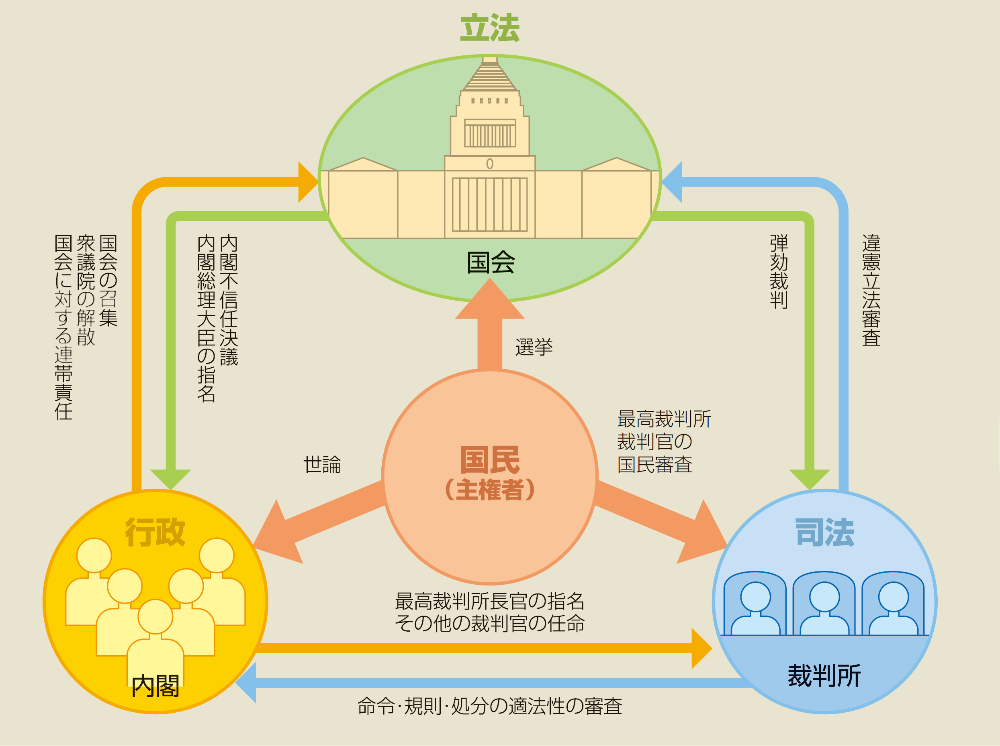
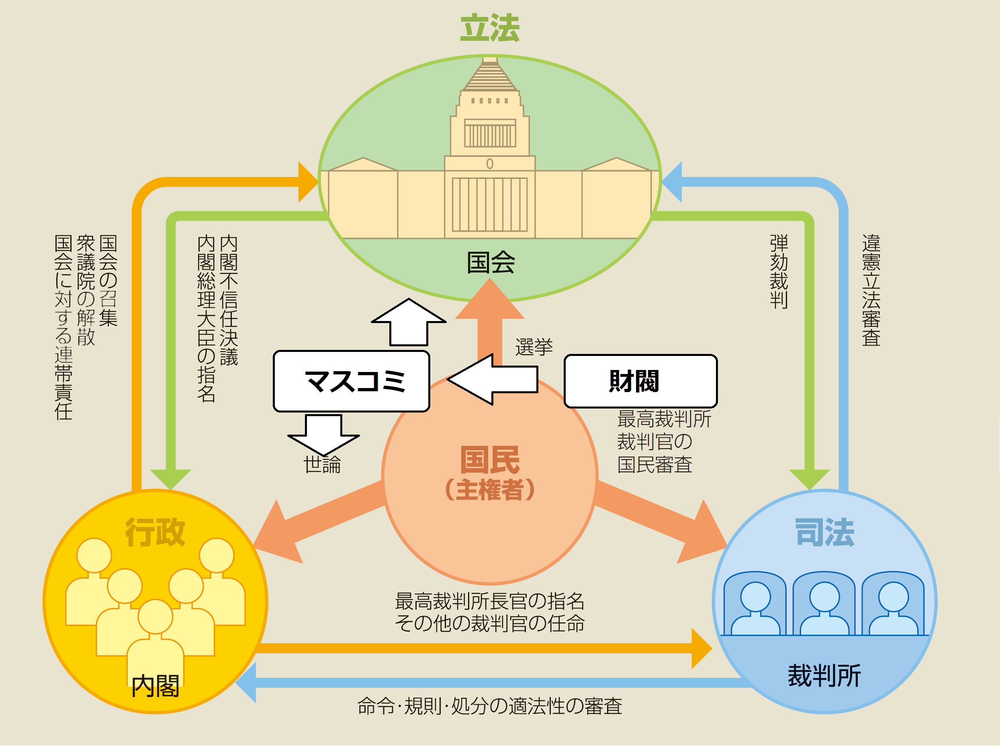
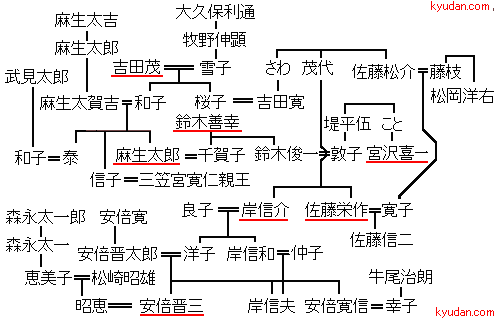
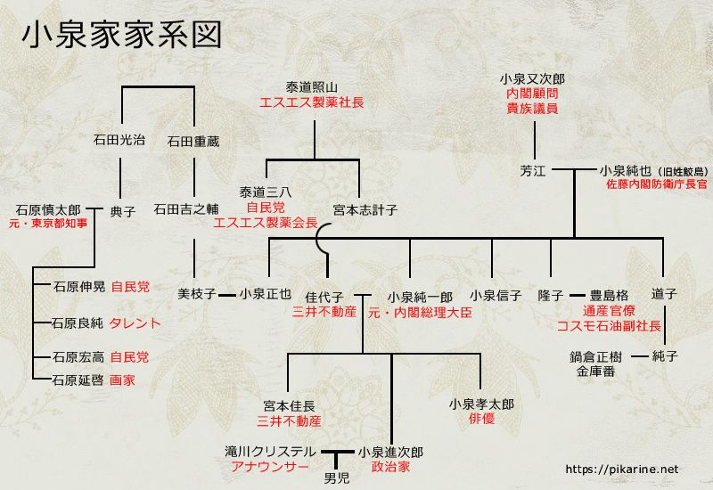
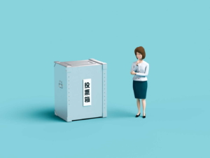
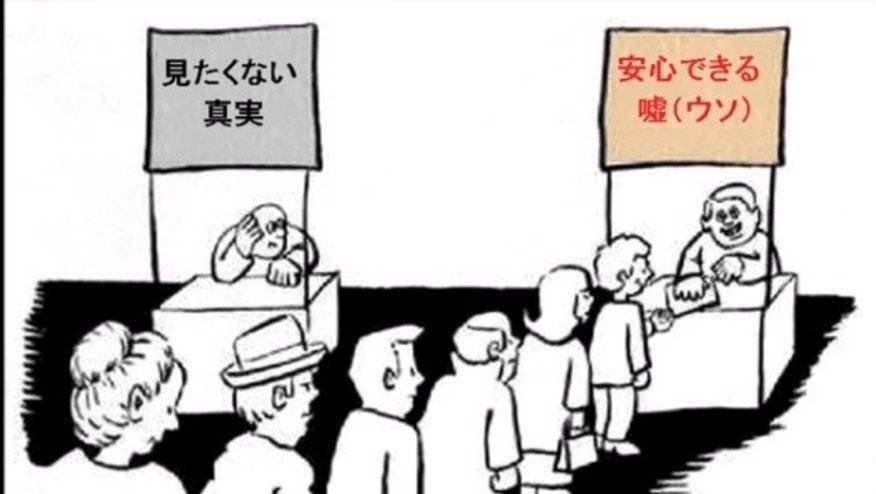

「民主」制度と言えば、国民は望ましい政権を選ぶ手段として、選挙制度は必ずセットするものです。  
選挙は本当に国民左右されるものか？現実は違うかもしれないと、国民の意識ではなく、財閥等の資本にコントロールされる本質の所まで触ってみたいと思います。

衆議院のページから、[三権分立](https://www.shugiin.go.jp/internet/itdb_annai.nsf/html/statics/kokkai/kokkai_sankenbunritsu.htm)の記載を引用します。

> 日本国憲法は、国会、内閣、裁判所の三つの独立した機関が相互に抑制し合い、バランスを保つことにより、権力の濫用を防ぎ、国民の権利と自由を保障する「三権分立」の原則を定めています。

選挙で、立法、行政、司法の三権を制する、非常に理想な構図です。

但し、気づく人もいるでしょうが、欠陥として、**国民の大多数は、政治、外交などの事、全く知らない素人である**。

経営者なら税制周り、技術者ならその専門技術等、得意分野に詳しいですが、国とした戦略の策定、国家関係の外交など、そして選ぶ人はどんな人柄なのか、普段の生活と直結しないことについて、どうやって分かるのでしょうか？

近年はネットから情報収集する人は増えるが、基本、テレビ、新聞紙などのマスコミから知らない情報を収集するでしょう。但し、日本のマスコミとは、殆ど、政府と直結しないとはいえ、裏側に何かしらの財閥はついてるので、上の関係図を修正して以下になります。

まとめると、**表向けに三権は国民が監視してるが、事実は、財閥のマスコミはコントロールしているわけである**。

#### **嘘！僕は自らの意識で(?？？)**

殆どの日本国民は僕の意識で投票したから、民主だと思い込んでいる。勿論、民主と言えば民主でしょうが、マスコミは役割を上手く果たす結果でもある。  
揉める前に、日本政界で活躍する安倍氏、小泉氏の家系図を見てみよう。  
例えば、2021年の今、もし次の首相は誰か❓と言ったら、安倍晋三と思い付く人は多いでしょうか。勿論、岸信夫や、石破と思い付く人もいるかもしません。基本、自民党の誰かになると間違いないでしょう。

意外と選択肢がないと気づくのでしょうか❓  
何にせよ、まず、疑問を持つことは大事です。

 

#### **民主制度であるこそ、コントロールしやすい訳**

人種、民族と関係なく、人間の7割の大多数は愚か者である。この多数の愚か者を動かせば、選挙結果をコントロールできることは、民主制度の基本的なやり方である。

選挙で当選するために、必ず国の内政、外交に精通の専門家である必要はなく、マスコミで世論をコントロールできればよい。勿論、マスコミを握るのは政府ではなく、大金持ちの財閥です。  
偶に、ヤクザネタの映画などで、ヤクザも政界も裏側のボースは財閥だという話は、こちらの事を指してるでしょう。

日本に限った事ではなく、世界中の民主国家は共通のものです。例えば、国民からの普通選挙で大統領まで選挙するフランス、最も理想な民主国家と近い国であるこそ、財閥による制御するマスコミで選挙をコントロールするのは基本的なものになります。

日本は政治家族経由ですから、定期的に選挙があるとしても、基本、自民党内部から首相を選出します。

この民主制度の仕組みにより、いざとなる時、行政権を握る側の政府として、国民より、財閥の利益は最優先になります。本当の顧客は国民ではなく財閥だからです。

特にコロナ禍の今、危急存亡に関わる時期こそ、分かりやすいでしょう。  
こちらの記事「[新型コロナの対策から、中国と日欧米の社会の違いを理解する](https://blog.loveapple.cn/politics/202108167219.html)」何故、日欧米の民主国家は財閥にコントロールされるかの所、深く言及しなかった部分、本文の内容となります。  
財閥利権優先のため、クルーズ船が横浜に寄港した時、[感染病専門家の衝撃告発](https://www.businessinsider.jp/post-207913)と分かるが、同氏の岩田先生は日本語で船内の無策な酷い対応状況を語れません。批判を浴びて医師の資格まで危なかったそうだ。  
1年半を経て、未だに科学的にコロナの対策はできずに、感染状況も誰も把握できず、製薬業者の利益のために、ワクチンを打てと謳いながら、[救えるはずの軽症感染者は自宅で放置されて、ばたばた倒れて死んでいく](https://twitter.com/tbs_news/status/1427106916036079617?s=20)。  
何故だろうか❓国民は、政府にとって、優先度低いからです。

#### 

勿論、人は信じたい事しか信じませんので、こちらの記事の内容を信じてもらうつもりもない。この社会の真実を知りたい人、自らと家族を守りたい人向けの内容です。

資本主義、民主、そして、選挙制度について、こちらの情報を知った上、観測してみれば、新たな発見はできるかもしれません。  
民主制度は、選挙人の意識で動くのではなく、財閥はマスコミで多数の選挙人を動かし、選挙結果を制御します。  
こちらも、安倍家の家臣、菅首相は、コロナ対応で政府観点の決断が難しくて、財閥の言われた通りしかできない。結局、前述の、大勢な人は感染され、家でバタバタ倒れていく状況である。

最後に、関連しますが、ちょっと話が変わって、  
↓こちら、日本社会の特急階級の内容についてのムービは見た人が多いと思います。  
但し、この特急階級はどうやってやるのか？の部分、当記事の内容に当たると思います。  
この動画を借用して、以上とします。

https://twitter.com/fxi9ttSrGrL5Hnx/status/1200720980676505600?s=20&t=k2B9YLlSRoXAGaEf6f5rlA

#### 最後の補足：資本主義の本質を分かった時の自己防衛策は？

私の庶民立場の自己防衛策として：

1．政府に言われた通りで動く前に、疑問する、考える  
　⇒何で言われたのかいきなり言われた通りに動くのではなく、  
　　行動に移す前に、何故と考える習慣を身に着ける事  
2．自分の利益大優先と考えてください。  
　⇒他人を損害して利己主義ではなく、自らの利益が組織の利益とマッチするかどうか、  
　　知った上の言動と言ってます。自らの利益、価値観と衝突がある場合、  
　　犠牲する価値があるかどうか、考えた上の言動を取る事です。  
3．海外の拠点を増やす　  
　⇒凡人は世界を変えられないので、逃げる手段はあります。  
　　自分と家族を守るために、恥ずかしくないです。  
　　実は、中国や、東南アジアへ逃げて、安泰な生活を送る日本人も多いです。

**※**誤解して欲しくないことは、日本だけダメだという事ではなく、資本主義であろう、社会主義であろう、国、政治というものの本質が変わりません。日本だから、特別に恵まれる事もありません。  
英語、中国語等を一つ以上の外国語を覚えて、情報難民から脱出し、自らの力で、選択肢を増やす事が確実です。

まとめとして、ヘイトを煽る奴、君は戦ってくれるだろうと犠牲してもらう奴など、基本あやしい。相手は天皇であろう、総理大臣であろう、関係なく、自らは何をすべきか、よく考えてください。
