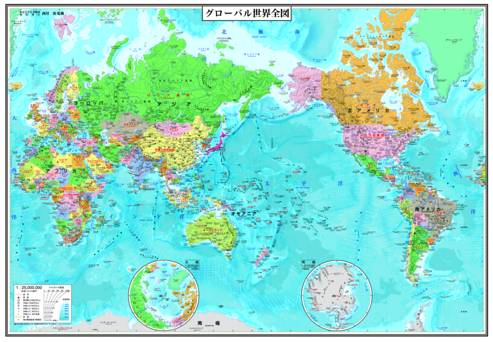

香港は一国二制下であるので、**中国**政府は**直接干渉するべきではない**。

制度云々を除いて、何故か中国は香港の騒乱に手を出さなく、やり放題を放置するのでしょうか。  
改めて世界地図を添付します。

今の中国は、一帯一路で、欧亜大陸のマーケット、生産地を繋げるのが最優先と言えるでしょう。  
海上通路の中心は南シナ海を制する事で、香港は南シナ海の広範囲の中では、本当に小さすぎるのです。

アメリカは中国の発展の足を引っ張る事は定常であるので、香港にアメリカの戦略リソースを消耗させる方は都合がいいのです。  
もし、香港はほかの都市と同じように、疑問なく共産党政府を支持するとしたら、アメリカは別の切口を見つけようとするでしょう。

例えば、内陸の都市から騒乱の切口を開けたら、香港より大分ひどくなるでしょう。  
ですから、台湾もそうです、制御できる範疇内では、アメリカのリソースを消耗でき、現段階では、統一より、離れた方が都合がよいです。
