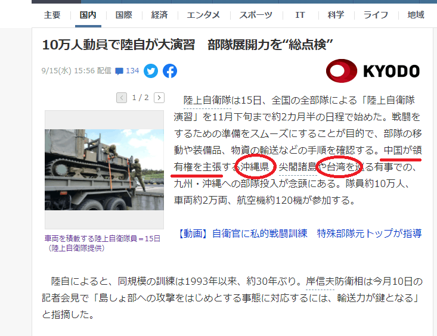
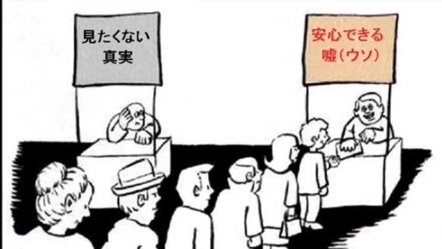

何だ？嘘だろうと思うタイトルだが、民主国家だから、平和という勘違いをまずしないで欲しい。 貴方ご自身、賢明だと思い込む前に、冷静に考えてほしいです。

勿論、国民殆どの人は平和を望んでるが、長年のマスコミ洗脳で、国民の思う平和のイメージを歪め、本当の平和と離れていきます。

米国を始め、欧米豪の軍人はアフリカ、中東で戦争を興して、現地住民を虐殺してます。日本軍国時代の侵略も、ドイツのナチズムの侵略も、他民族の虐殺、ジェノサイドも、民主制度の下で動かすものである。 日本は、もう軍国時代じゃなくて、憲法9条もあるから戦争しないという事は(❓)まずありません。少なくとも、戦前、戦争を興した政治家族の勢力は今まで残っているわけ。

「邦人救出」の言訳でアフガンへ武器を持つ軍隊(自衛隊)の派遣は既に憲法9条を崩してるのに、誰も疑問しない。戦争を興そうとするとき、在日米軍司令官の了承次第であり、憲法と関係ありません。

**日本では戦争のための洗脳は既に進行中**

嘘に見えても、実に進行して、国民全員バカされてる日々である。 実例として、下記のニュースを見てください。「[10万人動員で陸自が大演習　部隊展開力を”総点検”](https://news.yahoo.co.jp/articles/19531147bd20985a6d0a4331a743bad9f139f0f0)」 見た目上自衛隊演習ですが、中に「**沖縄**」と「**台湾**」の中国が**領有権**を主張がポイントである

**沖縄**について、中国はいつに主権を主張したか❓ 日本政府、右翼系の嘘である。このようなニュースを大量に流して、日本人国民は誰も気づかなければ、実在しない事でも、あると思い込めるようになると洗脳が成功です。このような洗脳文書は今後増えるでしょう。 誤った情報でも、潜在意識まで埋め込めれば、いざと戦争を興す時、スムーズに戦場へ送れます。

「**台湾**」が国では❓と思い込む日本人は多い。こちらも長年洗脳の結果である。 実は、日本は中国と建交の前提として、台湾が中国の一部である前提です。 「[日本国政府と中華人民共和国政府の共同声明](https://www.mofa.go.jp/mofaj/area/china/nc_seimei.html)」の中には、以下と明記しています。

> 三 中華人民共和国政府は、台湾が中華人民共和国の領土の不可分の一部であることを重ねて表明する。 日本国政府は、この中華人民共和国政府の立場を十分理解し、尊重し、ポツダム宣言第八項に基づく立場を堅持する。

洗脳されてる個人は多いので、台湾が国だと言論の自由と主張してもよいが、マスコミや、当局者は平気に吐き出すことは、自由と関係なく、日本という国の低劣さを見せてるだけです。

**洗脳は長年継続してるものである。** 

日本の政治家族は、再び中国大陸へ侵略する準備を長年で備えてる。 **1．中国崩壊論で日本は勝てるぞと呪文を繰り返す** 中国は急成長しているのに、何故、日本で中国崩壊論は流行るのか？中国崩壊を煽る目的は、日本は中国を勝てると、日本人に思い込ませることだ。 **2．中国が悪だと、隣国を虐めるというイメージ操作** 南シナ海で中国は東南アジア各国と紛争あるが、何故かと日本語で調べたら、基本、9段線と南シナ海判決の内容になります。 但し、**9段線**の前身、**11段線**、南シナ海判決は、国連と関係なく、フィリピンの自作自演の茶番劇まで、特に主流マスコミは触らない。 台湾海峡についても、台湾が国だと、台湾民進党の詐欺集団からの情報を盛り沢山持ってきた所までしか報じない。中国の内戦状態など、本当の経緯は全く触らない。 **3．第二次世界大戦の結果を言わず、誤解させる** 第二次世界大戦の結果とは、琉球王国の琉球諸島は米軍⇒日本の順で移管。中ソなど他の常任理事国の認めがないと、日本の領土か、まだまだ、言い難い所です。 日本降参し、南シナ海、台湾を中国へ返還し、南シナ海は**11段線**の領域となる。中国国民党政権を引き続いた共産党政権は、ベトナムの北側の各自の主張した紛争をやめ、**11段線**⇒**9段線**になりました。 **事実を教えないというか、態々隠すことは、また、国民を戦場へ送る準備として、中国ヘイトを煽ってる。**

実は、今の状態は第二次世界大戦前の状況と非常に似てます。日本のマスコミは海外からの脅威を煽って、国民を戦場へ送る準備の洗脳も変わりません。 過去の教訓と言えば、やられた後、やっとわかったより、事前にリアルを読めた状態がよいかと思って、この記事を書きました。

勿論、人は信じたい事しか信じませんので、こちらの記事の内容を信じてもらうつもりもない。この社会の真実を知りたい人、自らと家族を守りたい人向けの内容です。

民主国家だから洗脳がない❓思い込む人は多いので、このきっかけで、「[民主制度の選挙の本質：本当に選挙で政界を変えられるか？](https://blog.loveapple.cn/politics/202108207248.html)」と考え直しても良いのではないかと思います。

家族、ご自身の安全と豊かな生活を守る事が最優先であると、我々皆は平凡でから、特別に賢明ということがまずありません。 如何に、冷静に考えるかどうかは重要である。

**補足説明：最後に、何故日本人は戦争を遠慮すべき❓**

多くの日本人は戦争に罪悪感がなく、反戦より、反戦敗である。 今の日本の立場として、米国に反中で使われてるが、 実質には、前述の第二次世界大戦後のルールを破ることは、今の平和を壊して、国連常任理事国全員の敵になる。

中米は、中ソと同様、いつもの敵対関係ではない。 日本が捨てる必要ないと判断されたら、日本が再び滅国になります。また、戦争が起こったら、自衛隊、日本人はいきなり中国軍の軍人に直面するのではなくて、中国軍のドローン、ロボットとの戦いになります。虐殺になるかもしれません。

繰返すが、右寄りの人こそ、今の情勢を冷静に考えるべきでしょう。
