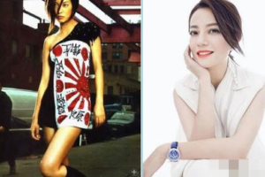

日本のマスコミはいつも通り「[中国女優、名前を一斉削除　趙薇さん「親日」が一因か](https://www.sankei.com/article/20210829-E5XCLYVJGFPA5PEU6KKJQ2CFH4/)」のピンポイントで誤解を招く記事で中国芸能界の大地震を報道してるが、本当は何が起こってるか、当記事で掘下げて展開していきたいと思います。

ぶっちゃけいうと、和平演変の一環として、日米台は、中国の金融、芸能界に嵌めたスパイの失敗である。 汚職の官吏を始め、金融、芸能まで、マネーロンダリングの一連の流れから、中米対立の背景から、スパイを抜き出す動きである。 勿論、これらのスパイは今から気づいたわけではなく、天安門事件の時代から、和平演変のために、嵌めている。芸能界に詳しい人は昔から異様だと感じる人はいるでしょうが、今回の件について、我々の一般人は見え始める事件として、2018年の香港騒動からでしょう。

**マネーロンダリングの流れ**

中国経済、2000年以降の発展は飛躍的に向上し始めた。高速な経済発展に伴って、江沢民時代から酷くなり始めた官吏の汚職も、強い勢いで大量な資金を集めてきた。大量な現金を手元に残しても現実的ではありません。

仮に100元の紙幣を1億元単位で手元に残ったらどのようなイメージか？右図は「人民的名義」ドラマは汚職の官吏は別荘に1億元を隠して、担当部署は捜査した時のシーンです。壁一面、ベッド、赤く映ってるあらゆる所は100元現金の紙幣が溢れる感じです。

個人や家族名義で銀行へ入金したらすぐばれてしまうので、初期は、知人など経由して、マカオのギャンブル場へ持っていき、ギャンブルをやって、お金を合法にするやり方があるが、ギャンブルって、必ず勝つと保障がないので、短期間内で、大量な金額を消費できる業界ーー芸能界へ移り始めました。

気づく人はいますが、習近平の汚職撲滅キャンペーンまで、中国の官吏の賄賂金額大きいです。地方によるが、農村部の村長レベルでも、1億円規模の汚職は珍しくない。通常の挨拶などでも、数十万以上のブランド品は普通である。

**マネーロンダリング＋芸能界**

マネーを洗浄したい官吏たちは映画、ドラマなどに投資、例えば2億元を投資して、最終的に、1億元戻っただけでも、合法な収入になるので、勝ちになる。但し、投資するから、成るべく儲かりたいわけです。海外でも有名な監督と、人気ある芸人は熱くなります。

人気あるような人を集めれば儲かるだろうという発想で、汚職で取得した資金をかなり煩雑な金融ルートを経由して芸能界へ回っていく。 勿論、芸人たちも自らの事が人気だから値上げして、ちょっと有名な芸人でも、数十億円単位の資産を抱えてると、日欧米では想像できないほどのものでしょう。

ここで、**海外でも有名な中国人監督の所**、和平演変につながるものになります。

ハリウッド等、米国の映画はCIA主導の心理戦の一環である。中国共産党政権を批判する作品であるほど、海外へ持っていくとき、奨を得やすい。中国の国営映画業者で中々上手く行かない若い監督たちは、態々農村部の過酷な環境や、中共を批判する体裁の作品で海外でも有名になってきた。

2000年以降、地方でも生活が豊かになって、単純な批判から、宮廷劇に変わりました。2010年頃まで、中国の大型宮廷劇が異常に多いと分かるはずです。 恐らく、中米貿易戦の2018年前後まで、これらの作品の影響を受け、反中共の人は、中国内でも多いではないかと思います。

**官＋金融＋芸能界のマネーロンダリング**

勿論、金関連の事は金融が欠かせません。 馬曇のアントから、政府と、芸能界は深くかかわり、マネーロンダリングは上手く回っていきます。去年末頃、「[アントの超大型ＩＰＯ中止](https://www.bloomberg.co.jp/news/articles/2020-11-06/QJBABHT1UM0X01)」から、中米対立の中、中国版のリーマンショックの退避であろうと推測したが、同氏と深く絡む趙薇さんの失脚から、それだけでないと気付くべきだろう。

[未成年者の性的な暴行で逮捕された元俳優呉亦凡](https://www.sankei.com/article/20210804-MEZCYAGLC5MRHCOCJN37FZQ4O4/)は、何を供出したか興味深い。確かな情報筋から、呉氏は未成年者の性的な暴行、覚醒剤の携帯、摂取等併せて、死刑に当たるだろう。 刑罰を軽くするために、関連の47人を供出したそうだ。リストまで得られないが、あまり才能のないのに、大人気の彼の資金チェーンまで、現れてきたでしょう。

話を戻って、「官＋金融＋芸能界のマネーロンダリング」とは何か。 1．賄賂などで得た不正所得、アントなどの金融機関を利用して、表に出せないカネを芸人の数沢山の会社に回す 2．作品などを制作して、興行収入はまた金融機関経由して各投資者に戻して、正当収入になる 3．汚職官吏の場合、香港の金融機関経由で、ケイマン諸島等、海外にある追跡し難い金融機関で、家族の会社へ振込

不正所得を消化する金融機関の裏には、必ず官が立つだから、アントと併せて、「[浙江省から汚職巡り2万5000人調査](https://www.nikkei.com/article/DGXZQOUB231BN0T20C21A8000000/)」もセットしたものになります。 法人税等、細かいやり方はこちらは割愛しますが、右図、還珠格格に出演した、范冰冰、林心如、趙薇のどなたも、可愛い顔の裏側に、100程の会社を持つ、膨大なグループである。范冰冰は2018年の脱税疑惑で失脚した、林心如と趙薇は、今回のマネーロンダリング関連で関連会社を廃業してるようだ。

**お金の問題だけではなく、政権転覆の政治問題に！?**

賄賂でとった資産は世界で流れてるので、中国当局は一時的に分からなくても、金融覇権を握る米国は必ず見えます。直接スパイを探す以外、汚職の官吏の資金チェーンをコントロールすれば、スパイとしても利用できるわけ。

勿論、芸能界の投資はアントだけではなく、テンセント社もありますが、スパイ、政権の転覆に熱中してるのは、アントの馬曇、趙薇関連、裏側に日本勢が立つ人達です。 中国に超えられたくない米国は米中対立してるが、中国が崩壊したら逆に困るので、本当に中国を滅びたいのは日本だからです。

  

こちらは冒頭の趙薇さん傘下の芸人、チャン・ジャーハン氏の写真です。日韓の芸人として靖国神社の参拝は勿論だめですが、ただの神社への参拝ではなく、小泉家族、ディブー夫人等、中国人大量虐殺の関係者と深い関係を持つって、既に親日の範疇を超えたわけ。

趙薇さんの裏に立つ馬曇のアントの一番の投資者はソフトバンクである。更に、同氏は台湾の独立勢力とも絡みが深くて、投資した作品の中では、台湾の独立を支持する芸人の起用など、中国から政治正確でないことも良くある。

馬曇の狙いは中国の人民民主専制の政権を転覆して、中国の大統領になることらしい。芸能界を駆使して、以下の情報戦を長年で行ってる。 1．微妙に歪曲した歴史で、中国文化、歴史を否定する 2．中国文化を否定する、欧米文化を肯定する 3．中華民国時代の歴史を捏造して美化する 4．溢れた低品質作品で、視聴者の審美の能力を下げる。愚かにする 5．男のメス化(中国語：去雄化)、韓国のおばちゃんらしい男優、日本の草食系、オタク文化の中国版です。前述の呉亦凡は代表人物である。

中国文化は元々多様性のものですから、同性愛や、女権主義は響かなく、中国ではあまり目立たないようだが、近年の人気作品は、上記の内容に当てはまるものは多いです。 要は、中国文化と衝突するものは多い事です。 自らの文化、歴史を否定して、愚かな愚民になるほど、平和演変が成功である証だ。民主主義の国を実現するにも、大量な愚民が不可欠である。本当に実現したら、中国は馬曇等の大金持ちのやり放題になるわけです。(※民主主義国家は何故、大量な愚民必要かについて、過去の記事「[民主制度の選挙の本質：本当に選挙で政界を変えられるか？](https://blog.loveapple.cn/politics/202108207248.html)」をご参考ください。)

**日米との戦争を備えてる**

台湾、南シナ海の統一、領土問題を巡って、中国にとって緊迫になってきたわけ。 外向けの戦争の前に、内部の敵を倒さなくてはならなく、準備は必要な訳だ。中国軍は2018年から訓練を進行中の一方、内部向けは、 1．香港の英米勢力を追い出す事で、汚職の官吏の資金チェーンを切断ーーだから香港騒動 2．アントの超大型ＩＰＯ中止、資金源調査を開始、[浙江省から汚職巡り2万5000人調査](https://www.nikkei.com/article/DGXZQOUB231BN0T20C21A8000000/) 3．明らかにスパイである趙薇を逮捕 併せて、関わりそうな人気芸人のほぼ全員(?)調査開始

趙薇の失脚は恐らく、終わりではなく、ただの始まりです。趙さん本人に限った話ですが、日本の関東地方の暴力団と絡んだ殺人事件の首謀でもあるので、芸能界で顔を出せないけど、商業は続くだろうという事が難しいかと思います。

日本ではあまりお馴染みのない名前が多いので一々記載しませんが、今、中国で一番人気の芸人の殆どは、政府の調査対象となっています。 金融、芸能界に潜んでる日米台のスパイ洗浄は、これから本番的に対応し始めたかと思います。

**まとめ**

腐敗があるが、トランプ前の平和な時代が良かったかもしれません。 米中貿易戦争を始め、香港騒動、コロナ禍、そして、これから起こり得る台湾海峡の統一戦争、様々な大事件は、米中の国家戦略の中の関連しており、ピンポイントで存在するものではありません。

私のいつもの観点ですが、中米は対立しながら、お互いに必要とするわけで、誰も滅びになりません。一番危険なのは、中米両国より、真ん中に立つ日本ではないかと思います。

台湾の地方政権はいずれ消えますから、痛みも喜びも関係ない。骨抜きにされた日米台のスパイとは、後々、苦しくなるのは日本だけでは？

特に、中国人を大量に虐殺した戦後も、長年で中国文化を滅びようとする日本に対して、中国軍は何をやっても、国民からの反対の声が少ないかと思います。
