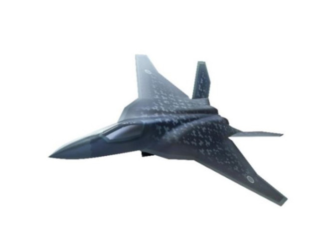
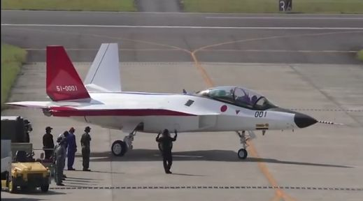
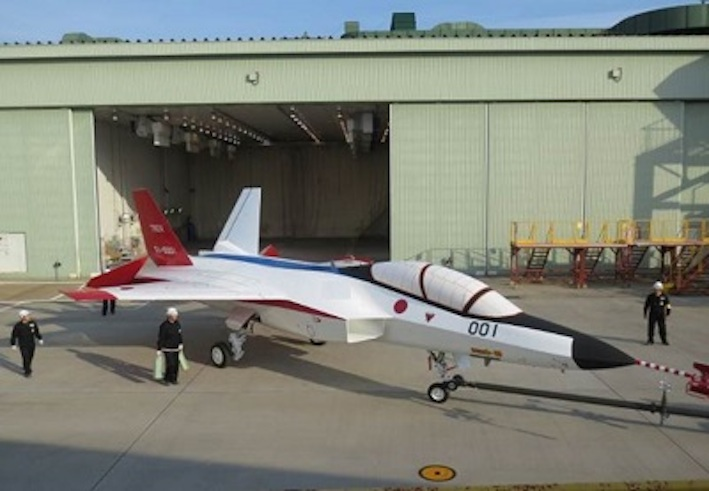

<figure>

<figcaption>

次期戦闘機のイメージ

</figcaption>

</figure>

時事通信社より、２０２０年度の防衛予算案は、５兆３１３３億円となり６年連続で過去最高を更新した。退役するＦ２戦闘機の後継となる次期戦闘機について、初期設計費１１１億円を計上。  
写真は、次期戦闘機のイメージ図＝防衛省提供

日本の次期戦闘機研究開発のためには、先進技術実証機「ATD-X」、「Ｘ-2」もあります。ステルス時代の日本製先進戦闘機はどうなるかお楽しみします。

<figure>

<figcaption>

先進技術実証機「ATD-X」

</figcaption>

</figure>

但し、Ｆ-2の位置づけ的には、対艦、対戦略爆撃機ですので、イメージと実証機を見る限りでは、ちょっと物足りないかと思います。  
少なくとも、マッハ数2以上の最高速度、マッハ数1.5以上の巡航速度、ステルス性は求めるでしょう。  
サイジング的には大丈夫かの所と、行き成りのデルタ翼機?は、ノウハウが少ない日本は問題ないかと、ちょっと懸念があります。

<figure>

<figcaption>

先進技術実証機「ATD-X」

</figcaption>

</figure>

想定するターゲットの戦略爆撃機Tu-160と、H-20(中国次期戦略爆撃機)は全て超音速巡航可能の機種ですので、日本の次期戦闘機開発は相当ハードルは高い挑戦になるでしょう。
