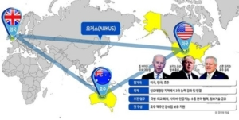
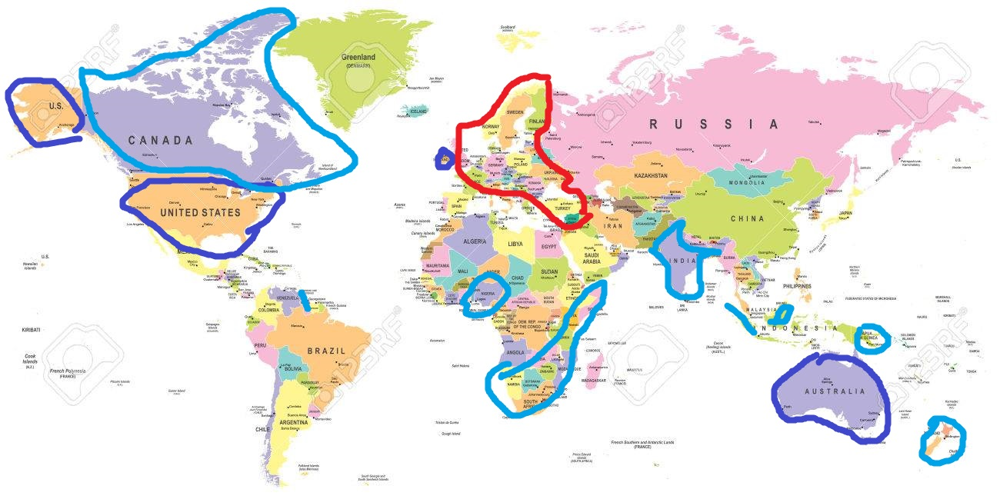

[AUKUS(オーカス)](https://ja.wikipedia.org/wiki/AUKUS)、米英豪軍事同盟とは、簡単にいうと、アジア太平洋地域バージョンの[NATO](https://ja.wikipedia.org/wiki/%E5%8C%97%E5%A4%A7%E8%A5%BF%E6%B4%8B%E6%9D%A1%E7%B4%84%E6%A9%9F%E6%A7%8B)である。

大国間の軍事競争のキモは潜水艦にある。 表に見える軍艦などはあくまで脅かす物であり、本当に対抗するのは水面下の核潜水艦等です。 特に海をコントロールする海洋文明の各国には、外交、国家関係、政策などは、裏側には潜水艦がどこまで制するかによるものです。 最近、中国は対米の態度が強硬になってきたのも、表の経済力もあるが、南シナ海の海底要塞の形成、南シナ海から米軍勢力の排除は要因の一つかと思われます。

米軍は南シナ海での連敗を受け、いざの時大敗するリスクが高まる中、代わりに戦ってもらう「使用人❓」(代わりに戦った貰う人)が必要となり、中国と交悪の豪州と手を組みました。しかし、何故豪州と英国なのか？下の図を見ましょう。

■赤い線：NATO ■深青線：AUKUS ■薄青線：イギリス連邦

ヨーロッパでロシアの勢力を留めるNATO軍事同盟あり、ソ連時代では、中国中心でソ連を留めたが、中国と対抗の今、南シナ海側では空白だったので、豪州と手を組んだわけです。そして、豪州の南から出港する潜水艦について、中国は人工衛星以外、監視する手段がほぼなく、隠蔽しやすい利点もあります。 因みに、イギリスだけ、ポツンと離れた所は何故❓と思われるでしょうが、この図を見ればすぐ分かるでしょう、イギリス連邦諸国で、中国周辺だけではなく、海上の通路を含めて、包囲網は既に形成しています。

日本、韓国、グアムには沢山の米軍が駐在してるので、事実上もれなく包囲しています。

**中国の対策**

AUKUSは進攻ではなく、防衛です。ある意味、中国は対策がない。必要もないからです。 既存の政策からAUKUSなりの対策に近い内容を説明します。

反テロの名目で、準軍事同盟の上海協力機構は既に存在してあります。 鋭い読者は、上の図から、中東が抜け穴❓と気付く方はいると思います。その通りです。 [イランは上海協力機構に加入](https://news.yahoo.co.jp/articles/408908323f196f5311834bf7a5a0d03402262985)して、アフリカのエジプト、サウジアラビアはパートナーですが、中露、中東各国利権を確保する組織は形成しています。 中国の課題は、シーア派とスンニー派の盟主、イランとサウジアラビアを組んで、お互いに協力するよう、共の敵(イスラエル、米国)と戦う準同盟を築くことです。 アフガンタリバンはどこまで平和を実現できるか未知であるが、中国は上海協力機構の枠の中、ロシア、中東、中ア各国の利益を重視しながら、中アの平和を実現していくための投資をしていきます。

東シナ海、南シナ海側も、中国は特別な策がなく、自らのリズムで米国勢力の排除を進んでいます。 豪軍の核潜水艦の戦力形成が10年先のことで、すぐに米軍から潜水艦をレンタルして、負け犬の米軍の装備で、豪軍に代わっても勝てるはずがない。 豪州の核潜水艦に一番恐れてるのは中国より、インドネシアとマレーシアになる。 インドネシアは豪州との宿敵ですし、中豪は核潜水艦で戦争を興したとして、沈没したら、インドネシアとマレーシア周辺の海域になるので、農業に頼る一番大きな被害はこの両国になるかもしれません。 ですから、中国より、この両国が一番困ってるわけです。

2千万人口規模、元々発達しない豪州は、第二、第三産業の割合が少なく、中国の経済制裁を受けて、暫く我慢できるが、AUKUSのお蔭で、東南アジア諸国、欧州に孤立され、核潜水艦の膨大な建造費用と毎年の維持費で、いつまで続けるか疑問です。

**中国の別の対策**

中国の別の対策と言えば、CPTPPへの加入申請です。

中豪貿易摩擦は、豪州の約束破りから、両国間のお互いに納得しない価値観から生まれるものかもしれない。 CPTPP、既に豪州も納得するフレームの下で、改めて会談を始め、米国に戦争の地獄へ騙してる豪州に、経済発展の明るい道へ導く機会を与えている。

世界一市場を抱える中国は、豪州を含めて、CPTPP諸国に魅力的です。 麻生さん等、[日本の言動](https://news.yahoo.co.jp/articles/9754dc02d3ac008b2e225cdfaa7562641fdf63eb)は多数のCPTPP構成国の反感を招くでしょうが、本文と直結しないので割愛します。 ようは、CPTTPの加入申請は、中国を敵視する各国を孤立させる手段の一つと読み替え頂ければと思います。

**中国の戦略**

AUKUS軍事同盟に対して、既存以上、更に強い軍事同盟を築きません。豪州、AUKUSに特化した軍事競争をしない方針でしょう。 隋唐時代の[楊堅](https://ja.wikipedia.org/wiki/%E6%A5%8A%E5%A0%85)の歴史は今と非常に似てます。当時、強いトルキスタンから、国内への浸透、国境での危険な状況でした。無謀に戦争を興さず、各属国の特徴に合わせて、分断させることです。結果的に東トルキスタンと西トルキスタンの分断まで、そして、千年経ても、分断し続けて、弱いままでした。

前述通り、[フランス](https://www.cnn.co.jp/business/35176915.html)、[インドネシア](https://www.nikkei.com/article/DGXZQOGM174FX0X10C21A9000000/)と[マレーシア](https://www.nikkei.com/article/DGXZQOGM191BI0Z10C21A9000000/)の反応からも分かるでしょう、豪州は既に欧州と東南アジア諸国に孤立されてます。こちらは、中国の戦略が映した結果ではないかと思われます。

**まとめ**

中米の軍事力の競争は核潜水艦の競争、指導部の思想にも関わるが、結局製造力に当たります。 今のAUKUSは太平洋戦争の日本のようなもので、太平洋を支配する軍事力を持つようだが、裏側の製造力、資源が足りないので、反撃されたらすぐ崩れてしまうものになります。

補足： 内容が分散してしまって、すみませんが。 中国の戦略とは、アジア、アフリカ、ラテンアメリカ、資源を出産する第三世界諸国を、日欧米主要と思われる国と平等な世界ルールを築くだけです。 多極化する グローバル社会という世界実現できたら、米国主導の覇権も、日本の妄想したアジア制覇もは、自然に崩れます。 勿論、大多数の第三世界諸国は、中国とも平等関係であり、中国の望む方向へ進むのは主軸になります。弱いものを団結させるのは中国共産党の得意技である。
