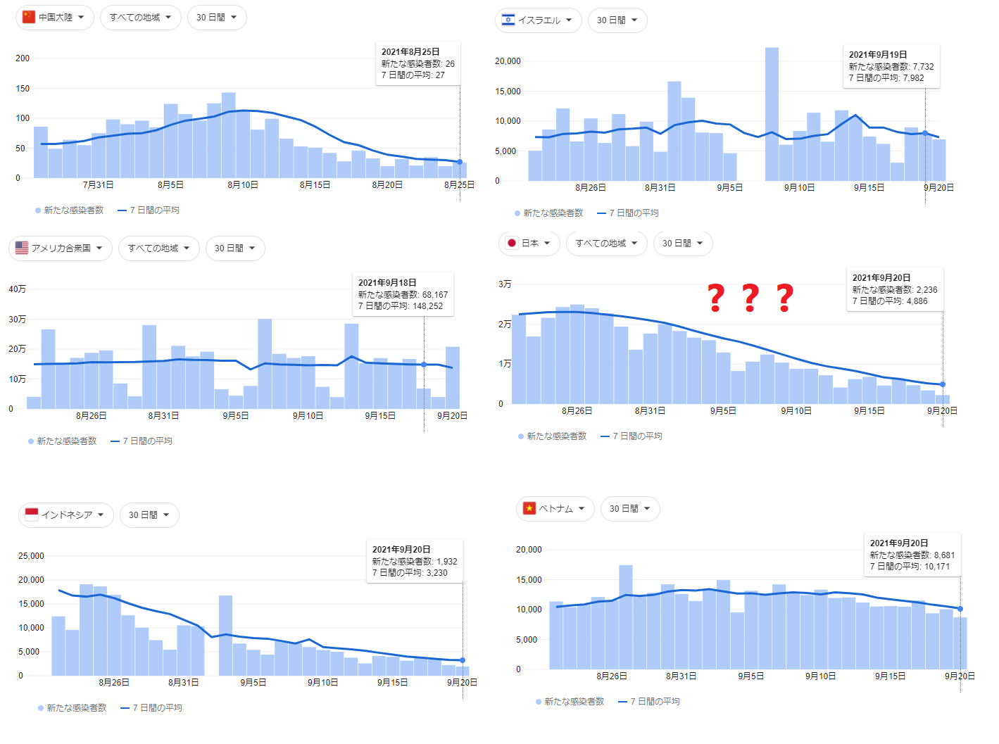
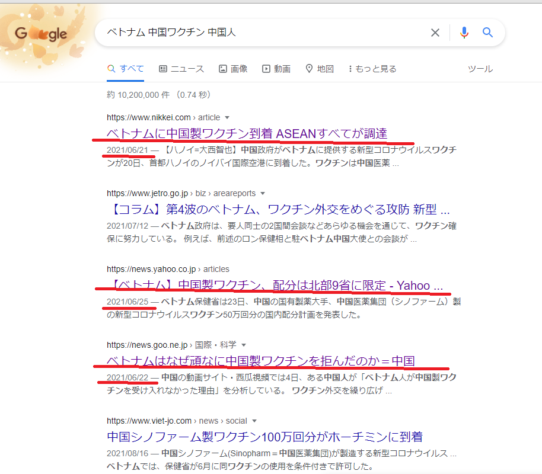

[中国ワクチンが日本でも臨床試験開始](https://www.j-cast.com/trend/2021/09/17420372.html)し、これから日本でも展開されるでしょうから、中国ワクチン有効か❓ 素人でありながら、弁証法的に考えた結果を読者の皆さんと共有したい。私の結論でいうと、完璧でないが、ファイザー製、モデルナ製ワクチンより、マシの結論です。

訳の分からない専門用語より、結果から見ましょう。 中国と、接種率の高いイスラエル、アメリカ、そして、日本の感染状況です。 併せて、中国ワクチン効果疑問視と、日本で報道する対象の国インドネシアと、中国と揉めの多いベトナムの直近30日間の感染状況のグラフを以下にピックアップしました。

いう程もなく、コロナを収めてるのは中国だけです。1日数十人程の感染でも、殆ど、海外から輸入した数字で、市中感染の割合がかなり少ないです。 日本のグラフに「？」した理由は、1日の検査人数は数千から1万人規模で、科学的に感染数を出せてない所、他の比較対象の国と異なるからです。あくまで参考数字だと読替えてください。

ワクチンの利用状況ですが、イスラエル、アメリカ、日本は中国ワクチンが基本なく、ファイザーとモデルナワクチン中心です。接種率が高いにも関わらず、どこも収まりません。

中国は中国の不活化ワクチン中心、mRNA等、新技術のワクチンがほぼなし。 日本マスコミの宣伝する[インドネシアで中国ワクチン効果疑問視](https://www.asahi.com/articles/ASP7S5S3FP7RUHBI035.html)について、当初は接種率も低かったため、何製と関係なく、感染が広がるわけだ。[ちゃんと接種した医療従事者も感染だ](https://news.yahoo.co.jp/articles/1cd4fab94786386a35061bb1e252bb5b75acbd17)と、マスコミは中国ワクチンを中傷しようとしてるが、数字から、やっぱりファイザーワクチンよりましではないかと私の結論です[。日本では、医療従事者じゃなくても、接種後に感染して死亡する人は多い](https://news.yahoo.co.jp/articles/498fa134074a6c259d136d0ca6d66dcee1ec8018)からです。 今は収束してる傾向で、仮に3本目は米国製と言っても、何故、米国は収まらないか？その矛盾は誰も説明できない嘘しか見えません。実には中国ワクチンが普及しただけかもしれない。

ベトナムをここに持ってくる理由として、 1．日本では中国⇒ベトナムのワクチンを拒んだと、到着が同時に報道するところ。どっちが嘘か？ 2．ベトナムは中国のワクチンに対して、ダメ出しながら、奪ってる

マスコミを信じるなという事ではなく、我々の目に入って、一見ニュースのような記事が、業者は雇ったライターの書いた文書も沢山あります。 こちらはビジネスの常識であり、特別な事ではありません。

mRNAワクチンを売り込むために、不活化ワクチンを中傷する記事を書いてもらうよう、業者からの依頼があってもおかしくないこと、気づいてほしいです。家族や、自らの命に係わることですから、軽信しない事が重要です。

中国は特別にベトナムにワクチンを上げたいのではなく、自国民の安全のために、[現地中国人や中国へ渡航する予定の人にワクチンを提供したいだけ](https://jp.reuters.com/article/health-coronavirus-vietnam-vaccine-idJPKCN2DX0K7)です。なのに、ベトナムは約束を破って中国からのワクチンをベトナム人に振り分けた。そして、その後も、何かしらの言訳で、中国からワクチンが欲しいとい報道はありました。

**まとめ**

中国ワクチンが有効かどうか、中国、そして、英米、中国ワクチンを選べる地域では、既に結論を出しています。

勿論、新しい技術がよい人であれば、ファイザー、モデルナワクチン、是非お勧めします。

改めて「[不活化ワクチンとmRNAワクチンの違い：新型コロナワクチンの基礎知識、どちらを接種すべき？](https://blog.loveapple.cn/news/202105127009.html)」の内容を振り替えてみたいと思います。変異し続けるウイルスには、mRNAワクチンでは追いつくはずがない。 人間の自分自身の免疫機能が一番戦力になるはずである。

個人的に中国製に拘りませんが、安全に、自分と家族を守るためには、不活化ワクチンにしたい。 コロナワクチンが2、3回接種して終わりもんではないから、半年頃に接種し続ける必要あるので、人類初の健康者向けの新薬に興味ありません。

コロナの不活化ワクチンといえば、現時点、中国製ワクチンのみになります。
