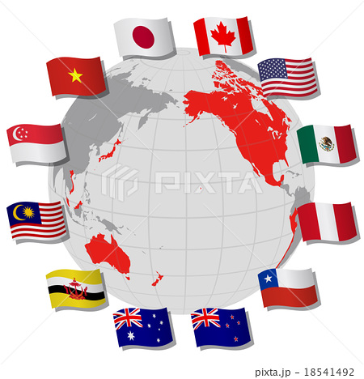
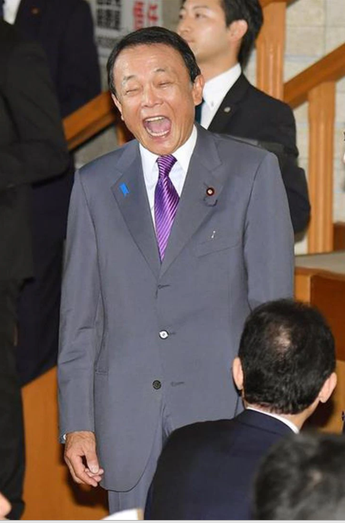

中国の[CPTPP(環太平洋パートナーシップ協定)](https://ja.wikipedia.org/wiki/%E7%92%B0%E5%A4%AA%E5%B9%B3%E6%B4%8B%E3%83%91%E3%83%BC%E3%83%88%E3%83%8A%E3%83%BC%E3%82%B7%E3%83%83%E3%83%97%E5%8D%94%E5%AE%9A)加入申請とは、  
一言にまとめると、米国の脱中国戦略を潰すことです。もうちょっと掘下げると、日本叩きであること。  
CPTPP加入が難しいと思われる人多いでしょうが、中国のいつものやり方でいえば、9割確定と断言します。

**歴史から、見るCPTPP(TPP)**

中米貿易戦争の米国のように、曽て、経済の窮境に直面すると、自国経済を守るといって、保護主義が台頭し、貿易を打撃します。関税を引き上げるなど、輸入のハードルを設ける策は、選挙、一時的に一部の産業によいが、結局、発展できない悪循環に陥ります。  
失敗を経験した各国は、自由貿易の重要性を理解でき、[保護⇒GATT⇒WTOまで発展してきた歴史](https://www.meti.go.jp/report/tsuhaku2019/2019honbun/i2210000.html)があります。

中国は[WTO](https://ja.wikipedia.org/wiki/%E4%B8%96%E7%95%8C%E8%B2%BF%E6%98%93%E6%A9%9F%E9%96%A2)に参加して、驚くほどの勢いで急成長を遂げた事を受け、米国は中国の発展を牽制するために、WTOと別に[TPP](https://ja.wikipedia.org/wiki/%E7%92%B0%E5%A4%AA%E5%B9%B3%E6%B4%8B%E3%83%91%E3%83%BC%E3%83%88%E3%83%8A%E3%83%BC%E3%82%B7%E3%83%83%E3%83%97%E5%8D%94%E5%AE%9A)を築きました。

TPPは急成長の中国はアメリカ大陸など、新たな市場への進出を前提に、中国市場の利益を最大化を図った戦略でした。中国は米国の陰謀を看破し、一帯一路構想を上げ、環太平洋のTPPを離れました。  
(※こちらの詳しい内容について、「[一帯一路の戦略を理解するーー海上編](https://blog.loveapple.cn/politics/national-strategy/2019120379.html)」シリーズをご覧ください。)

中国は離れてしまうと、TPPを維持するために、米国はTPP諸国から、大量に輸入しなくてはならず、予想と離れすぎて真っ赤の状態でした。当初、TPPを謳ったヒラリー氏も、2016以降、言及しなくなったようだ。  
トランプ時代の2017年に至って、米国は離脱しました。今は、日本主導の比較的に小さな規模な貿易協定になってます。

**今更、中国のCPTPP申請の狙いとは**

1. 米国からの包囲網から脱出です。  
    米国の包囲網とは、実には保護主義の産物である。CPTPPに入れば、例えば、政治、安全云々、根拠なしにHUAWEI等、中国企業勝手にを規制する事ができなくなります。
2. 中国のサービス業の輸出です。  
    これから、５G以降の時代はAI時代になります。  
    ビッグデータで勝負するAIは、中国と匹敵する国がありません。中国のAIを世界へ展開する狙いがあるでしょう。
3. 製造業のレベルアップの一環として、多様化とした生産拠点、世界の工場の座を固める  
    テスラを例にしますと、米国工場で生産した車は排ガス基準の高い中国、欧州へ売れません。  
    替りに、中国で生産した中国基準の車は欧州でも売れます。あえて米国で、基準高い車生産する必要なく、高いコスパで商品の製造は可能になる。
4. 世界経済の主導権の握る  
    「日本製」だけではブランドのような時代ですが、CPTPPに加入する事で、中国製も日本製並みの品質、認知度が高まるでしょう。アジアだけではなく、日本製、日本の重要度のレベルが下がります。  
    米国も中国を弾圧し難くなり、世界経済の主導権を握るようになるでしょう。
5. 豪州に対話の機会を与える  
    豪州は一帯一路の契約を破り、中国企業への制裁を受け、ワイン等の農産品から、炭まであらゆる商品、豪州⇒中国の輸出も影響ができて、経済の窮境に向いてる結果、豪州は中国との対話を強く求めている。  
    CPTPPの申請で、日本から予想内の反対の声を出したが、豪州は意外と、反対と言いません。  
    中国はCPTPPのフレームの下、豪州との対話を求めてる。一方的に豪州から輸出ではなく、中国企業の利益も確保しなければならない。豪州はCPTTPまで破る事がないでしょうとの推測です。  
    アングロサクソンの謳う契約精神を守れという事です。
6. 日本の過ちを待つ？  
    筆者はこの文書を書いてる間、[麻生さんの愚かな発言](https://news.yahoo.co.jp/articles/9754dc02d3ac008b2e225cdfaa7562641fdf63eb)だけではなく、[台湾のCPTPP申請](https://news.yahoo.co.jp/articles/e28392b59fec166580d319da8a12b885dd4ecb4a)もありました。  
    日本マスコミ、政客の動きから、日本は裏側に押してると言ってよいでしょう。

**まとめると、中国の本当のターゲットは日本である**

緊迫がないのに、何故、中国はCPTPPを加入しようとするか？  
まず、1つは日本の孤立である  
引続き、中国の加入に対して、各国の態度は既に明らかである。

- 反対：日本
- 検討：メキシコ、豪州等
- ほぼ賛成？：日本より世界一市場規模の中国と貿易したい東南アジア等

メキシコの反応は理性である。米国はメキシコの第一貿易相手、地理上も近い。反対と言わなければ、すぐに態度を明確しない事も、賛成に近いである。  
豪州は中国と貿易戦争中であるから、反対と言わない事が、賛成に等しく、中国との対話を求めてるわけだ。  
検討中の両国とも、中国対応次第ですが、他の国要素を含めると、やっぱり変動の要因がある。

シンガポール、マレーシア等、東南アジア諸国の最大貿易相手は中国であり、基本賛成であるでしょう。  
もし、日本と一緒に反対するとしたら、損失を補填できるか？勿論、あり得ません。

CPTPPは既に3つのグループに分けられて、中々結論の出ない混乱な状態に陥ったようだ。

**台湾の加入で、中国の加入を加速させる**

台湾のCPTPP加入とは、経済と別に、1つの中国という、世界各国は中国と外交関係を結ぶ大前提、中国の主権に関わる問題を前提として持ってくるわけです。  
日本は勝手に約束を破って、中国を挑発する事に熱中してるが、メキシコ等、検討中の殆どの各国は、中国と対抗するつもりないのに、いきなり巻き込まれる事を避けざるを得ない。どうしても日本の機嫌を損ねるので、反対側の中国の方によるでしょう。日中両方と対抗する必要がないからです。

元々、まとまらない混乱な状態のはずだったが、日本の主導した台湾加入で、日本以外の皆は中国の賛成は加速するでしょう。  
台湾について、軍事は勿論、政治、経済、全て存在感の薄いものであるので、各国によってどうでもよいである。蔡英文政権は、CPTPP加入で、支持層の農民の安心を買う、心理、マスコミ上の対策となる以外、実質的になにもない。

**最悪のケース**

中国のCPTPP加入は、全てのメンバーの同意が必要な訳です。  
最悪なケース、最終的に、中国はメキシコ、豪州まで1つ1つ説得して、日本だけ反対な状況になります。  
この場合、中国はCPTPPをやめ、別の〇〇協定を立ち上げ、日本を孤立させればよいでしょう。

但し、私のいつもの言った通り、今の日本武士道精神は腰抜け精神であり、最後まで戦いません。  
今回も意外することなく、叩かれて、十分痛みを味わえば、その内、大人しく臣服するでしょう。

中国は日本のような民主国家と異なる点は、世襲制によって、アホや凡人でもTOPに立つ国ではありません。  
CPTPP申請と出す前、利害を十分図った上の言動である。  
中国のいつものやり方で見ると、中国のCPTPP加入は、9割ほど、ほぼ成功になるかと思います。

**虎ノ門ニュースの評論を補足します。**

こちらの内容と併せて、以下のポイントを押さえながら、確認して頂ければと思います。  
1．世界中、95％以上の国は資本主義、民主主義国家ですから、イデオロギーで共通認識をとれるならば、世の中はそんなに紛争がありません。  
2．政治は重要だけど、経済協定で、民主主義と社会主義を選ぶのがアホです。それで中国を孤立できるならば、TOP2のGDPになりません。もし、この知識人たちは日本政治を主導するならば、逆に、日本が世界に孤立されるでしょう。

https://twitter.com/i/status/1441159330271686667
