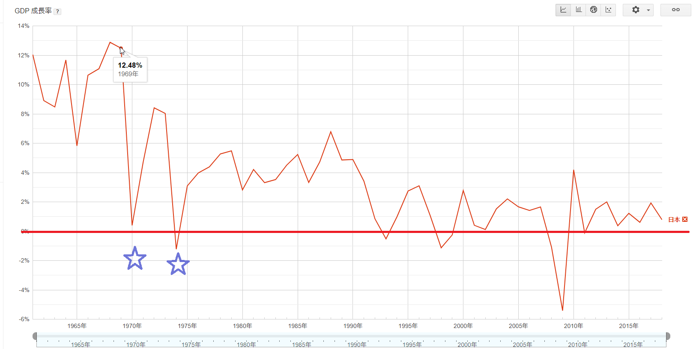
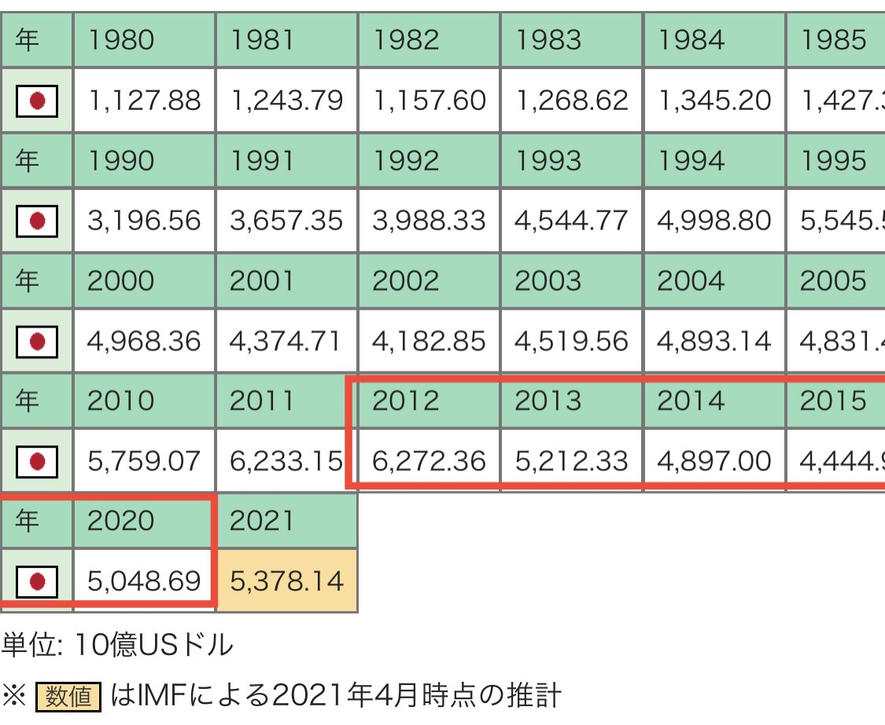

日本経済の新たな飛躍を狙って、日本政界のTOPは何を狙ってるか❓最近、中国、台湾向けの政策から、直接結論をいうと、間違いなく、アジアの戦争を興す事で、新たな経済の飛躍である。

**日本経済飛躍の歴史を復習**

今の先進国とした日本経済はいつから発展してきたのか？  
戦後の廃墟から、1990年代末までの急成長である。  
特に、廃墟から、1970年代までの急成長は奇跡と言われてます。  
[ニクソンショック、オイルショックがあって、一時的に落ち込んだ](https://www.dynic.co.jp/company/80/chno6/ch06-1.html)が、1970年代～1990年代、プラザ合意後の不動産崩壊まで、高成長を維持し続けました。

**日本経済飛躍は曽ての経験から学ぶ**

1970年代以降の日本は、世界工場の位置づけとしされました。今の、老齢化した日本は改めて繰返そうとしても、基本難しいでしょうか。  
歴史を復刻して、再度経済の飛躍をさせようとすれば、1950年代の日本国境外のアジアのどこかでの戦争となります。50年代のアジアを復刻するとは、周りは戦禍など紛争地が多く、東アジア、日本は一番平和な所で、優秀な人材も、自然に集まってくるわけです。老齢化問題も簡単に解決できるはず。

最近、日本周辺、領域の紛争の中、元々日本制御した釣魚島(尖閣諸島)は、中国は完全に行政行使に踏み出して、海上保安庁の船をぶつけて追い出しても、黙ってる替りに、台湾巡り、色々動きが多い。パイナップルの演劇から、CPTPP加入まで、曖昧にしようとした蔡英文政権を、独立へ強く引っ張ってる動きに注目して欲しい。

日本のTOPの思いは上手く行けば、中国が台湾海域で戦争の罠に陥り、米軍も参入して、長く続けば、中国は内での紛争も煽りやすくなり、連鎖的に起こり得る。崩壊と言わなくても、世界工場は日本へ戻るしかない。インドも、東南アジアも、人材も環境も今一ですから、一部の生産拠点は東南アジアへ移っても、日本は今の中国のように注目が高まるわけですから、新たな飛躍を迎えるでしょう。

**日本の行方**

国運を賭ける事が、明治以来、日本政治家族のいつものやり方です。  
産業革命、[日清戦争](https://ja.wikipedia.org/wiki/%E6%97%A5%E6%B8%85%E6%88%A6%E4%BA%89)で勝ったが、あくまでギャンブルですから、運次第で、殆どの場合は負けてもおかしくない。

AUKUS、CPTPP等、中国との敵対、まさか、国運を賭け、1950年代の経済発展を再現するために、日本は周辺で戦争を挑発しています。  
但し、日本周辺を含めた台湾などの有事で、米軍がやってくる前提の動きは愚かです。  
朝鮮戦争以来、米軍はちゃんと実力のある国の正規軍と戦争を興したことあるか？現実を見てほしい所です。  
逆に、今の中国共産党政権は、ちゃんとした実力ある国の正規軍以外、弱い国と戦争しない。  
全体的に中国と米国は並みかもが、世界に散らばる米軍とアジア中心の中国と比べると、リソース集中できなく、強弱は既に明白である。

私のいつもの観点ですが、日本周辺で有事になった場合、相手は中国軍なら、米軍も自衛隊も黙るべきです。特に日本は、変なマネをすると、滅びを招きます。在日、在韓米軍は確保できれば、米軍は同じ核保有の中国と本気で戦いません。

**捨てられるのと分かってるのに、何故日本は**❓

日本は捨てられるかもしれないと分かっても何故やるのか？  
今の政治家族の利権は米軍の利益との絡みが深いわけですから。米軍が排除されたら、今の政治家族が揺られて別に勢力にやられるでしょう。

中国のリズムで台湾海峡、南シナ海を完全に制する事が米軍勢力排除であること、東南アジア諸国の本当の平和な環境に迎え、米国の海洋覇権が崩されるわけだ。  
戦後も、戦争を興した政治家族はそのまま政権を握って、バックに米国が立て、アジアの制覇は止まっていません。米勢力が排除されたら、今までの長年で経営してきた勢力の存亡が疑問になるのと、韓国、東南アジア諸国に清算されないか❓も、疑問になるでしょう。不明が多いが、日本、そして、1.3億の国民で賭けてみないと分からない。

**日本はどうすべきか。**

自らより強い、[最大の貿易相手](https://www.jftc.or.jp/kids/kids_news/japan/kadai.html)と、いきなり対抗する事って、恐らく、日本以外、世界中どこにもありません。知恵ある反攻が勇敢だが、日本の場合、異様に愚かであることです。

私の過去の記事にて主張した通り、[日中韓のＦＴＡ、ＲＣＥＰを始め、東亜の平和な環境を築くのが、本当の日本の飛躍を迎える方法である](https://blog.loveapple.cn/news/202002042685.html)。  
特に[台湾関連、中国の核心利益に関わる事の爆言](https://news.yahoo.co.jp/articles/bcf707f7caa03a6c9f09bc11e991842988c46e58)の連発は、必ず報復を招く。

但し、今の国内の空気を見る限り、アジアの紛争を煽って、いずれか、[国民を再び、戦場へ送ること](https://blog.loveapple.cn/news/202109167336.html)も、考えた方がよいでしょう。

最後、高市さんを紹介される動画を添付します。  
安倍さんのお蔭で、日本GDPが2割萎縮しました。恐らく首相にならないでしょうが、日本の民意を代表する人でもあるので、万が一、安倍の引継ぎのような同氏は首相になったら、日本の滅びを招くかもしれません。

国力も、武器も、生産力も、戦争の思想も弱い日本にとって、今の時代の戦争では、上手く戦場を国外に留めるしようがありません。今度こそ、中米露三国、第二次世界大戦後、疑問の多い日本での利権の分割をやり直しだけかもしれない。

https://twitter.com/i/status/1437392420820242434
