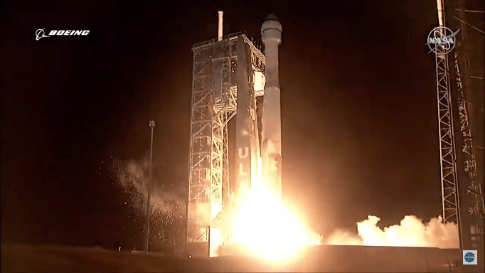

米ボーイングの宇宙船「スターライナー」のテスト打ち上げ、国際宇宙ステーション（ISS）へ到達することができなかっとことについて、残念だという意見は多いが、以下の点から、大進歩だとの見解です。

1. エンジンに故障があったとき、行き成り爆発などせず、停止したこと。
2. 宇宙船は転落することなく、安全に回収できたこと。

私はロケットの専門家ではないと、詳しい情報を入手できてない所で、完全に言い切れませんが、ロケットエンジンは止める事が難しく、過去の事例では、中国以外、アメリカはほぼ見受けていません。  
特に、宇宙船は無事で回収できることは、スペースシャトルの不祥事と比べて、何よりです。  
乗員の安全を確保できるシステムには、大きな進歩であると、今度のボーイング社は見せているかと、大成功だったと思います。
