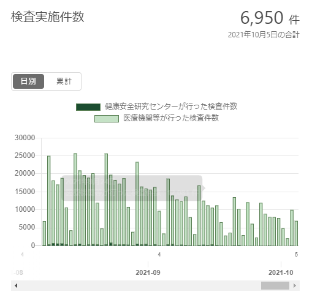

東京五輪が終え、選挙の時期に近付いてきたので、そろそろ正常に戻ろうといったところで、新型コロナの感染者数も、タイミングよく、減っています。

日本は良くやったと思う人は多いかもしれないが、こちらから見ると、日本のデマ策戦の一環である、そして、印象操作の簡単な事例を紹介します。

日本政府、マスコミはコロナ退治には、基本、何もできなく、製薬業者の利権確保、デマ流し中心をしてると私のいつもの主張です。 日本は先進国、民度が高いと思い込む人には都合が悪いが、自らと家族を守るために重要なリアル情報ですから、いくら中傷されても、発信し続ける要因である。

今回は非常に分かりやすいケースとなります。 夕刊フジからの記事：「[日本は急減なのに…韓国、止まらぬコロナ感染者数　文大統領が自画自賛「Ｋ防疫」見る影もなく　ワクチン種類で日韓に違いも](https://news.yahoo.co.jp/articles/1751d12aa2f0cc21988c96e9faa3bc9ebb487bd6)」

見た目上、日本は韓国よりコロナ退治できてるとアピールしながら、隣国を貶して、日本の自信を取り戻そうと言ってよいでしょう。

最近、日本の感染者数がぐんと下がってるのが、何故か、まず原因をご存知でしょうか❓主な要因の一つは、検査数を減らしたからです。

こちらは[東京都新型コロナウイルス感染症対策サイト](https://stopcovid19.metro.tokyo.lg.jp/)からのデータです。 東京都の日当たり感染者数千人以上の時期、検査人数は1-2万程でした。本日の上がってるデータから、7千人近く検査して、165人陽性、割合的には下がってるようだが、東京都の実際の感染状況を反映する数字ではないと認識してください。

替りに、韓国の状況はどうなってるか、一日当たりの検査人数は7万(？)超え、最近の検査人数が比較的に少ないとは言え、1万人超えてるような規模で行っている。

(韓国関連のデータの情報元：[https://gitpress.io/@statrstart/Coronavirus08](https://gitpress.io/@statrstart/Coronavirus08))

韓国は中国や米国などのような感染状況を分かるための地域ごとのPCR検査に当たるかわかりませんが、人口数が少ないので、日本よりしっかりと検査してることが明らかです。

単に東京の例にすると、1日2万人程規模で検査すれば、「日本は急減なのに」と言えるのでしょうか❓

コロナについて、情報収集のプロの記者は、素人の私より、もっと知ってるはず。夕刊フジの記者も情報収集で飯を食ってるので、私以上詳しくても当然なことである。 このような文書を書くのが、間違いなく、真実を隠そうとしてるわけである。

日本の状況を知りながら、粉飾してデマを流す理由は何か❓ 日本が隣国より優れて、コロナ退治したとの印象操作である以外の理由がないでしょう。 政府当局、財閥はコロナ退治に投入しようとしないからこそ、マスコミを使った印象操作が不可欠である。

今回は一つの事例しか過ぎないが、実には、毎日このようなデマは溢れています。 コロナ退治より、マスコミを使って、隣国を貶して、中国ヘイトを煽る方が随分低コストであるし、選挙にも有利な訳です。

ぶっちゃけいうと、日本はPCR検査しなければ、感染者数もなく、✙デマ策戦で、コロナ退治できるでしょう。
