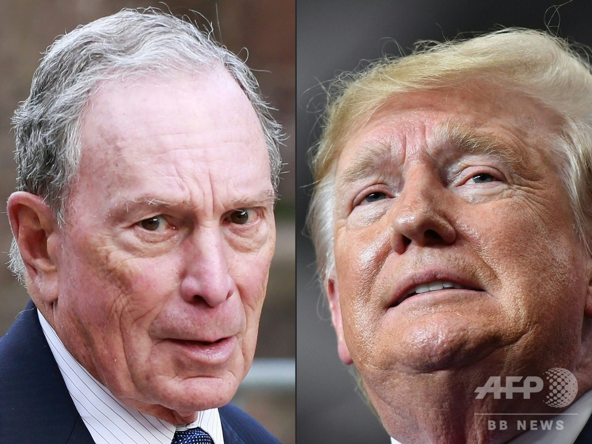

次期の米大統領は、ドナルド・トランプとマイケル・ブルームバーグ、両氏の中からうまれるでしょう。  
裏側の勢力は中国、アジア今後の発展に大きな影響を与えるので、ここで、マークしておきます。  
そして、トランプ氏より、ブルームバーグ氏は、勝つ可能性が高いかと、こちらは予想しております。  
以下は、[パンダ野郎](https://twitter.com/pandypandy0513)氏の整理した内容で、転記します。

- **マイケル・ブルームバーグ**
    - ヘンリーキッシンジャー
    - ロスチャイルド財閥
    - ロックフェラー財閥（シェブロン系列）
    - ゴールドマンサックス系ヘッジファンド群
    - 江沢民派閥
    - 日本の野党全部及び一部の自民党幹部
    - ドミートリー・メドヴェージェフ
    - その他欧州のグローバリズム政党
- **ドナルド・トランプ現職大統領**
    - ジェルドン アデルソン
    - ブラックストーングループ系ヘッジファンド群
    - 習近平派閥
    - 安倍政権
    - ウラジミール・プーチン
    - ボリス・ジョンソン政権
    - その他欧州のナショナリズム政党
    - イスラエル・リクード党
- **今後どちらかに着く可能性のある勢力  
    **（ロックフェラー本家）
    - シティグループ系ヘッジファンド群
    - エクソンモービル系列軍産複合体
