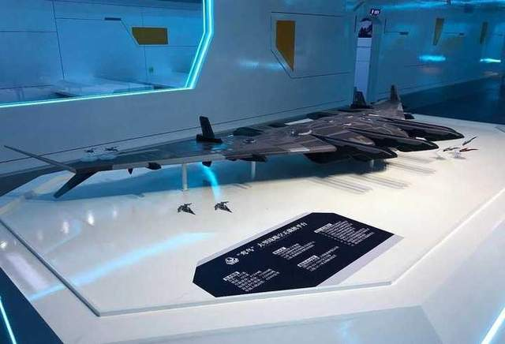
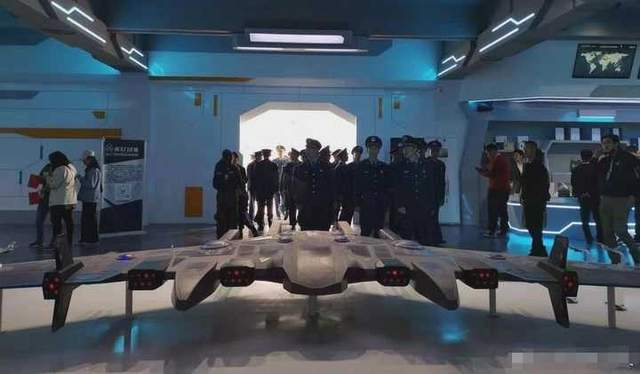
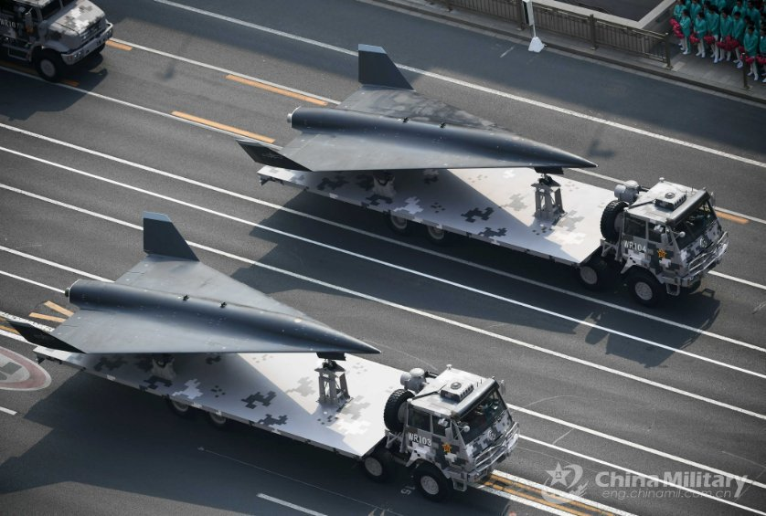
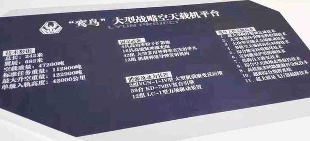
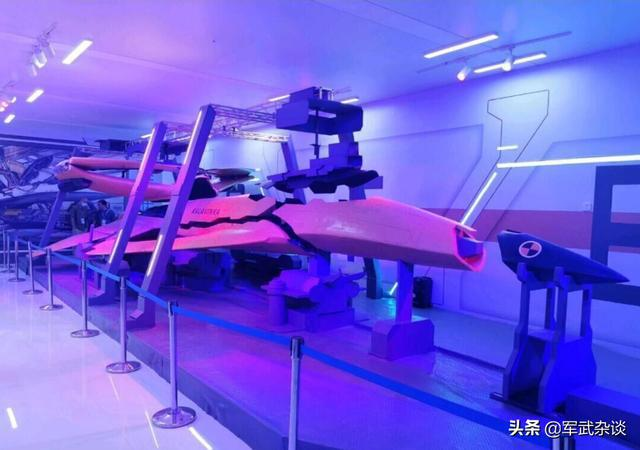
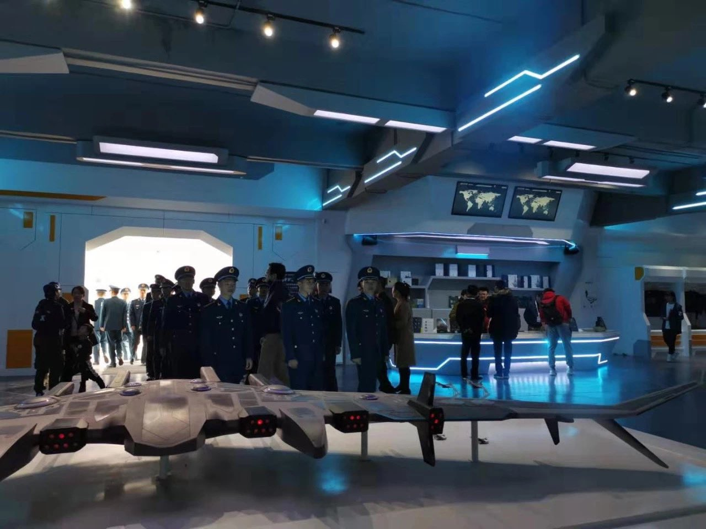

中国では色々ハイテック関連の情報の中、最近、自分は一番面白いと思ってるのが、こちらの「鸞鳥」という宇宙空母です。まさか、SF映画のものを再現しようとしてるようです。 2021年9月、開催された珠海航展(中国国際航空宇宙博覧会)で公開されたものですから、勿論、完成されたときの形と必ず同じものと限らないが、少なくとも、関連する技術の開発は進んでおり、既に、計画している内容と言えます。

[珠海航展](https://ja.wikipedia.org/wiki/%E4%B8%AD%E5%9B%BD%E5%9B%BD%E9%9A%9B%E8%88%AA%E7%A9%BA%E5%AE%87%E5%AE%99%E5%8D%9A%E8%A6%A7%E4%BC%9A)とは、2年ごとに中国広東省珠海市で開催される、中国最大規模の航空ショーである。中国は海外向けの武器の展示、又は、中国へ売込む武器の展示はこちらで行っています。特に、中国の航空、宇宙関連の最新鋭技術の開発した成果もこちらで披露します。

例えば、近年、中国軍は披露した最新鋭ドローン、飛行機等、技術検証や、開発段階のものは、同航空ショーで披露するものは多いです。

言い換えると、中国軍の最新技術を知りたければ、珠海の航空ショーへ行けば、一通り、収集できると言ってもよいでしょう。

新しいアイデアはあるのが勿論ですが、今回は公開した「鸞鳥」という宇宙空母について、個人的に驚きます。

公開されたスペック情報を訳してみます。

・長さ：242m ・翼展：682m ・重量：47200トン ・標準任務時の重量：112,800トン ・最大上昇重量：122,900トン ・軌道高度：42,000キロ

世界最大の空母、ワシントン号332.85mに対して、こちらは倍以上の長さ、0.68キロぐらいのデカいものです。 宇宙空間で飛ばすので、飛行高度の替りに、軌道高度と訳してます。 42,000キロとはどういう意味かと、人工衛星の地球軌道、[高軌道](https://ja.wikipedia.org/wiki/%E9%AB%98%E8%BB%8C%E9%81%93)の35,786キロ以上、高い所に配備する想定のものである。小惑星のようなものでしょうか❓

**エンジン、動力装置から見る実現性**

この小惑星のようなものをどうやって動かすかの所ですが、以下はエンジン装置： ・VCN-1-1V型、大型飛行機用原子炉　×　２基 ・KD-78BV型、複合エンジン　×　38基 ・LC-1型、フォースフィールド駆動装置　×　12組

原子力の宇宙空間での運用については、中米露各国は既に進んでいます。 2019年に、月の裏側に打ち上げた月探査[機嫦娥4号](https://ja.wikipedia.org/wiki/%E5%AB%A6%E5%A8%A54%E5%8F%B7)について、覚えがあるのでしょうか。まだ稼働中で、3年以上連続運転してます。小型だけど、原子力を使うそうです。

複合エンジンは日本の[ATREX](https://ja.wikipedia.org/wiki/ATREX)と似ており、大気圏と宇宙空間の飛行環境に合わせて、空気、又は携帯する酸素の使用を切替えできるように、理想的なジェットとロケットエンジンの複合したものです。日本のATREXと違いとして、中国は2020年、スペースプレーンの試験飛行まで進んでおり、複合エンジンは実用へ踏出してる状況である。

3種の動力装置の内、2種は既に実用に近い状態の製品は出ているはずです。自分の中では一番怪しく見えるのが、フォースフィールド駆動装置です。こちらはまさか、SF映画の宇宙船に登場するものです。但し、同航空ショーで登場する第7世代の戦闘機のコンセプトでも、フォースフィールド駆動装置のキーワードが登場してます。

一番上の図から見ると、「鸞鳥」には、この第7世代の戦闘機を搭載するらしいです。

中国空軍の飛行機の開発のやり方では、実用世代、研究開発世代、予備研究世代、同時に進行してるので、現在、米国のF-22と同世代の、第5世代(J-20)戦闘機は実用段階である。公開されないが、次世代、第6世代の戦闘機は研究開発最中である。第7世代の戦闘機は予備研究の時期であり、機密情報が少ないので、この航空ショーで公開するのに適するでしょう。

**実まで実現できるか❓抑々あり得るか❓**

[J-20](https://ja.wikipedia.org/wiki/J-20_\(%E6%88%A6%E9%97%98%E6%A9%9F\))の開発⇒実用までの期間、1990年代⇒2010年代で推測すると、約30年後の2050年代頃、第7世代の戦闘機の実用化と簡単に計算できます。

但し、「鸞鳥」のようなデカいものは実現可能かと疑問する所でしょうが、中国のエネルギー戦略に注目したいところです。最近、欧州の天然ガス不足、中国各地で起こる電力不足から、地球の資源が尽くしてなくても、不足になり高騰する事が間違いありません。

中国のエネルギー戦略の一環として、地球で米国と資源の覇権を奪うのではなく、宇宙から新たな試験を探すわけ。もし、核融合反応は実用に向けて、月のヘリウム3を上手く利用できれば、膨大な利益に支えられて、こんなものは作れるかと私は推測します。

勿論、月等、宇宙空間から、石油を代替する、新たなエネルギーを見つけたとしたらの話です。

上手く進んでほしい所です。別に面白い飛行機ができたかどうかではなく、資源を奪うための戦争が、地球で繰返してほしくないだけです。

