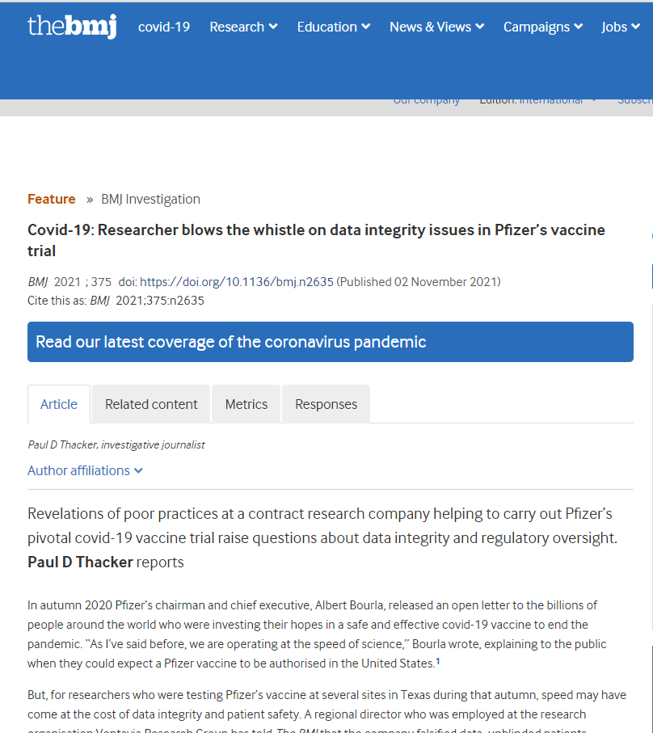

イギリスの医学誌、BMJ(ブリティッシュ・メディカル・ジャーナル)は、ファイザー社は臨床試験でのデータ不正問題について、研究者より、内部告発の記事を公開しました。 「[Covid-19: Researcher blows the whistle on data integrity issues in Pfizer’s vaccine trial](https://www.bmj.com/content/375/bmj.n2635)」

原文のポイントを以下にまとめてみます。 ・ファイザーのワクチンの試験を実施する研究会社での不適切な慣行、データの不正について、疑問視してるのは「Paul D Thacker」のレポートである ・研究組織「VentaviaResearch Group」に雇用されたディレクターは、同社のデータ改ざん、盲検にならない患者の雇用、不十分な訓練を受けたワクチン接種者を雇用など、第三段階の臨床試験の不正について、BMJに暴いた。 ・同氏は問題を報告しても、同社のフォローアップまで時間がかかり過ぎて、FDAに通報したら、間もなく、同社に解雇された。BMJ社に写真などを含めた証拠をメールで提供した。

詳しい内容について、英語の原文をご参照してください。拡散もしてください。

内部告発した人だけではなく、当時、試験に関わった責任者は全て解雇されたようで、告発された内容は、個人的報復の可能性が低く、信憑性が高いと思われます。
