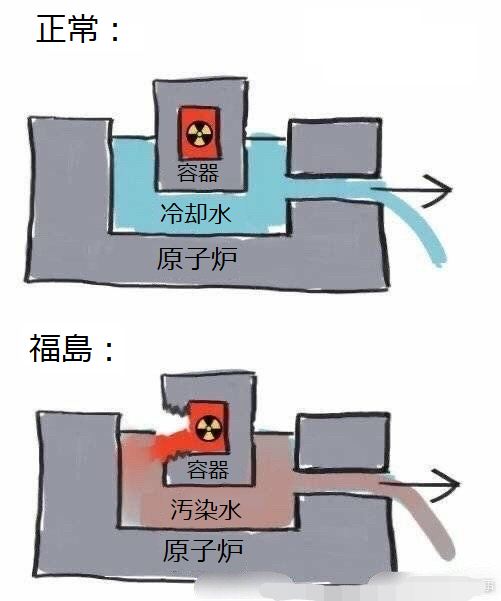
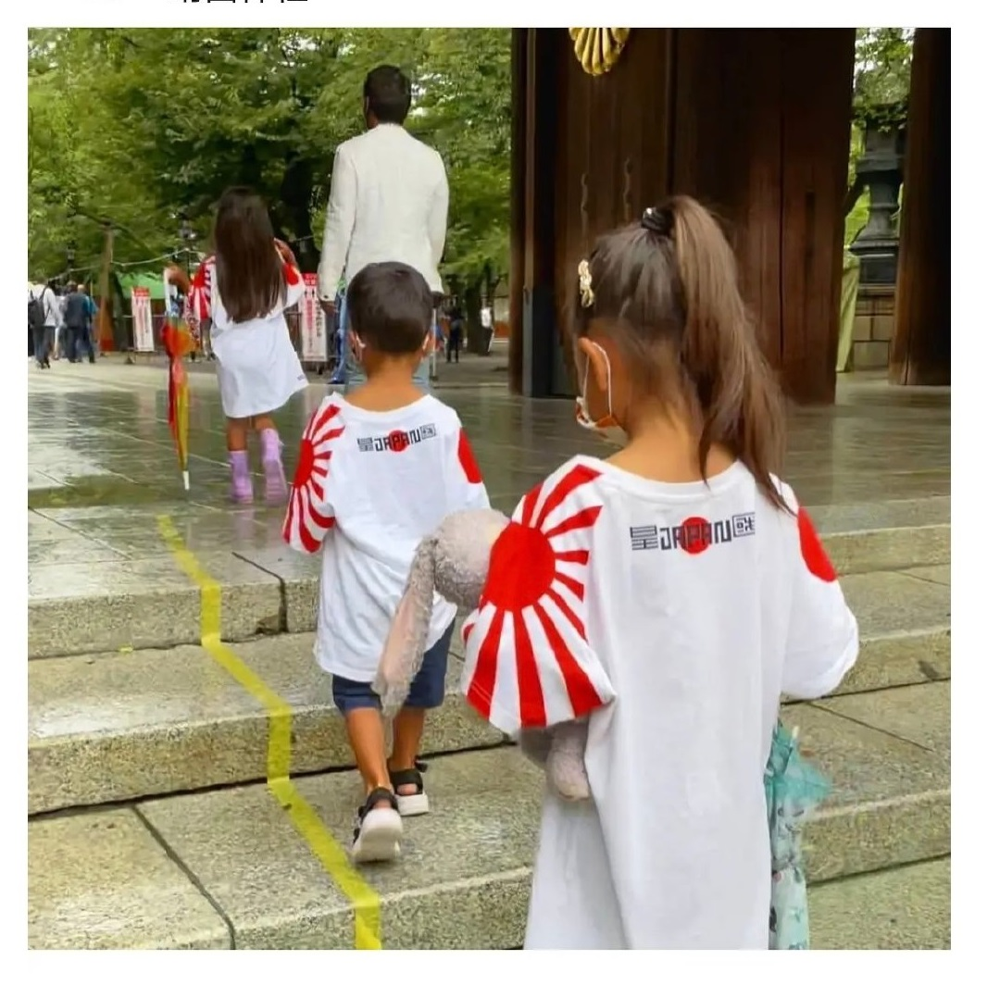
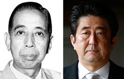

中国から、日本という国はどんな国ですか？ 最近、特に流行ってるような見方とは「知小礼而无大义，畏威而不怀德，强必寇盗，弱而卑伏」となります。

「**畏威而不怀德**」が「[資治通鑑](https://ja.wikipedia.org/wiki/%E8%B3%87%E6%B2%BB%E9%80%9A%E9%91%91)」に[唐太宗、李世民](https://ja.wikipedia.org/wiki/%E5%A4%AA%E5%AE%97_\(%E5%94%90\))の言葉から借用したものです。 同氏は当時の中国周辺にある、一部の少数民族政権が威力に尊敬するが、恩返しなど知らないから、文化のない野蛮な政権に向けて、強硬な対応すべきとの主張です。

「**知小礼而无大义**」とは、儀礼、マナーなどよくわかる、守るが、大義がない。 日本という国のイメージは平和？マナーがある？儀礼を尽くす？少なくとも、最初から皆はこのようなイメージでしょう。

但し、国、民族、人類に関わる大きな事でしたら、誤った判断や、いつものイメージを壊す言動が多いです。 福島の汚染水の排出、コロナ対応の無作為、など、できないのではなく、責任を逃げるために尽くしてる。遡って、大量な民間人などを虐殺した第二次世界大戦、全て、大儀がない言動である。 而も、反省もできずに、未だに原爆を使って、被害者に返信しようと印象操作をしてる。

「**强必寇盗，弱而卑伏**」が「**畏威而不怀德**」に対する補充です。 日本は平和ではなく、恩返しも知らない低劣な国である。強い時、弱い隣国から強奪して、弱いとき、畏怖する意味を指す。納得しない人は多いと思うが、日本の歴史を振り返ってみてください。

日本は野蛮な縄文時代からいきなり水田稲作、金属の製造、言葉まで、中国、朝鮮から学んできた。 言葉は朝鮮語(韓国語)、文字は中国語で、当時、世界最先端の文化から学んできて、まともに特有な大和文化に形成してきた戦国時代になり、初めて考えたのは、中国大陸への侵攻である。

中国、朝鮮半島の政権の強さは知らなかった時期は、失敗を繰り返して、畏怖して、勉強して、また、強くなったら、新たな戦争を興して、強奪するのを繰返した。その頂点は第二次世界大戦で、中国という国だけではなく、中国人の人種まで滅びようとした。

敗戦して、時代が変わって、金融と経済という強奪な手段が増えたから、米国のアジアでの使用人として、アジア諸国から資源を強奪して、植民地しなくても、奴隷にしてもらう手段は確保してきた。特に、戦後、中国経済は台頭するまで、東南アジア諸国の庶民の高収入とは、女性は日本で売春ぐらいでしょうか？

今の日本は戦前と同様、国運を賭け、中国と新たな戦争を図っているわけ。

**日本≠日本人**

日本は革命がないから、今の時代の日本という国、又は政権は、昔から継続してきて、形成したものである。 政治勢力の交代があっても、エージェントが変わるだけで、本質が変わりません。 戦後の今の日本は、戦前の日本と本質的に変わりがなく、米国の使い方次第で、戦火を興す国である。

「知小礼而无大义，畏威而不怀德，强必寇盗，弱而卑伏」 この言葉は日本人に通用するかと、私は違うと思います。 但し、右翼系の人だったら、かなり参考になるかもしれません。
