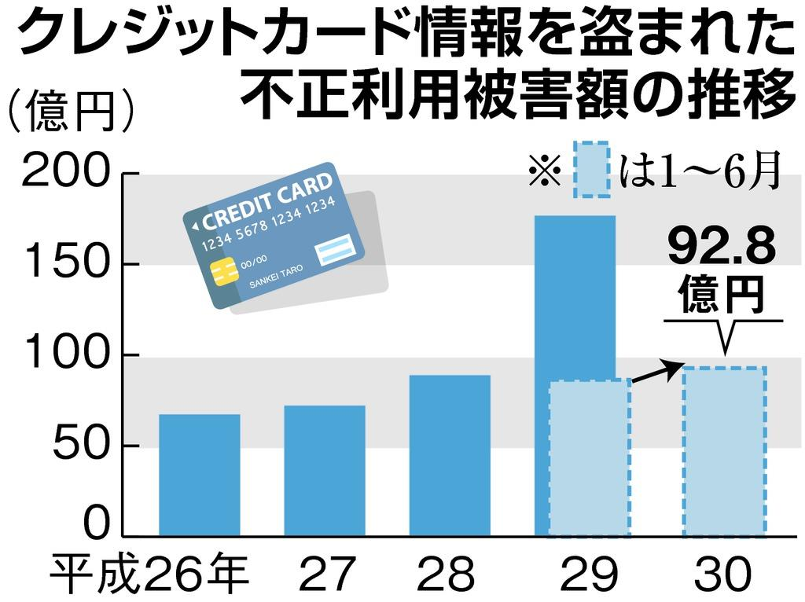

最近のクレジットカードの不正使用と思われるケースは確かに目立ちます。  
ニュースだけではなく、こちらの直接確認できた決済情報も同様です。  
そろそろ、クレカをやめたら？

日本の大手はキャッシュレスの大規模プロジェクトは進行しているようです。  
今のものだけではなく、日本も、中国のようにクレカ決済より、セキュアなキャッシュレスサービスは普及するでしょう。  
消費税の10%アップは政府から、キャッシュレスを推進するための行政的な対策である。単なる増税ではありません。

画像の出所：[クレジットカードの番号盗み被害額が過去最多に　ネットショッピング普及が背景か](https://www.sankei.com/affairs/news/181104/afr1811040011-n1.html)
