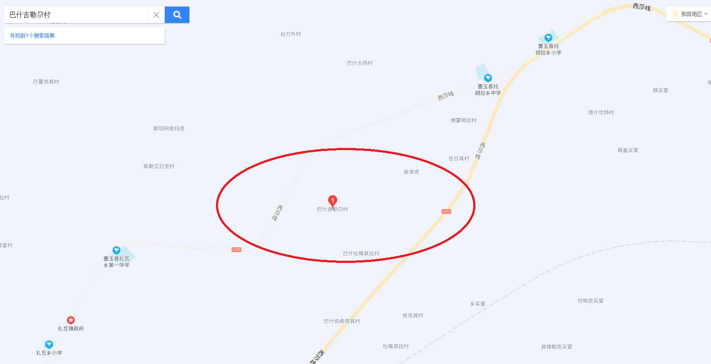

日本の方に難しいかもしれない。ちょっと検索してみれば、怪しいと気付くはずのフェイクですが、このツイト内容通り、虎ノ門からのフェイクニュースです。  
「両親がウイグル人強制収容所に入れられ、親と引き離された子供が両親を探して1人で歩いて凍死してしまった。中国は親子の隔離政策をし洗脳教育をしてる。」❓❓❓

このフェイクニュースの真実を解析して、暴きます。

https://twitter.com/dappi2019/status/1177492618202058752?s=20

まず、画像から検索して、一番古い記事は、2018/12/29、台湾の三立新聞からの情報です。  
[記事のリンク、サイトがYahooです。](https://tw.news.yahoo.com/%E7%88%B8%E5%AA%BD%E8%A2%AB%E6%94%BF%E5%BA%9C%E6%8A%93%E8%B5%B0-%E7%B6%AD%E6%97%8F%E7%AB%A5%E6%85%98%E5%87%8D%E6%AD%BB%E6%B2%B3%E9%82%8A-163545542.html)

同じ日付で、別の台湾のサイト「痞客帮」から、同じ記事がありました。

記事の内容が同じだが、情報元がtwitter、「Halmurat Harri Uyghur」というアカウントだそうです。  
但し、「Halmurat Harri Uyghur」のアカウントは見当たっていません。

こちらは[記事のリンク](https://tx56118.pixnet.net/blog/post/269461040-%e5%bf%83%e7%97%9b%ef%bc%81%e7%88%b6%e6%af%8d%e8%a2%ab%e6%8a%93%e9%80%b2%e9%9b%86%e4%b8%ad%e7%87%9f-%e7%b6%ad%e6%97%8f%e7%94%b7%e7%ab%a5%e5%87%8d%e6%ad%bb%e6%b2%b3%e9%82%8a)です。

三立新聞は台湾の主流マスコミで、何故、主流マスコミの情報元は、ジャーナリスト、同等な新聞業者ではなく、第三者経由したtwitterなのか、疑問を持ってほしい所です。

写真は更に検索しても、中々出てこないので、事件の発生した場所を確認していきたい。

三立新聞の内容から、「中國新疆維吾爾自治區，和田地區墨玉縣巴西吉勒尕村的一處小河」の記載があります。  
場所は、中国新疆の和田、墨玉県の「巴西吉勒尕村」という村だそうです。

[墨玉県政府のページ](http://www.myx.gov.cn/detail.html?did=350)(中国語)を確認していきます。村までないが、こちらの[地域情報を集めるページ](http://www.tcmap.com.cn/xinjiang/moyuxian.html)(中国語)から、「巴什吉勒尕村」という場所を見つかりました。

仮に、三立新聞の誤字としましょう。

「巴什吉勒尕村」で検索してみます。

村はかなり小さい単位ですから、通常、人口数でいうと、数十世帯、千人程からのイメージです。  
Baidu地図の検索結果を貼り付けます。

**「巴什吉勒尕村」の周辺に川がありません。****・「巴西吉勒尕村」が存在しない⇒嘘**  
**・「巴什吉勒尕村」に川がない⇒嘘**

抑々、あの写真は何なのか❓

もう一つの写真から、解析してみたいと思います。

右上、屋根で使うような素材のようなものを壁？として使う所が疑問です。

もう一つは、綺麗なタイルを壁のような所です。  
このような高そうなタイルは室外で使わない。この壁は倒れたものだと推測します。  
平和な中国新疆より、中東など、戦火を浴びてるところではないかと推測します。

また、中国で起こった事件だったら、公開された写真ぐらいならば、ニュースなど、あるはずです。検索してもどこも出てこないことは、報道されない情報です。事故で子供の死亡は、平和な社会では珍しいが、戦場なら、毎日沢山出てくるものである。

台湾では、詐欺が多く、フェイクニュースは量産地である。  
解析の冒頭に、三立新聞という、主流マスコミは第三者経由したtwitterからの情報を報道するについて、疑問を持ってください理由はこちらです。

まず、収容所などのことは、米国やカナダの曽てやった事の主役を中共に書き換えたフェイクである。

ぶっちゃけ、墨玉縣は観光地ですから、自らいってみれば、この写真が嘘であること、すぐ分かるでしょう。存在しない場所ですから。
