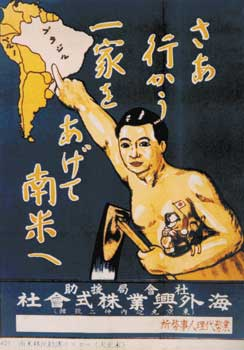

日本には移民が必要だ。勿論、移民が増える事によって、色々、曽てのなかった問題が増えるわけだが、前向きに改善していけば、良くなるわけだ。

移民とは「[通常の居住地以外の国に移動し、少なくとも12ヶ月間当該国に居住する人のこと（長期の移民）](https://ja.wikipedia.org/wiki/%E7%A7%BB%E6%B0%91)」。日本のでき上った時代から、移民は、日本にとても重要な存在である。

日本の発展は亜欧大陸の各文明と異なって、原始人から行き成り農耕社会になったのだ。これは中国や、朝鮮半島移民のお陰です。曽ての日本人は海外から先進な文化、技術は重要であると分かって、遣隋使、遣唐使を派遣した。  
仏教を広めるために鑑真和上は日本にきて、宗教以外にも、当時の新しい技術を持ってきました。味噌、砂糖、納豆、豆腐など、今でも我々の生活は影響を受けています。長崎に中国人の集結した街になり、テレサテンの「長崎は今日も雨だった」のような美しい歌はできました。

近代になり、キリスト教など西洋からやってきて、そして日本でも産業革命はおこって、そして脱亜入欧、沢山の日本人は世界へ行ったり、沢山の外国人は日本へ来たりして、先進国の陣にたちつづけて、今までだ。

日本の輝く歴史は、曽ての人から、常に世界中のよいものを受け入れようとして、オープンな姿勢でやり続けたからです。

移民排除ということは、外国人の日本へ移住する禁止とともに、日本人は海外への移住もできないことだ。これは国家間の平等な対応だと分かってほしい。言い換えれば、移民排除、反対する事は、日本の扉を閉じ込め、世界から孤立させる事です。

古代の何も知らなかった日本人の先祖達は孤立されないために、命を懸けて海を越え、世界と繋げるようにしたのに、今のグローバル時代で、日本を孤立させようと唱える人を理解できません。  
移民により、興した社会問題が目立ちになる時、保守的な声があっても想定内でしょうが、この勢力は大きくなると、逆に、内乱になりがちで、日本を壊そうとしているでしょう。  
自らのまちを壊しかけていることは香港で起こっている最中だ。日本も香港と同様なことが起こった場合、背後に、CIAだけでなく、中共政権の影響を考えられるでしょう。  
本当に日本のためだと思ったら、利用されないように注意を払った方がいかがでしょうか。

移民はあるこそ、日本は世界とつながって、常に先進国に立ち続ける前提の一つだ。

最後に追記しておきます。国として人口を増やすのは、基本、二つ、一つは国民に多くの子供を産んでもらう、もう一つは、大量な移民を受け入れる事だ。女性は社会でも活躍する時代ですから、日本の場合、前者が上手くいかないようであれば、大量な移民を受け入れる事しかできません。  
AI云々などもあるが、日本人生まれって、AIをコントロールできる人と限らず、優秀な人材を沢山輸入するのが必須で、現状でもある。しないと、日本は自然に消えてゆき、自分自身を滅ぼすでしょう。
