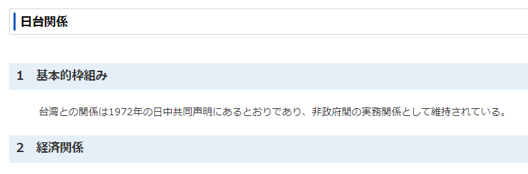
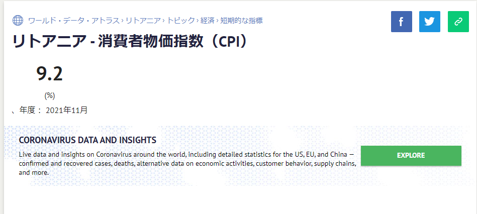
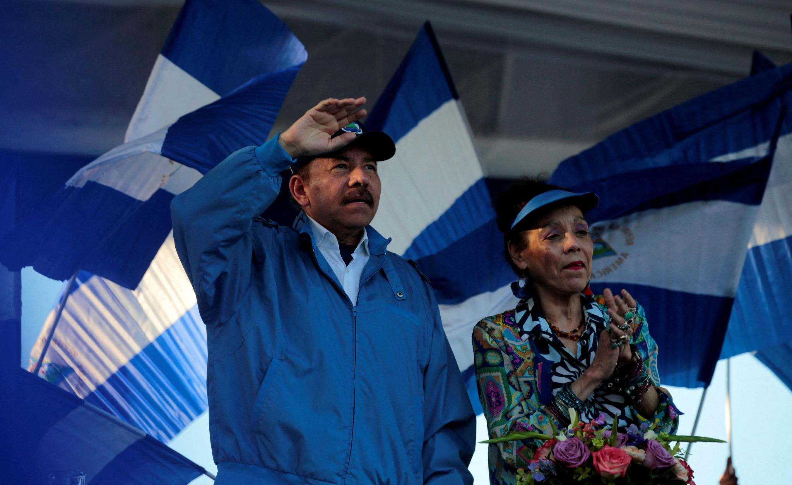
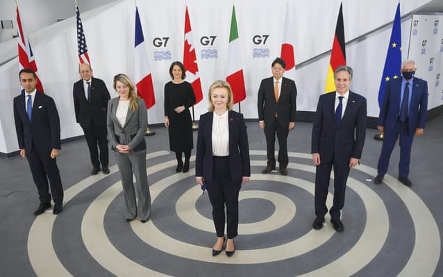
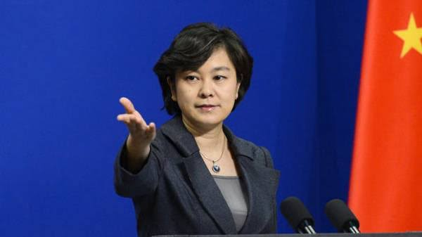
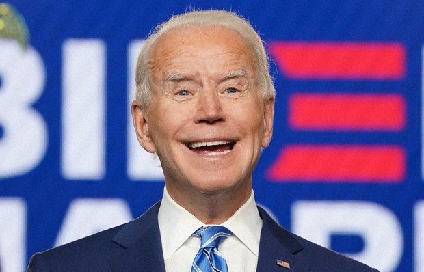

台湾問題を巡って、リトアニアから、中国への挑発から、北京五輪、民主国家サミットまで、最近、一連の中米外交戦争について、日本マスコミは報道しない、実際の状況をまとめて、展開したいと思います。

**前提**

リトアニアからの挑発を言う前に、日台関係を例に、台湾とは国か❓のところから、おさらいです。

いつもの繰り返しですが、日本から見る台湾が国ではなく、中国(中華人民共和国)の一つの地域です。詳しくは[外務省の日台関係](https://www.mofa.go.jp/mofaj/area/taiwan/data.html#section5)の記載、又は、中華人民共和国との[日中共同声明](https://www.mofa.go.jp/mofaj/area/china/nc_seimei.html)の原文を参照してください。

中華人民共和国と外交関係を結ぶ全ての国は、台湾が中華人民共和国の一つの地域であること、認めなくてはならない、皆は同じ約束をしなくてはならない。 勿論、台湾を国として認める自由あるが、中華人民共和国と断交すれば、約束通りだが、 中華人民共和国と外交関係を維持しながらも台湾を国として認める事は、中国からは許せないことです。

**リトアニアの結末**

「[台湾、リトアニアに代表機関開設](https://www.nikkei.com/article/DGXZQOGM18AP10Y1A111C2000000/#:~:text=%E3%80%90%E5%8F%B0%E5%8C%97%3D%E4%B8%AD%E6%9D%91%E8%A3%95%E3%80%91%E5%8F%B0%E6%B9%BE,%E5%A4%A7%E4%BD%BF%E9%A4%A8%E3%81%A8%E3%81%97%E3%81%A6%E6%A9%9F%E8%83%BD%E3%81%99%E3%82%8B%E3%80%82)」とは、事実上、台湾を国として認めて、中国との約束を破った事である。 中国に対した挑発の結末とは、かなり窮境に陥てる： ・2021年11月だけ、[CPI指数9.2%](https://jp.knoema.com/atlas/%e3%83%aa%e3%83%88%e3%82%a2%e3%83%8b%e3%82%a2/topics/%e7%b5%8c%e6%b8%88/%e7%9f%ad%e6%9c%9f%e7%9a%84%e3%81%aa%e6%8c%87%e6%a8%99/CPI%e4%be%a1%e6%a0%bc%e5%af%be%e5%89%8d%e5%b9%b4%e6%af%94)上昇。ようは、収入は変わらないのに、生活必需品は50%以上上がってるイメージでしょう。 スタートしたばっかりですから、この悪性インフレは、これから更に悪化すると予想してよいでしょう。 ・[中国の通関システムから「リトアニア」という国が削除され、](https://www.afpbb.com/articles/-/3379156)実質上、今まで、リトアニア⇒中国の輸出ができなくなる ・中国企業のみならず、[中国で業務のある多国籍企業も、リトアニアボイコット](https://jp.reuters.com/article/china-lithuania-trade-idJPKBN2IO0EZ) ・欧州に助けを求めても、同国の勝手な反中の動きに無関心というか、北京五輪のボイコットについても、欧州のTOP、[フランスの大統領から直接否定的な発言をもらいました](https://news.yahoo.co.jp/articles/4e5814f5bfddd6676763307125894bfc474d072c)。 ・欧亜大陸を結ぶ「中欧班列」、中国の上海⇔ドイツのハンブルクの鉄道線路は、元々、リトアニアを重要な中継として利用したが、[トラブルメーカーのリトアニアを通過のみで、停止しないと、合意しました](https://twitter.com/loveapple/status/1468833630114168833?s=20)。

これで以上になるか❓間違いなく、NOです。 リトアニアは、ロシア、ベラルーシからの領土問題、アフガンなどからの難民問題など、中国の加味の下で、何があってもおかしくない。２、３年経て、リトアニアという国はなくなってもおかしくないか？と勝手な憶測で分からないが、更に大変な状況に陥ることが間違いありません。

**暗渡陳倉：民主国家サミット当日のニカラグアの台湾断交と中国建交**

中米対抗の中では、お互いの勢力範囲から蚕食していくものです。 中国の経済の影響力は、米国の「裏庭」中南米まで届くものである。台湾の金銭外交に満足できなく、米国のプレッシャーを耐えて、いきなり中国と建交するパナマのような国もあれば、ハイチのように、国民の福祉のために中国と建交して、台湾の派遣されたスパイに足と腕が切られて、虐殺された大統領もいます。 勿論、中では、どちらにするか、論争中のホンジュラスもあります。

態々とやったでしょうか❓ホンジュラスは台湾と断交して、[中国と建交するか中南米での中米対抗について、マスコミアは煽ってきた](https://www.sankei.com/article/20211117-TEXRTGMVANLABFKTEA2BDBJFFI/)が、民主国家サミットの当日、突然、[中国とニカラグアの建交](https://jp.reuters.com/article/nicaragua-china-taiwan-idJPKBN2IP03Z)と発表された。 三十六計の言葉を借用すると、「[明修桟道、暗渡陳倉](https://ja.wikipedia.org/wiki/%E6%9A%97%E6%B8%A1%E9%99%B3%E5%80%89)」ではないかと思います。米国の目線をホンジュラスに集中させて、民主国家サミットにニカラグアの爆弾を設けてやる、中国外交の謀略である。

日本マスコミも大量に報道してきた民主国家サミットは、 訳の分からない中国対抗のために、各国の代表を集めて、裏庭に大炎上して、結局、結論なしで終わってしまった茶番劇であると、世界中に見せました。 勿論、この民主国家サミットの茶番劇は、米国内から反対の声も多く、民主と言いながらも、コメント機能を停止して、閲覧者の発言を抑止にしてしまったようだ。

**G7サミットの発信こそ、米国外交の失策と失敗**

[G7で中露に対抗一致](https://www.47news.jp/7162861.html)と態々宣言するのは何を表すのか？

今まで、対抗しなかったのか❓ 勿論違います。G7の内部では、分裂があるからです。アングロサクソンと欧州、そして、責任を取りたくない日本も曖昧な態度だからです。

大国間はそうだけど、中米対抗の先頭に立つ小国の状況から、どちらが優位であるか、明らかに鮮明である。 米国は[カンボジア制裁](https://news.yahoo.co.jp/articles/a19655e411bd2ccc011e9e8035f2766e346e8e6e)と発表した後、首相のフンセン氏は、米装備を破棄する命令を下して、コスパ悪い米国の武器をやめるチャンスだと明言したようだ。 中国側の小国カンボジアは米国の制裁に恐れないのと、米国側の小国リトアニアは中国の制裁の中、前述通りの困窮に陥るのと、差が鮮明である。

しかも、カンボジアの属するASEANは米国対抗に反対しない、 リトアニアの属するEUは、中国対抗に反対するからです。 EUの中では、ユダヤ、アングロサクソン系の反中勢力が潜んでるから中国を批判する発言するが、利権に触るような実際の動きは慎重である。 逆に、ASEANは第一番の貿易相手の中国と、良い関係を保たなくてはならない。 米国のために尽くしたリトアニアは中国だけではなく、利権の深い隣国にも嫌われてるわけだ。

米国外交自体は無策であり、中国外交に翻弄されてる状況だからでしょう。

**まとめ**

中国外交は数十年を渡って政策は一環している、世界中有数な国である。 他国、特に、国力の弱い、多数の後進国から見ると、接するリスクが低いわけだ。逆に米国は大統領が変わる度に、外交政策が変わってしまう、リスクが高い。

日本マスコミだけを見ると、米中対抗で、中国は孤立され、常に大変な状況に陥るように見えるけど、実は、中国崩壊論と同様、崩壊を謳うほど、強くなると気づきませんか❓

米国、特にバイデンはソ連と冷戦、ようは、自らの集団を作って、別集団と対立させる外交に得意だが、中国はソ連ではないので、欧米日を含めて、世界の経済は中国と深く絡んでいて、而も、米国の対立集団を築こうとしない。 サミットといって、百以上の所謂民主国家を集めて中国対抗と言っても、無感というか、内の90%以上の第一貿易相手は中国だから、自国の経済を崩壊せようと言われてるのと一緒で、誰も動かないだろう。

この世界各国の動きは、中国外交部の想定通り、確実に、1つ1つの勝利を収めていくのかと見受けてます。
