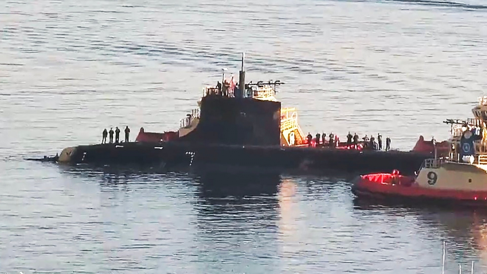

中国南シナ海で衝突事故を起こした米軍のコネティカット原子力潜水艦は、グアムからサンディエゴの基地へ引き込む時の写真は公開されました。⇒[情報元](https://vov.vn/the-gioi/xuat-hien-hinh-anh-tau-ngam-my-uss-connecticut-nat-mui-vi-va-cham-o-bien-dong-911257.vov) 

写真から、先端のソナー_フェアリングは完全に剥がられてるような、確かに大きな損傷である。_

コネティカット号は、アメリカ海軍、シーウルフ級原子力潜水艦として、世界最強と言われてます。 同型潜水艦は、上に氷層、下に複雑な山脈の北氷洋の中、ロシアの最先端潜水艦と対抗してきた実績は多いのに、何故か、比較的に航行しやすい南シナ海では失敗しました。

未だに事故の原因が解明されていないようで、[艦長ら3人、解任されました](https://www.jiji.com/jc/article?k=2021110500565&g=int)。 コネティカットの事故は、米海軍は、完全に南シナ海から追い出される、ポイントとなる事件であるかと思われます。
