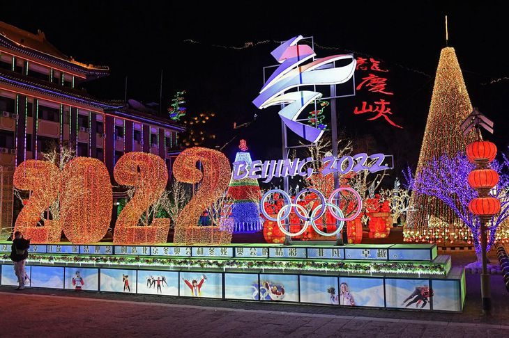

1980年モスクワ五輪のボイコット事例があったのに、何故、今回はアングロサクソン系諸国は、中途半端な外交的ボイコットしかできないでしょうか❓本当に、国民に反対され、都合が悪くなるからです。

まず、バイデン政権は冷戦の経験を活かして、中国と対立する集団を築こうとした一環、北京五輪のボイコットでしょう。この動きのなか、どれだけ中国と対抗する味方を集められるか❓現実的に、ほぼなしだ。 日本は主権国家ではないから、はきはきとしない、強引されるような印象だが、アングロサクソンの味方になるのか。

但し、本当のボイコットはできません。 別に体育精神と関係なく、大失敗した東京五輪直後、IOCの興収にも関わるが、冬季五輪のメインとなる観客は北半球の先進国であるからです。

中国は冬季五輪の観客も、得意のスポーツも比較的に少ない。北京五輪は中国の国威発揚より、大規模スポーツイベントをやって、欧米諸国にメンツをあげるものである。 勿論、成功を収めたいが、最悪、ボイコットで上手く行かなかったら、欧米諸国の選手から、ファンまでの不満は必至である。政治に関心しない多数の民衆を政権の反対側にすることですから、欧米諸国は、基本、選手までのボイコットが無理だろう。

一方、コロナ禍の下、日欧米諸国はパンデミックの最中である。 外国人観客拒否は、北京の英断である。

ちょうど、アングロサクソン系のファイブアイズと日本は、パンデミックの一番酷い地域でもあり、要人を含めて動きを控えてほしいところです。 中国側、招くつもりもないから、外交的ボイコットは、負けてる状況を隠すための手段として、よいでしょう。
