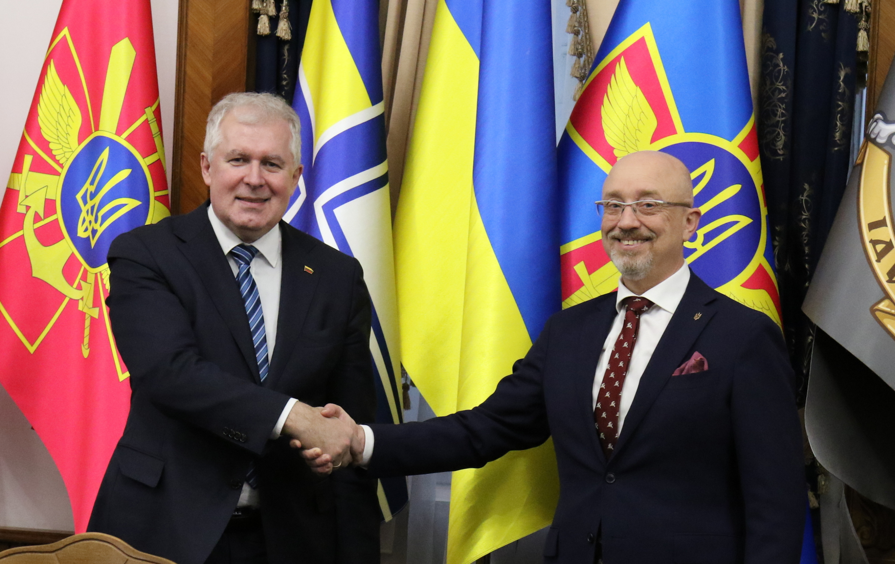
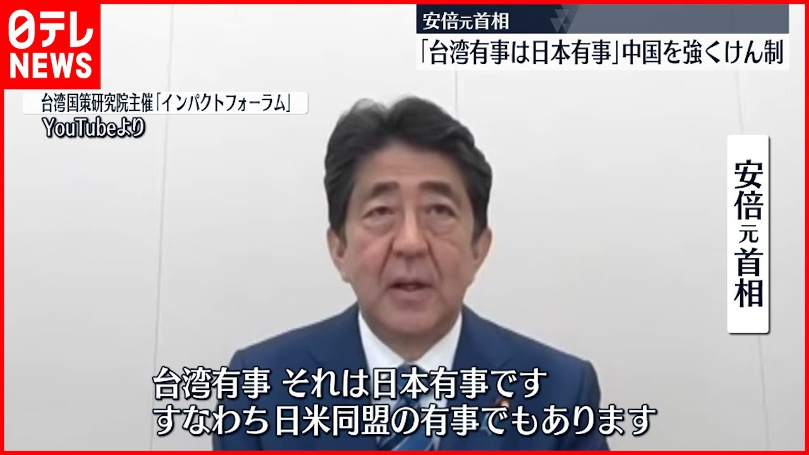
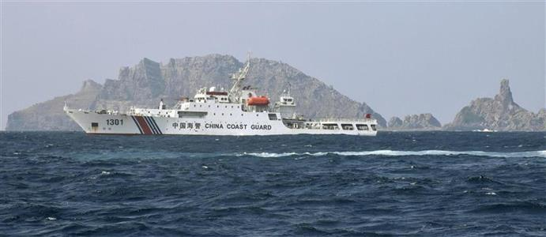

[ワシントンポストは2024年、米国の内戦](https://www.washingtonpost.com/outlook/2021/09/27/how-scared-should-we-be-about-2024/?tid=ss_tw)について、言及しました。予想された内戦はジャーナリストの憶測ではなく、軍内部の専門家から、予想されてものである。勿論、「内戦」といっても、世界一強権の米国だから、「内戦」の起こり得る不安定要素を外部へ転嫁する可能であり、米国内部で戦争が起こると限りません。 外部へ転嫁すると、我々にも深く変わるので、簡単に推測をしてみたいと思います。

現在米国の状況とは、[文化戦争](https://gendai.ismedia.jp/articles/-/75734)により、分断されていると言われてます。「文化戦争」とは何か？中国の「文化大革命」にあたるものです。事実べーつではなく、イデオロギーで国を動かそうという状態である。 特にバイデン政権以降、米軍内部での思想統一が進んで強化されているようです。黒人国防長官、オースティン氏の登場は、米民主党は、左翼の勢力を元々右翼主導の軍内部へ浸透させる、重要な一環でしょう。

難局に向かってるが米経済は、まだまだ強いので、社会内部の紛争は何となく納めそうだが、いざと、経済の成長が鈍化し、最悪な状態に陥ると、2024年大統領選挙のきっかけで、内戦が必ずやってくると言われます。 実には、2020年の大統領選挙にも、米民主党議員のペロシ―らは、トランプ元大統領を架空させ、SNSアカウントを永遠に封じ込む等、米国の立国の根本、憲法を反するものであり、内戦に近い状態で、危機一髪だった。

**投資を米国に集めるためには？**

第二次世界大戦と同様、新たな世界大戦で、欧亜大陸は戦場に陥れば、世界の資産は再び米国へ流れます。 中東(いう程もない)、ウクライナ、台湾海峡、同時に戦争が起これば、欧亜大陸東西に、同時に戦場の状態に陥て、米国は、また、世界一平和な環境に戻るでしょう。特に中国と日本も戦争状態に陥れば、追い越される懸念も必要ない。 また、米海軍の軍艦、潜水艦の40％以上は、2030年まで退役期限に向かえ、而も、新たな軍艦を製造する生産力も、財力もなく、2030年後、老朽化した軍艦で、1万キロ離れた中国と対抗するのは、とても想像し難い。 戦争をやるなら、2024年頃は、唯一なチャンスかもしれません。 因みに、戦争で旧装備が壊して、別のソ連程の経済規模から利益を収穫できれば、新たな武器の生産を見込めるので、一番いい都合である。

欧亜大陸の戦争とは、特にウクライナ当たり、[リトアニアはウクライナへ致命的な武器を提供する](https://112.international/politics/lithuania-announces-its-readiness-to-transfer-lethal-weapons-to-ukraine-67884.html)と発表したことから、ウクライナだけではなく、バルト海三国まで巻き込んでしまって、欧州は戦場に巻き込まれるのかと考えてよいでしょう。 ロシアは中国じゃないから、常に冷静な対応する国ではない。外交レベルの引下げなどでは、済まないでしょう。リトアニアは中国と交悪する一方、ロシアへの挑発はかなり危険な行為である。

台湾有事＝日本有事の爆言は、幸い、中国公船は尖閣海域に入っても、自衛隊も、米軍も、何の反応もないことから、強力な中国軍の前では、安倍さんの嘘しか過ぎないと分かってる。 台湾海峡での戦争は大きく発展しないではないかと、分かったでしょう。 中国はアジアから、上手く米国勢力を排除するほど、平和になるわけです。アジアの一番の不安定要素は、依然として日本はメインでしょう。

**プーチンも台湾カードを**

東欧で戦争起こりそうなことを言ってるが、台湾海峡があっても、アジアは平和？ そう簡単ではない。

[ロシアはＮＡＴＯに東欧から軍撤退と勢力拡大停止の要求](https://news.yahoo.co.jp/articles/9bb9f389e0256198acb371ed93378b72ce49b02c)、欧州、日本のマスコミから、批判の評論は基調でしょうが、本当には、プーチンは、米軍に、東欧から米軍を撤退して、アジアへ移る言訳をあげることです。 米国はアジアでの利権を守りたいでしょう。リソースが限られて、欧州に駐在してる軍をアジアへアサインしたいでしょう？ようは、プーチンも台湾カードをやってます。

中国も、ロシアも、欧亜で共に戦争をやって、米国勢力の排除は共通利益があり、欧亜大陸の平和のためであるが、どちらが先にやるか、米軍の集中をさけるように、お互いに見てるところでもある。

**まとめと予想**

米国の金融覇権の観点からも、世界中、混乱や紛争は大きくなるほど、大儲けのチャンスになる。ウクライナ当たり、台湾海峡の戦争は必ず発生します。どちらが先かわかりませんが、米軍の対応できないように、同時進行するものになるでしょう。

戦争があっても弱い所から始まるもので、中国も日本も、基本、戦場に陥ることないでしょう。 我々の資産はどこへ持っていく方が安全だろうか、多くの人に関わるものでしょう。 ドル主導のSWIFTと別に、[中露は新たな通貨システム](http://japanese.china.org.cn/business/txt/2017-10/27/content_50046733.htm)を開始と発表した。こちらは、中露だけではななく、イラン等も含めて、人民元立て天然ガス、原油等の取引になります。1970年代から、米ドル建て原油取引と似ており、人民元覇権は形成していくでしょう。

収まらないコロナ禍の中、こちらの考えた、本当に大雑把ですが、資産の安全な所の順位：

中国⇒米国⇒日本⇒西欧⇒ロシア⇒東南アジア/東欧/アフリカ⇒中東
