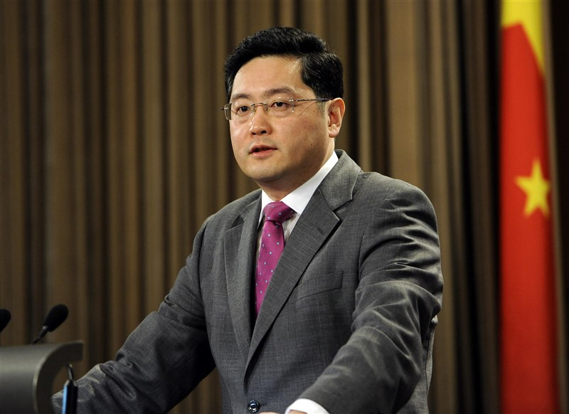
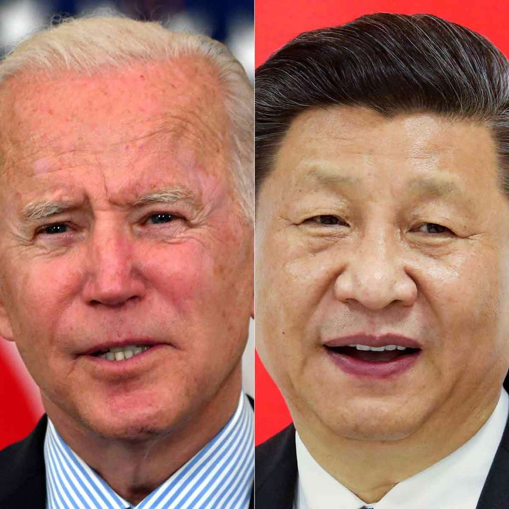

中国外交部副部長、駐アメリカ合衆国大使、秦剛氏は、[12/20の取材を受けた時、「中国はソ連じゃない…中国冷戦に負けるはずがない」(中国語)](https://www.zaobao.com.sg/realtime/china/story20211226-1226684)と強硬な発言をしました。こちらは、中国から、中米冷戦の正式な宣言だと見受けています。

中米対抗の中、中国の弱点として、冷戦の経験が比較的に少ないです。米国、バイデン氏の当選は、各財閥の冷戦の経験者の強い願望を反映している。そして、当選してから以来、西側諸国、米国陣営の各国とあわせて、冷戦の戦場を築いてきたわけだ。 日本マスコミの「民主国家」の呪文を繰返すのも、冷戦の雰囲を作ってる一環でしょう。

米ソ冷戦の中、ソ連の失敗した点として、軍の参謀長レベルの疎通は常に保っており、核戦争の起こらない基準は、米国側がはっきりと分かってる。更に、中国と手を組んで、ソ連の戦略上のミスを導き、崩壊してしまうまで発展してきた。 ソ連の教訓を分かれば、習近平とバイデンの会談は、中国側の誤算であること、明らかです。

米国経済、国民は難局に陥てるので、中米対抗は共に損するだけで、やめた方がよいでしょうと、中国側の一方的な思いだけで、米国側から見ると、国内向けに上手く洗脳できるから、民生を無視て良く、しかも、台湾、民生は中国の弱みだと、はっきりと分かったので、更に、攻勢を強めてきた。例えば、中国電信を含めて、中国国有企業等、制裁する大手企業は、基本労働密集型企業であり、更に、新疆の制裁とあわせて、中国で大量な失業者を作るのが目的である。

秦剛氏の強硬発言は、中国のTOP、中米関係回復の夢を完全に捨て、正式に中米冷戦を認めた宣言であり、中米冷戦の中、中国の転換点でもある。それを受け、[国務省職員らのビザを中国に申請](https://www.excite.co.jp/news/article/Recordchina_887139/)して、中国の態度を試している。結果はどうなるか、観測していこう。
