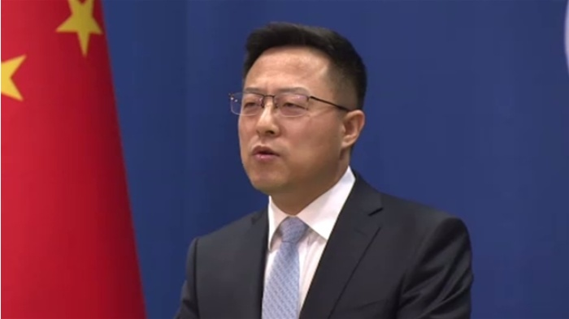

新疆めぐる米の制裁に対して、趙立堅報道官の[「情勢の変化を見てさらなる反応をする」](https://news.tbs.co.jp/newseye/tbs_newseye4432387.htm?1640591705769)発言以外、何も言及していないようだが、点在されたニュースから、2021/12まで、中国の対策は以下となります。 勿論、中国側の先取って、対応していく部分もあります。

**1．国有レアアース企業の本社の住所を新疆にすること**

レアアースの世界最大産地は中国であるが、今まで、各地方の企業は、実質上、ライバル関係となって、最大な供給国にも関わらず、定価権を握ってない窮境はずっと続いています。中国の新たなエネルギー戦略にあわせて、各レアアース企業を統括して、国有レアアース企業、[「中国稀土集団」を設立](https://jp.reuters.com/article/china-rare-earths-m-a-idJPKBN2J207Z)しました。 新疆めぐる米の制裁を受け、同社は、登録住所を江西省⇒新疆ウイグル自治区に変更するようだ。

レアアースは、通常の家電製品だけではなく、宇宙、航空等、ハイテック製品に不可欠である。例えば、F-35等、ステルス機に不可欠な電波吸収塗料、重要な原料の一つはマグネシウムである。中国から輸入しなければならない。言い換えると、マグネシウムの輸出量から、米最新鋭ステルス機の生産数を推測できる。

新疆めぐる制裁の中、米国はどうやってレアアースを輸入するか、中国は見たいでしょう。

**2．中国製マスクに新疆綿を混入させること**

コロナ禍の中では、日常の防護として、マスクが不可欠である。 世界中、[8割のマスクは中国製](https://www.nikkei.com/article/DGXMZO62961080T20C20A8I10000/)だそうです。日本や、台湾製造だと言っても、原料は中国からのものとなります。

新疆からの原料があるだけで、輸入しなかったら、米国はどこのマスクを買うのか？中国は見たいでしょう。

**まとめ**

勿論、これは全てではありません。 消息筋から頂いた情報です。中国にとっては実行しやすいが、生産力の弱い米国はどう対応していくのか？また、自らの言葉を覆すかと推測します。
