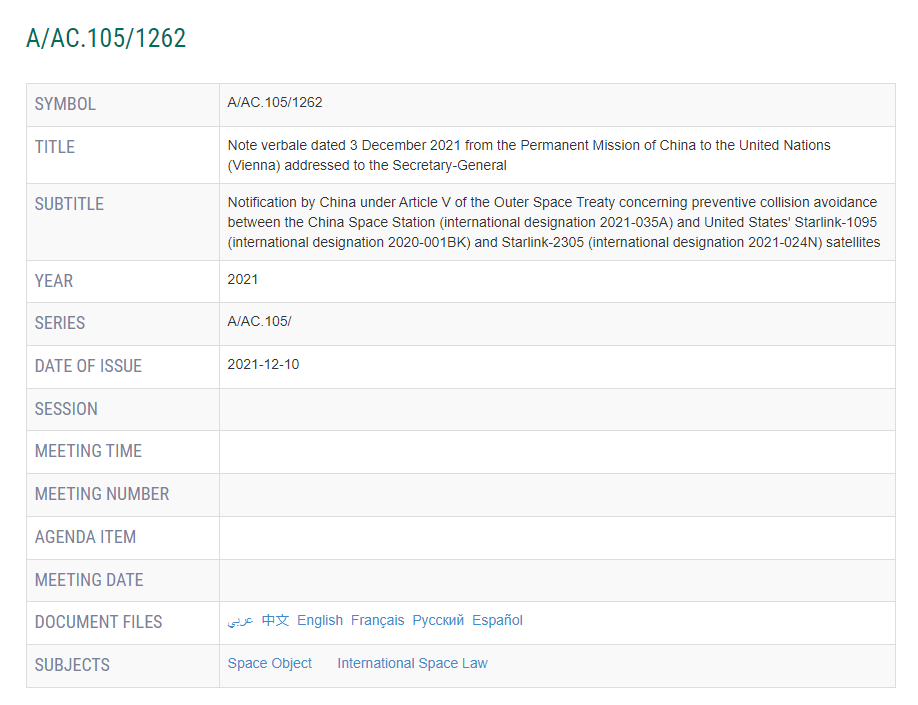

米人工衛星は、2021年中、2度と、中国の宇宙ステーションに接近して、攻撃しようとしたこと、国際連合宇宙局の発表された文書から分かりました。

文書のID「A/AC.105/1262」 リンク：[https://www.unoosa.org/oosa/en/oosadoc/data/documents/2021/aac.105/aac.1051262\_0.html](https://www.unoosa.org/oosa/en/oosadoc/data/documents/2021/aac.105/aac.1051262_0.html)

勿論、アメリカ様のご都合悪いニュースですから、日本マスコミは一切報道しません。

ロシアや中国等、破棄する人工衛星の攻撃試験をしたといって、日本ではスペースデブリ云々って、あんなに大声で謳ってきたのに、何故、人乗りの宇宙ステーションへ攻撃しようとした、本当の危険行為に対して、全員黙ってるのか❓ご興味のあるかたは、原文をご参照ください。

ある意味残念ですが、2021/7/1と、2021/10/21、2回の危険行為に対して、中国の天宮宇宙ステーションは緊急に軌道変更して、無事退避しました。

**経緯：**

**1回目退避(2021/7/1)**

スペースX社、starlink-1095衛星は、2020/4/19から、平均高度555KMの軌道上安定に運航し始めた。 2021/5/16～6/24、平均高度382KMの軌道に侵入した。 2021/7/1、同衛星は中国ステーションと接近し、安全のために、中国宇宙ステーションは軌道変更して、緊急退避しました。

**2回目退避(2021/10/21)**

スペースX社、starlink-2305衛星は不安定な軌道変動状態で、緊急接近したことを受け、中国宇宙ステーションは軌道変更して、緊急退避を行いました。

中国は、国際連合事務総長にに対して、宇宙条約を締約した各国に上記の事項を周知するように要請して、 注意喚起として、各国は宇宙区間での活動は、国際責任を負い、この条約の規定に準拠することを保証する責任あると強調しました。
