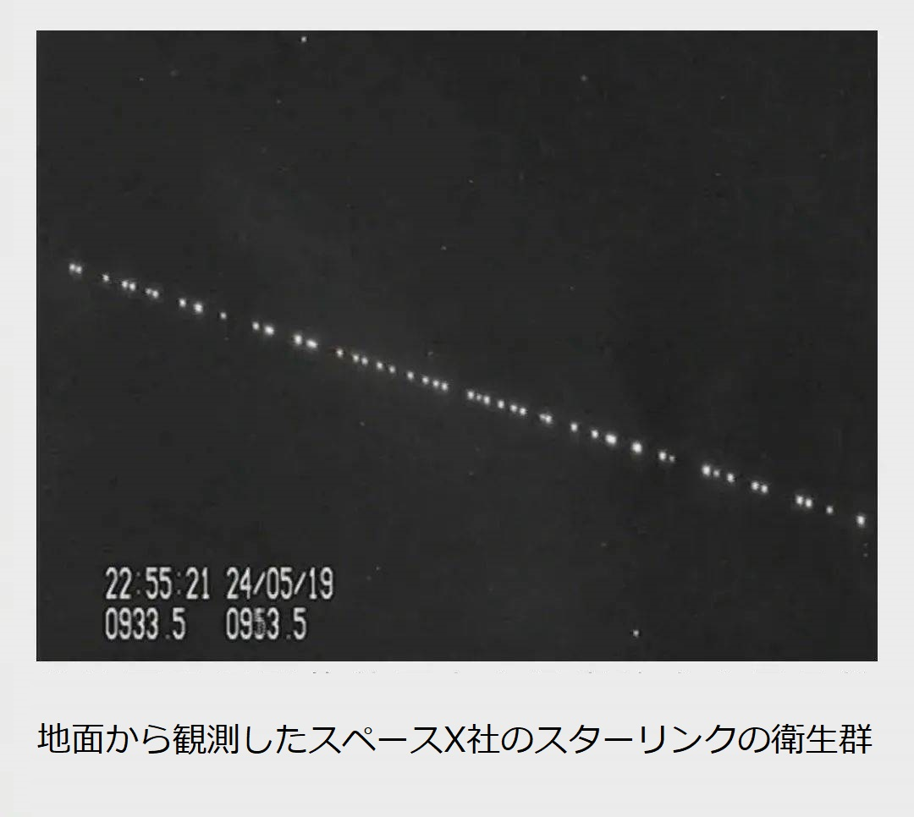
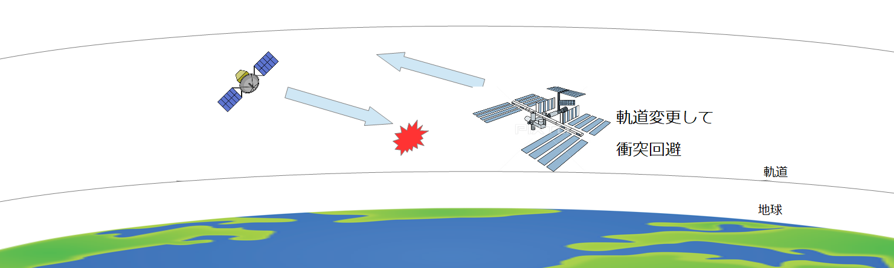

中国は国際連合宇宙局で、[米人工衛星による、有人宇宙ステーションの攻撃](https://blog.loveapple.cn/news/202112288239.html)の摘発は、偶然ではなく、スターリンクの陰謀は裏側に隠されている。

スターリンクは、[4万基の通信衛星で、地球を覆う](https://www.technologyreview.jp/s/255957/who-is-starlink-really-for/)大きなプロジェクトである。5Gが普及していない米国では、6Gのために、先取りして中国の5G通信技術と対抗する風に煽ってきました。 但し、スターリンクはそんなにシンプルなものではなく、[米軍と契約](https://jp.techcrunch.com/2020/05/27/2020-05-26-spacex-signs-testing-agreement-with-u-s-army-for-use-of-starlink-network/)しています。勿論、4万基低軌道衛星ですから、米軍の視野から外されることはないでしょう。しかも、単純に通信でもないようです。

4万基衛星は、[低軌道のリソースがなくなり、実質上独占してると懸念されている](https://www.afpbb.com/articles/-/3348899)声が多い。中国の国際連合宇宙局で披露した事件を見ると、スターリンクは、通常の通信衛星に必要としない、軌道間の移動機能も備え、単なるリソース独占ではなく、地球の低軌道を封鎖する野望であること、明らかです。 米軍はイーロンマスクのスターリンクを利用して、低軌道の封鎖を実現していることです。2022年1月現時点、[スターリンクの打上げた衛星数は1900基](https://ja.wikipedia.org/wiki/%E3%82%B9%E3%82%BF%E3%83%BC%E3%83%AA%E3%83%B3%E3%82%AF)超え、もし、４万基規模まで配備できたとしたら、世界中、高軌道の衛星、又は、星間の宇宙船を打ち上げるときは、イーロンマスクの承認は必要になってくるわけです。 このやり方は、今、米国の海上覇権と同様、世界中の海上貿易は米国の了承はないと、行かない事である、同じ考え方で、宇宙区間の覇権を図ってる。

何故、米軍の図りに、イーロンマスクを使うのか❓こちらは、[大航海時代の歴史](https://book.asahi.com/jinbun/article/13219460)の繰り返しです。イギリスの替りに、主役は米国になり、イーロンマスク氏は、米国に雇われる海賊である。 対立国の宇宙ステーション、人工衛星を衝突して、壊しても、個人会社だから、米国、米軍を代表できなく、脅かしながらも、外交レベルの交渉は可能である。

他国の匹敵できなくなる時になってくると、覇権を自然に握っている状況になります。

米国の宇宙区間の覇権は、間違いなく、人類全体の宇宙区間の探索、開発のじゃまになっているわけです。中露は黙って見ることは、まず、ありません。 今回、スターリンクの攻撃行為を見る限り、天宮宇宙ステーションの[ホールスラスタエンジン](https://ja.wikipedia.org/wiki/%E3%83%9B%E3%83%BC%E3%83%AB%E3%82%B9%E3%83%A9%E3%82%B9%E3%82%BF)の性能を試してると見受けてます。2021年、2回の攻撃で、中国側の探知力、宇宙ステーションのホールスラスタエンジンの性能を分かったら、上下軌道に攻撃用スターリンクの衛星を加えれば、事故させることは可能になります。

中国の対策の一環として、国連で米国低劣な行為を世界に知らせるからとなります。 何故、[ロシアは低軌道衛星の破壊試験](https://www.nikkei.com/article/DGXZQOGN1606Z0W1A111C2000000/)をするのか？スターリンクの対策であること、点在された情報から分かってくると思います。 中露とも怒って、スターリンク向けて対策を打っていることは間違いありません。 中国の情報公開の直前まで、何故、[イーロンマスクは、12月中でも、2度と、テスラの株を大量に手放す](https://www.bloomberg.co.jp/news/articles/2021-12-29/R4UZ3JDWRGG301)主な理由でしょう。

イーロンマスクは雇われてる企業家である。裏側に立つ米国、米軍のスターリンクは、宇宙空間の覇権を図って、全人類の宇宙資源を独占する陰謀である。 勿論、日本マスコミは、ここまで、宗主国の都合悪い情報を報道しません。
