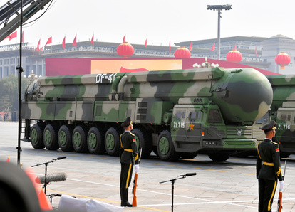
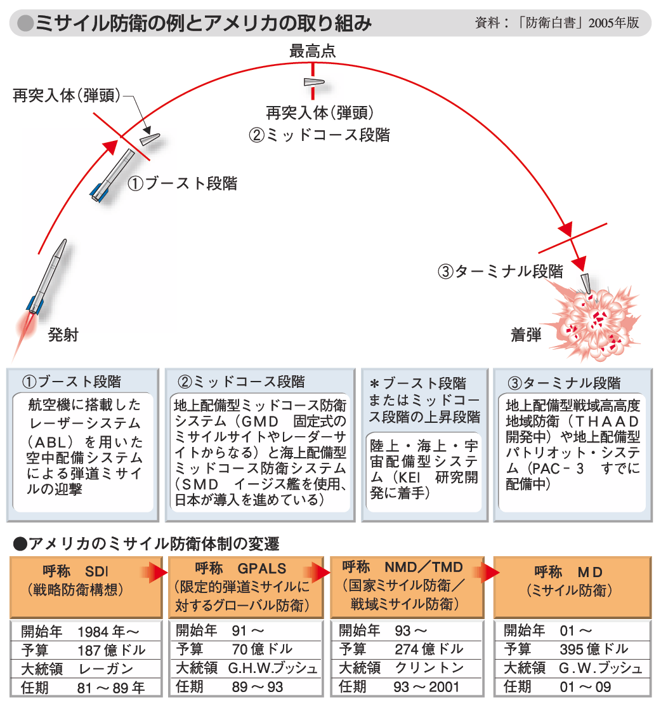
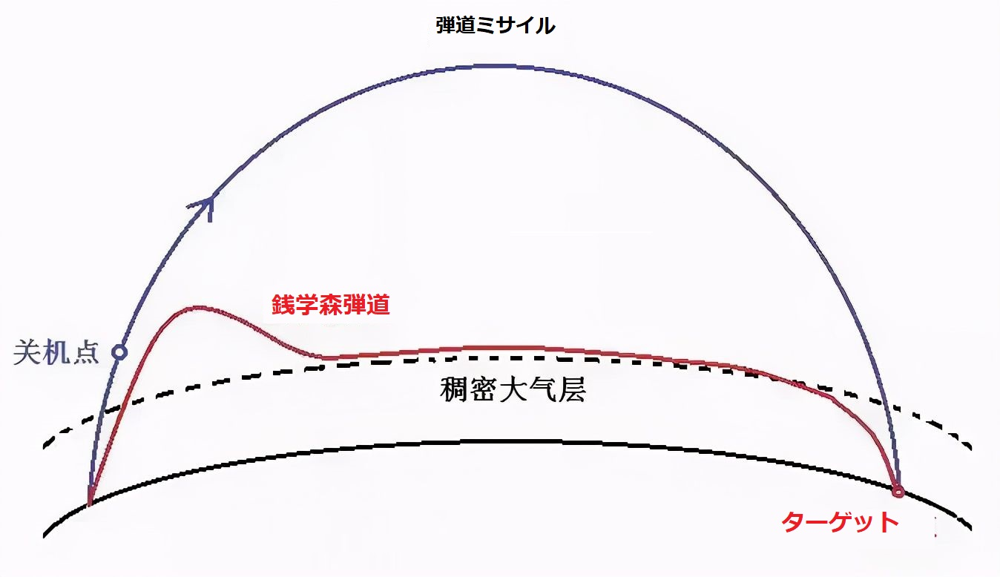
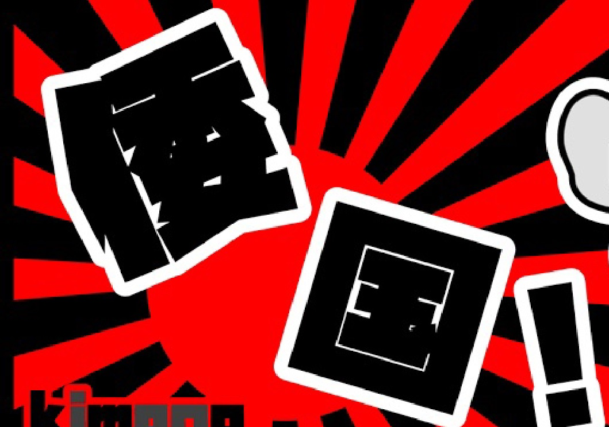

中米露英仏、[核保有5か国「核戦争に勝者なし」と声明し、核戦争回避](https://www3.nhk.or.jp/news/html/20220104/k10013413841000.html)する事を明確した。  
一見、平和に向いてるように見えるかも知れないが、こちらは、核保有国⇒核保有しない国の核戦争、又は、普通の戦争をするか否か、全く言及しない。  
新たな戦争をするために、核保有5か国間、核戦争しないことを約束して、世界を管理する核保有5か国は、お互いにレッドラインを設けた事である。  
第二次世界大戦の直前、ソ独、日米等、お互いに重要な声明、条約を結んだ事と同様です。

**背景**

核武器を拡散しない、先に使用しない事は、中国のいつも主張することですが、米国も参加する事とは、米軍が劣勢におるからです。

核攻撃は1回目攻撃と2回目攻撃(反撃)で分けています。  
1回目の攻撃は主に固定式発射台、又は、トラック、列車など、陸上の発射台から発射する弾道ミサイルで核攻撃を行います。  
攻撃を受け、又は、攻撃を受けると判断した場合、特に、陸上の発射拠点など破壊された場合、主に核潜水艦、山の奥などに隠されたトラック、列車から、弾道ミサイルを発射する流れとなります。

今まで、弾道ミサイル向けの防衛は、基本、中米露、3カ国は揃えてる。日本も、勿論、米国製防空システムですから、単独で、弾道ミサイルの防衛力がないでしょう。

このバランスを崩したのは、中露の高超音速武器の公開である。  
これらの高超音速武器は、従来の弾道ではなく、宇宙空間の低軌道当たりで飛行して攻撃するものである。

例えば、中国から公開された高超音速武器の場合、「銭学森弾道」と言われる空気動力の技術を駆使して、低軌道の大気圏の上に、跳ねさせるような軌跡で、ターゲットまで飛行するものです。  
而も、常に燃料を使うわけではないので、中国⇒米国の最短距離(北極航路)ではなく、オーストラリア側、南極の上空から飛ばす事も可能である。ロシアの高超音速と言われるミサイルも似たような技術となります。弾道が変わったことと、襲来の方向が特定できないことから、今まで、膨大な資金を費やした防空システムは、中露の攻撃に無力になる事である。

以下は「銭学森弾道」と「弾道ミサイル」の飛行軌跡の比較図です。

**「核戦争に勝者なし」とは何か**❓

背景から今の状況は理解できるでしょう。

いつも通り、核戦争を避けたい中露と、核戦争の勝ち味が見えない米国は、共通認識できたことです。英仏は元々、防衛力が欠ける側ですから、従うだけ。

今回の声明について、ぶっちゃけいうと、日本はいつも猛反対してきた、米国の先に核武器を使用しない声明と、全く同じものである。しかも、日本と相談なしらしい。  
核保有をしたがる日本を含めて、中米戦争を望んでる中型大国の全員、また、梯子を外されたと言ってもよいかもしれません。

特に日本は長年で台湾で中国分裂勢力を育て、台湾を中米の核戦争を点火させようとした国家戦略は失敗しました。  
台湾海峡では中米の核戦争が起こりません。  
但し、日本は無理やり絡んだら、日本列島では核戦争が起こるかどうかは、別ものである。中米は核戦争が起こらないだけです。

**「倭国」の本質とは**

「倭」の意味は単に背が低い事です。「倭国」国名としたことは、背が低い人(※)の国である。

背が低い事は、遠くへ見えない意味もある。国として、戦略上、いつも短視するのは、日本の特徴である。

特に核保有5か国の声明から、日本の国家戦略の短視、先見性のなさは気づくべきでしょう。

[日中国交正常化50年に向けて、宮本元中国大使の発言](https://www.nhk.or.jp/politics/articles/lastweek/74988.html)には特に気になります。

> 「政治的な自由など、リベラルな考え方に基づいた国際秩序を変えようとすることに絶対に甘んじてはならない。中国が間違いを起こさないよう、日本の立場をはっきり伝える努力をしていくべきだ」――宮本元中国大使

同氏の発言からも、何故、日本当局は良く勘違いするか、一斑を見えるかも知れません。  
大国、ようは、国連常任理事国の5か国の利益を尊重するのは唯一の国際秩序である。それ以外はありません。

何でも一歩遅れて、遠く見えない姿は、「倭」の本質でしょう。

中国は産業革命の時代に慣れるまでの間、先行した日本は、主導権を握った時代があったが、中国を含めて、アジア諸国はもとのあるべき姿に戻っているので、まだ、遅くないうち、日本は「倭」から脱出したほうがよいかと思います。  
前述通り、核保有5カ国は核戦争しない約束しても、日本と関係ない。  
日米安保条約も、日本の安全保障ではない。結局5カ国の利権次第で、変動するものである。  
特に、どうしても中国内戦に巻込みたい日本は、中米利権再分配させる時、弱かった中国の時代で定めた境界は通用しなくなるだけでしょう。

最後に、中国駐大阪領事、薛剣氏のコメントを引用して、終わりにしたいと思います。

https://twitter.com/xuejianosaka/status/1478411364872130563?s=20
