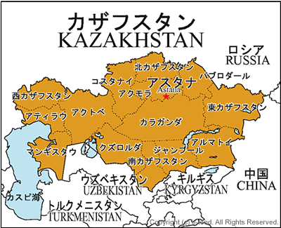
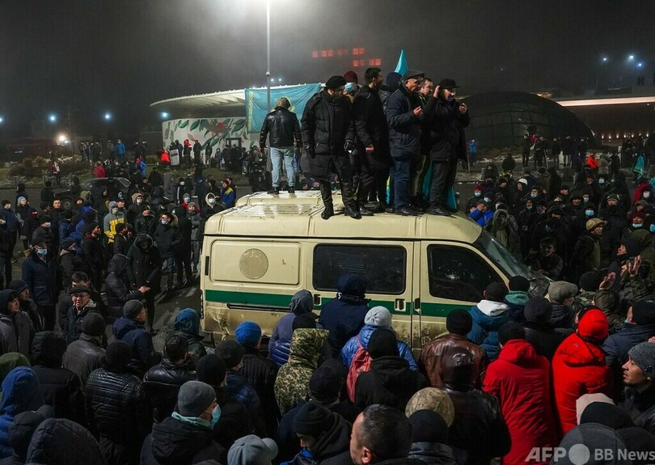

今年に入ってから、カザフスタンで起こってる騒乱は、勿論、裏側にNED等、米国NGO系の影響は欠かせませんが、火のない所に煙は立たぬから、経緯をざっくりと、まとめてみます。 裏側にある各政治勢力の紛争について、一旦、割愛します。

ガソリン、LPガスの値上げは、最初のプロテストの起因である。ただし、いくら資源不足といっても、石油輸出国機構（OPEC）のメンバとしたカザフスタンには、資源不足のことはありません。

1．カザフスタンは、割安の値段で、LPガスを、国民向けに提供してる。 ・隣国のロシア等、同じ資源輸出大国の半額ほど ・かなり安いので、料理等だけではなく、冬の暖房、自動車の燃料まで、LPガスを利用してる ・50%程の掛け率があるので、**不正業者により、LPガスのロシアなど、隣国への密輸は横行**

2．密輸の不正業者を打撃するために、1月から、当局は国内向けのLPガス価格の自由化をし、LPガスの単価が倍増になった。

3．コロナ禍の中、元々、生活が苦しんでいるミドル層以下の市民は、怒って、プロテストを興した。

4．急に収入源がなくなった不正業者の激怒は勿論、ウクライナで亡命政治家アブリヤゾフ、NED等米国系NGOと手を組んで、今のテロまで興した。

5．カザフスタンはガンなど、武器を自由に持つのと、民間向けだけではなく、軍用の武器まで、手に入る国である。 ようは、庶民は、軍人より強力な武器を持つことは多い。

6．警察、軍は、一部、主要な街しかコントロールできません。国全体、混乱に陥てる状態である。

7．中ア、中露等、カザフスタンの隣国は安定を望んでる。ロシア等、いち早く、軍を派遣して、テロ鎮圧に手をだした。 ロシアの裏庭、中アで紛争を興すことは、米国、ウクライナ、高圧状態のドネツクを緩める、囲魏救趙でもある。
