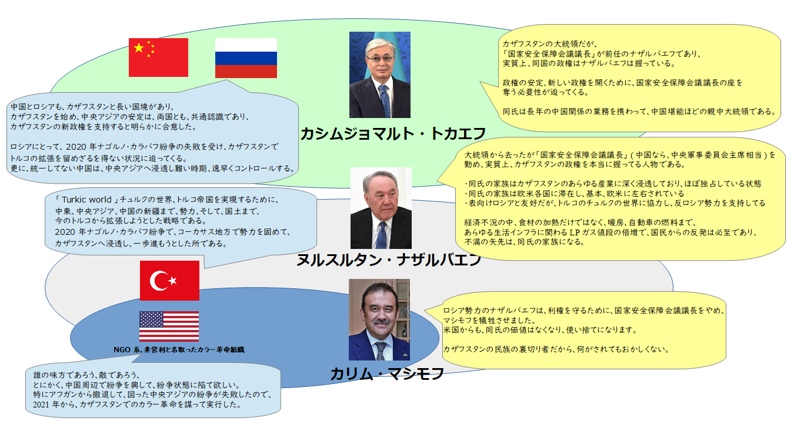
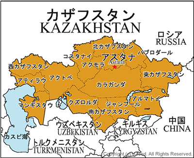

[カザフスタンのプロテストからテロまでの経緯をざっくりと纏めてみた](https://blog.loveapple.cn/news/202201078380.html)が、今回、その全貌を明らかにしてみたいと思います。 一言でまとめると、カザフスタンの騒乱は新旧政権の交代が上手く行かない中、米国のスパイはカラー革命を興したきっかけで、ロシアはカザフスタンへ入って、中央アジアの勢力を固めたことである。

以下はこちらのまとめた各勢力の関係図です。

カラー革命とは言え、火のない所に煙は立たぬから、経済、政治等、カザフスタン国内に必ず問題があります。大本は新旧政権の交代にあります。

元々、ソ連の制度から派生した政権ですから、中国と似ております。 中国の例をしますと、国の主席(政治のTOP、カザフスタンの大統領相当)は名目上、一番上に立つが、政権の一番強力な人は、軍事委員会主席(軍事のTOP、カザフスタンの国家安全保障会議議長相当)となります。 中国の場合、国家主席、軍事委員会主席、ようは、政治と軍事のTOPは、基本一人(習近平)となります。 (参考：[議会の違いから中国人民代表大会制度を理解する](https://blog.loveapple.cn/politics/2019112919.html)) 初期頃、習近平は国家主席、軍事委員会主席は胡錦濤の時期があったら、ずっと変わらなかったら、カザフスタンと同様に、政権交代で何かしらの紛争が起こるかもしれない。 今回、カザフスタンの混乱のもとはこちらとなります。

勿論、一回の紛争、カラー革命では、ナザルバエフの勢力が排除する事が難しいでしょう。 中国も同様、未だに日本の政治評論家は「江沢民派」云々って、中国政治を語ってる人は多い。勿論、江沢民という老人は何をやるわけではなく、同氏は政権を握った時代、成長してきた政治勢力の事を指してるでしょう。

中国ほどに癒着力がないカザフスタン、トカエフはロシア勢力を輸入して、特にトルコ、米国の勢力を留めようとしてるでしょう。

カザフスタンはロシアの工業都市、モスクワ地区、中国の新疆と隣接するので、中露にとって、カザフスタンの安定は非常に重要である。逆に、米国はカザフスタンの紛争を望んで、紛争を興すには精いっぱいである。

以下、関係勢力勢力図の登場人物の説明内容です

- 中国とロシア： 中国とロシアも、カザフスタンと長い国境があり、 カザフスタンを始め、中央アジアの安定は、両国とも、共通認識である。 カザフスタンの新政権を支持すると明らかに合意した。
    
    ロシアにとって、2020年ナゴルノ・カラバフ紛争の失敗を受け、カザフスタンで トルコの拡張を留めざるを得ない状況に迫ってくる。 更に、統一してない中国は、中央アジアへ浸透し難い時期、逸早くコントロールする。
- トルコ： 「[Turkic world](https://asia.nikkei.com/Politics/Turkey-s-Turkic-world-ambitions-face-reality-check-in-Kazakhstan)」チュルクの世界、トルコ帝国を実現するために、 中東、中央アジア、中国の新疆まで、勢力、そして、国土まで、 今のトルコから拡張しようとした戦略である。 2020年ナゴルノ・カラバフ紛争で、コーカサス地方で勢力を固めて、 カザフスタンへ浸透し、一歩進もうとした所である。
- 米国： 誰の味方であろう、敵であろう、 とにかく、中国周辺で紛争を興して、紛争状態に陥て欲しい。 特にアフガンから撤退して、図った中央アジアの紛争が失敗したので、 2021年から、カザフスタンでのカラー革命を謀って実行した。
- トカエフ： カザフスタンの大統領だが、 「国家安全保障会議議長」が前任のナザルバエフであり、 実質上、同国の政権はナザルバエフは握っている。
    
    政権の安定、新しい政権を開くために、国家安全保障会議議長の座を 奪う必要性が迫ってくる。
    
    同氏は長年の中国関係の業務を携わって、中国堪能ほどの親中大統領である。
- ナザルバエフ 大統領から去ったが「国家安全保障会議議長」(中国なら、中央軍事委員会主席相当)を 勤め、実質上、カザフスタンの政権を本当に握ってる人物である。
    
    ・同氏の家族はカザフスタンのあらゆる産業に深く浸透しており、ほぼ独占している状態 ・同氏の家族は欧米各国に滞在し、基本、欧米に左右されている ・表向けロシアと友好だが、トルコのチュルクの世界に協力し、反ロシア勢力を支持してる
    
    経済不況の中、食材の加熱だけではなく、暖房、自動車の燃料まで、 あらゆる生活インフラに関わるLPガス値段の倍増で、国民からの反発は必至であり、 不満の矢先は、同氏の家族になる。
- マシモフ ロシア勢力のナザルバエフは、利権を守るために、国家安全保障会議議長をやめ、 マシモフを犠牲させました。 米国からも、同氏の価値はなくなり、使い捨てになります。
    
    カザフスタンの民族の裏切り者だから、何がされてもおかしくない。

**今後の予想など**

1. 安定していくので、近いうちに騒乱は抑えていくでしょう。
2. 大きなリスクとして、露軍のカザフスタン進入により、反ロシア勢力の台頭で、対ロシアのテロリストは米国にサポートされるかと想定する。
3. 概ね、トルコ、米国勢力はカザフスタンで留められ、中央アジアは平和になって、安定になるでしょう。

**2022/1/20補足**

[ロシア軍はカザフスタンから撤退](https://jp.reuters.com/article/kazakhstan-protests-russia-military-idJPKBN2JN1VU)し、[前大統領のナザルバエフ氏は引退と正式に発表しました](https://www.asahi.com/articles/ASQ1M2G3CQ1LUHBI057.html)ことは、カザフスタンは一旦安定に戻っていることです。

無事ではないが、カザフスタンは政権交代を終え、政治環境は落ち着くこと、何よりです。 ロシア軍は一時的に入ったが、紛争の罠に陥る事ないよう、上海サミットの枠組を経由し、中国も各隣国と一同、カザフスタンの安定、米、トルコのテロ勢力の排除に協力すると正式に発表した。 この時世で難関はあるが、これから、経済に集中する事は可能になります。
