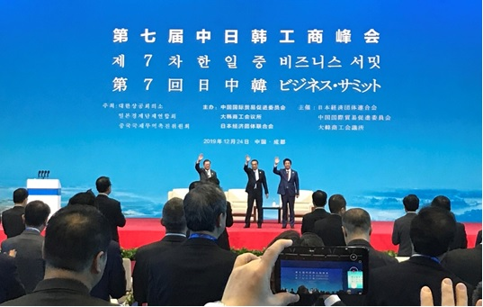

成都での日中韓ビジネスサミットは、東アジアの新たなマーケットは形成される。RCEPと合わせて、東南アジア含めて、関税ほぼゼロの巨大な経済圏になる。

東南アジアの原材料、日本のハイテック、中国、ベトナムなどの世界工場で生産した製品は、もっと安く流通することによって、各国は自らの利益は図れるでしょう。  
一つ注目して欲しいのは、中国の参加しないTPPのメンバー日本について、今後、中国はアメリカ大陸市場への進出は、日本の力を借りるでしょう。アメリカ大陸のマーケットへ進出するために、中国はTPPへ参入する必要がある、但し、TPPでは大きな罠が中国を待っていること、「[一帯一路の戦略を理解するーー海上編:その一](https://blog.loveapple.cn/politics/national-strategy/2019120379.html)」でも少し触った。 新しいマーケットを開拓するために、中国はTPPを諦めて、一帯一路戦略を立ち上げました。

今回の日中韓ビジネスサミットは、日中韓、そして東南アジアは関税免除の環境になり、中国の商品は日本経由すれば、アメリカ大陸へ安い関税で流通できる。  
特に日本は、アメリカ、ヨーロッパと関税ゼロの貿易環境はできており、中国は自ら経験ない所で冒険する必要もなくなる。  
安倍総理の対応から、日本はこの中継の位置づけにも喜んで受け止めているようです。勿論、仲介者としての利益ありきだ。  
この傾向だと、今まで中国生産の低レベルの商品はベトナム経由だったが、ハイテックなど、高いレベルの商品は日本経由でアメリカ大陸のマーケットへ流れるでしょう。

約一年間の貿易戦で、アメリカの最大貿易相手は、中国からメキシコに切り替わった。これは、アメリカはアジアからアメリカ大陸の原点へ戻り始める証でしょう。  
RCEPには、まだ、インドが欠席している。もし、インドはある程度発展してきて、RCEPに戻ったら、本当にアメリカの終焉に迎え、アジアから排除され、完全に孤立されるでしょう。
