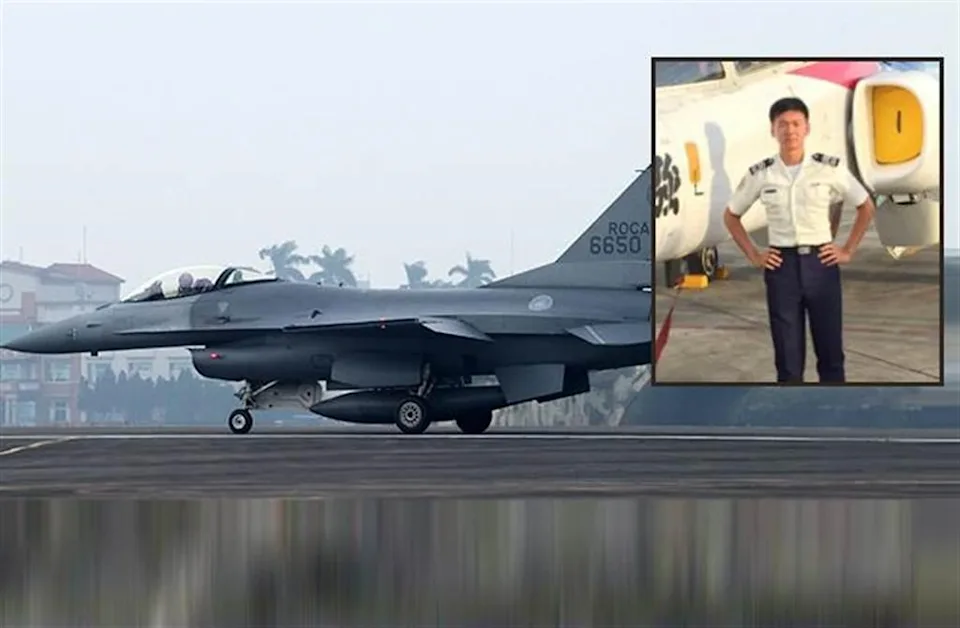
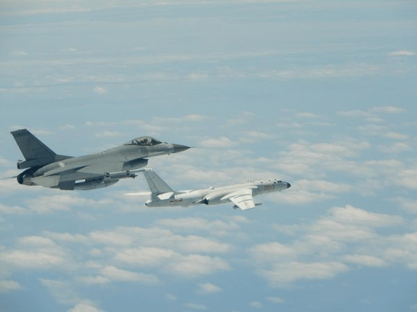

台湾 嘉義周辺海域で墜落したF16V戦闘機は1/12午前、機体の残骸を発見しました。残骸は同地域で、バラバラな状態で、パイロットのジャケットと思われるものも発見して、操作は続いています。 (情報元：[F-16V墜海疑尋獲外套 蔡英文今赴嘉義慰問家屬](https://tw.news.yahoo.com/f-16v%E5%A2%9C%E6%B5%B7%E7%96%91%E5%B0%8B%E7%8D%B2%E5%A4%96%E5%A5%97-%E8%94%A1%E8%8B%B1%E6%96%87%E4%BB%8A%E8%B5%B4%E5%98%89%E7%BE%A9%E6%85%B0%E5%95%8F%E5%AE%B6%E5%B1%AC-235327352.html))

同機、F-16V、6650号機は、台湾海峡でよく登場する飛行機である。以下は去年、スクランブル飛行で、中国空軍のH-6爆撃機と現れた写真である。

脱出装置を使わない、墜落直前の異様な操作から、同機の墜落は、中国からの電磁波攻撃により、興した故障だと推測されています。 2020年、旧型のF-16A/Bは中国空軍の電磁波攻撃により、[1機が墜落](https://jp.sputniknews.com/20201118/7946784.html)したと間もなく、同型機飛行停止。 今回の事故を受け、F-16Vも全機飛行停止となっています。

